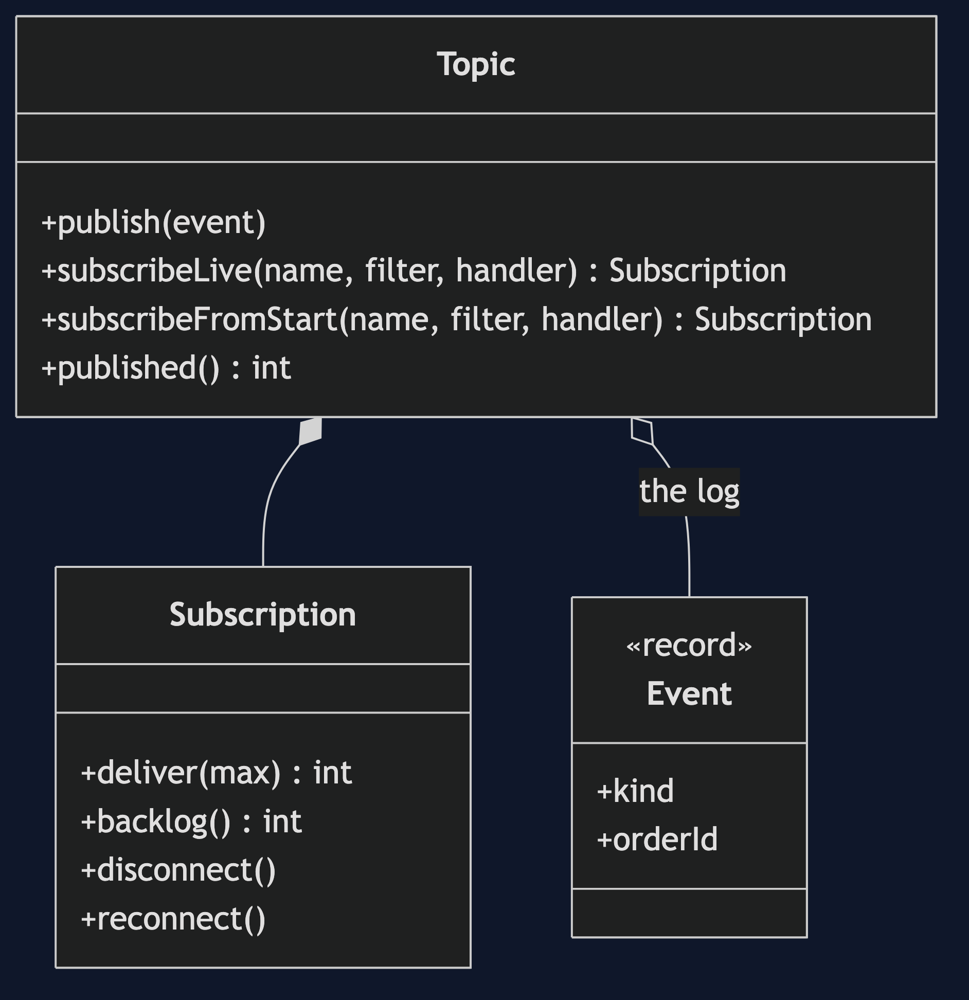
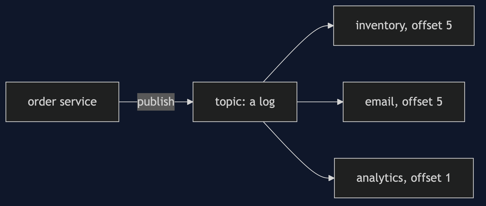
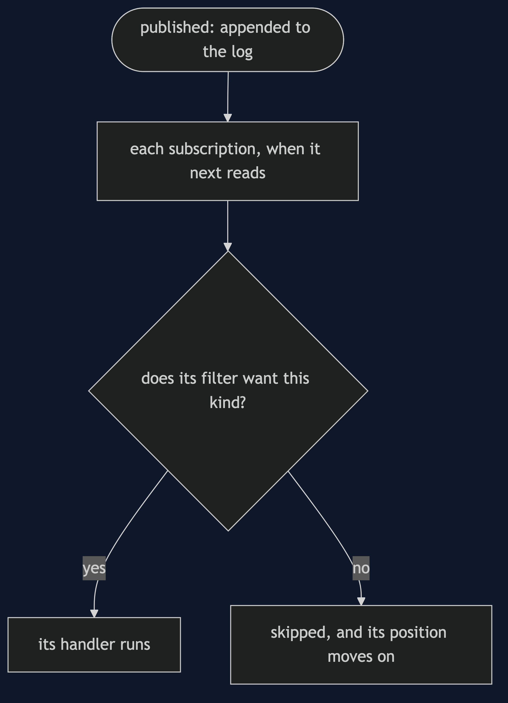
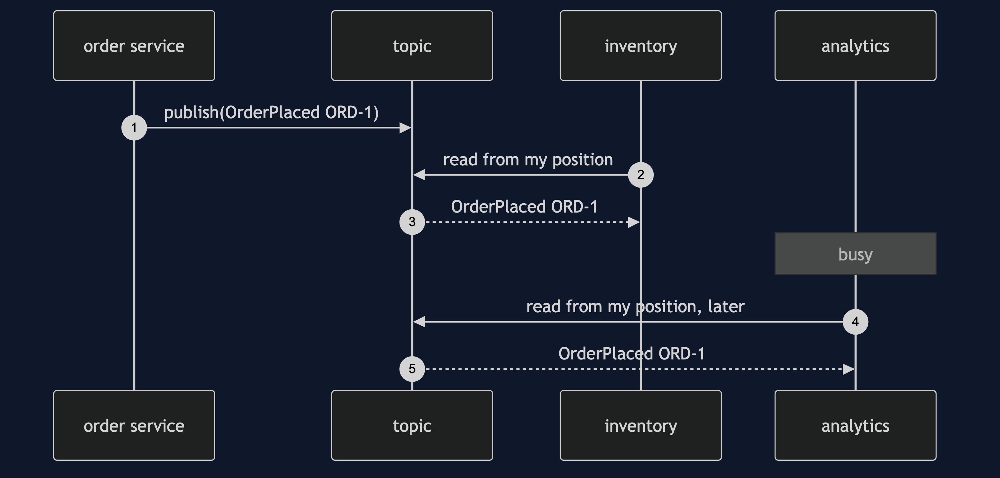
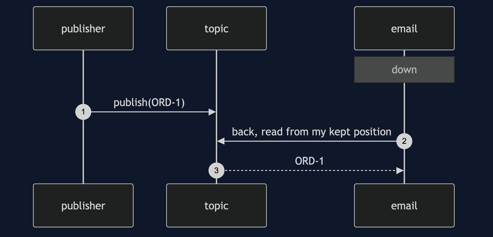

# Publisher-Subscriber Pattern

```
src/main/java/com/jk/explore/publishersubscriber/
├── PublisherSubscriberDemo.java     the six acts
├── Topic.java                       an append-only log; a subscription per reader
├── Event.java
│
└── naive/
    └── DirectOrderService.java       calls each service by name
```

**Publish once to a topic, and let anyone subscribe. The publisher never learns who did.**

This project is in [micro-services-design-patterns](..). It is the same idea as [Observer](../../behavioural/observer-pattern) across a network, and the pattern under [Domain Event](../../domain-driven-design-patterns/domain-event-pattern) and [Event Bus](../../messaging-integration-patterns/event-bus-pattern).

## Run

```bash
./gradlew run
```

Six acts. Every number quoted below comes from this program's own output.

```
ONE. The order service calls each one.
  inventory [ORD-1], email [ORD-1], analytics [ORD-1].
  the order service knows 3 services by name. a fourth, loyalty points, means editing it.
TWO. The order service only publishes.
  inventory [ORD-1], email [ORD-1], analytics [ORD-1].
  a fourth subscriber, loyalty points, is added: [ORD-1]. the order service was not changed.
THREE. Each at its own pace.
  5 orders published. email handled 5, analytics handled 1. backlog of email: 0, of analytics: 4.
  analytics catches up later: handled 5, backlog 0. a slow subscriber did not hold up the fast one, or the publisher.
FOUR. Each takes what it wants.
  email asked only for placed orders: [OrderPlaced ORD-1].
  analytics asked for everything: [OrderPlaced ORD-1, OrderCancelled ORD-1].
FIVE. A subscriber that arrives late.
  3 orders were published before loyalty was added, and one after.
  a subscriber that joins live sees: [ORD-4]. one that reads from the start sees: [ORD-1, ORD-2, ORD-3, ORD-4].
  keeping the log is what makes a late subscriber possible, and it has to be kept somewhere.
SIX. The bill: nobody knows who got it.
  email was down when the order was placed. the publisher was told: nothing. email got: [], backlog 1.
  when it came back, it caught up: [ORD-1]. because its place in the log was kept.
  the publisher still cannot ask whether the email went out. it published, and it does not know who listened.
```

## Test

```bash
./gradlew test
```

2 test classes, 8 test methods, offline, with nothing installed and no framework.

## Technologies and versions

| What | Version | Why it is here |
| --- | --- | --- |
| Java | 21 | The repository standard, via the Gradle toolchain block |
| Gradle | 9.2.1 | The wrapper in this directory; no separate install needed |
| JUnit 5 | 5.10.2 | Test runner |

No framework. A hand-built project stays plain Java so the mechanism is the whole lesson.

## Learning Material

| Document | What it covers |
| --- | --- |
| [`docs/problem-statement.md`](docs/problem-statement.md) | One event, several parties |
| [`docs/publisher-subscriber-pattern-explained.md`](docs/publisher-subscriber-pattern-explained.md) | The pattern, and six acts |
| [`docs/class-diagram.md`](docs/class-diagram.md) | The types |
| [`docs/architecture-diagram.md`](docs/architecture-diagram.md) | A publisher, a topic and subscribers |
| [`docs/data-flow-diagram.md`](docs/data-flow-diagram.md) | How an event reaches a subscriber |
| [`docs/sequence-diagram.md`](docs/sequence-diagram.md) | Written for a listener with the screen off |
| [`docs/uml-diagram.md`](docs/uml-diagram.md) | Four sequences |
| [`docs/animation.html`](docs/animation.html) | The six acts in a browser |
| [`docs/prerequisites.md`](docs/prerequisites.md) | What you need to know |
| [`docs/session.md`](docs/session.md) | A one-hour taught session |
| [`docs/spec.md`](docs/spec.md) | The generated specification |
| [`docs/youtube.md`](docs/youtube.md) | Title, description and chapters |

### The pattern in one picture



### Where each piece sits



### How one request moves



### Who calls whom, in order



### All four sequences




### Video

Built from [`video/scenes.py`](video/scenes.py) by
[`video/build_video.sh`](video/build_video.sh). The rendered file is not
committed; see the repository README for why.

## Where you have already met this

Every event-driven system, and the browser's `addEventListener`.

## When this is too much

If one known service needs the result, a direct call is clearer. A topic is for facts that many may want, and that you do not want to track.

## Where this sits

This project is in [`micro-services-design-patterns`](..), and is meant to be read with its neighbours there.
