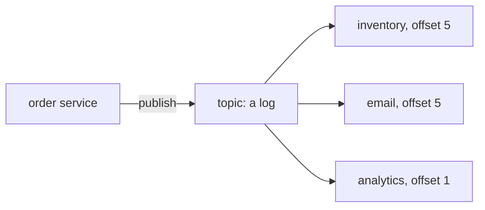

# Publisher-Subscriber Pattern — Architecture Diagram

The publisher writes to the topic. Each subscriber reads it independently.

Mermaid source

```mermaid
flowchart LR
    P["order service"] -->|publish| T["topic: a log"]
    T --> I["inventory, offset 5"]
    T --> M["email, offset 5"]
    T --> A["analytics, offset 1"]
```

