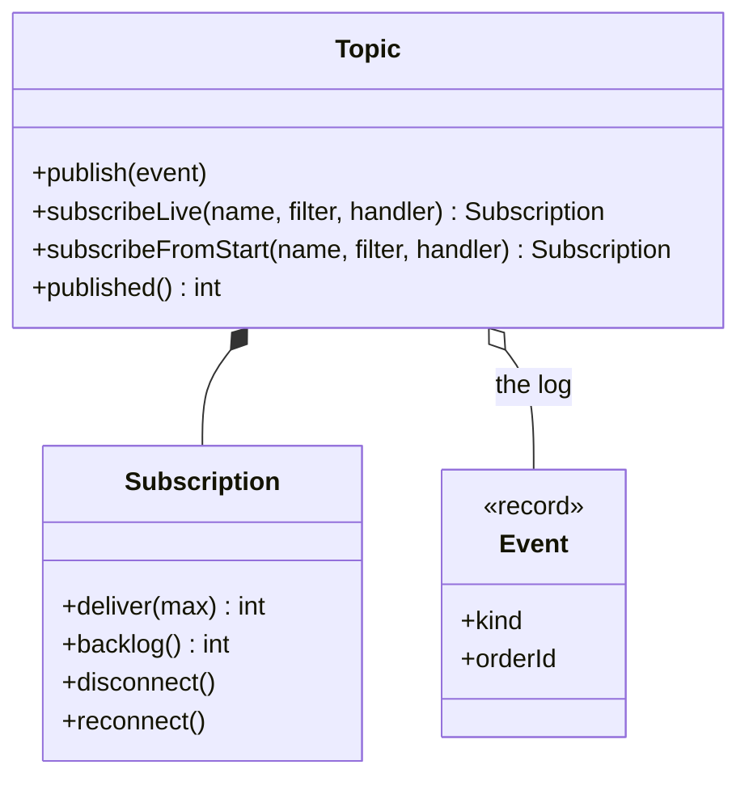

# Publisher-Subscriber Pattern — Class Diagram

A topic is a log. Each subscription is a reader with a position.

Mermaid source

```mermaid
classDiagram
    class Topic {
        +publish(event)
        +subscribeLive(name, filter, handler) Subscription
        +subscribeFromStart(name, filter, handler) Subscription
        +published() int
    }
    class Subscription {
        +deliver(max) int
        +backlog() int
        +disconnect()
        +reconnect()
    }
    class Event {
        <<record>>
        +kind
        +orderId
    }
    Topic *-- Subscription
    Topic o-- Event : the log
```

