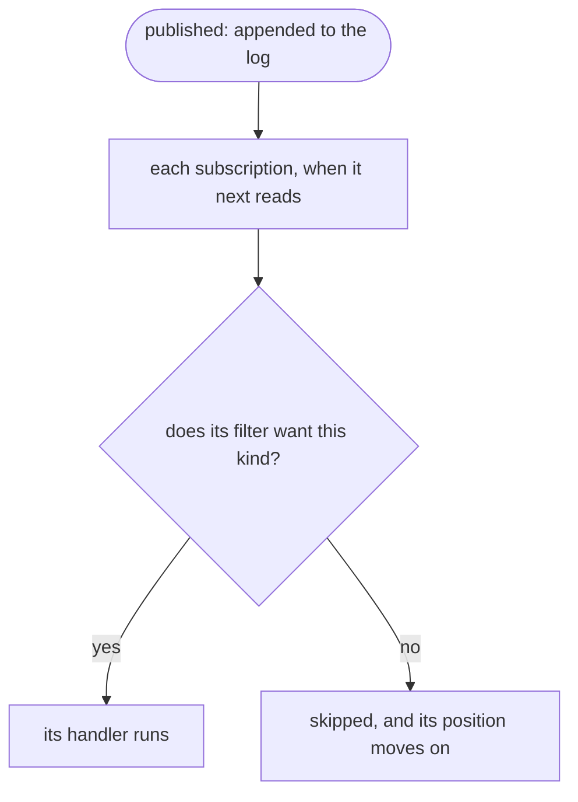

# Publisher-Subscriber Pattern — Data Flow Diagram

What happens to one event.

Mermaid source

```mermaid
flowchart TD
    Pub(["published: appended to the log"])
    Each["each subscription, when it next reads"]
    Want{"does its filter want this kind?"}
    Handle["its handler runs"]
    Skip["skipped, and its position moves on"]
    Pub --> Each --> Want
    Want -- yes --> Handle
    Want -- no --> Skip
```

