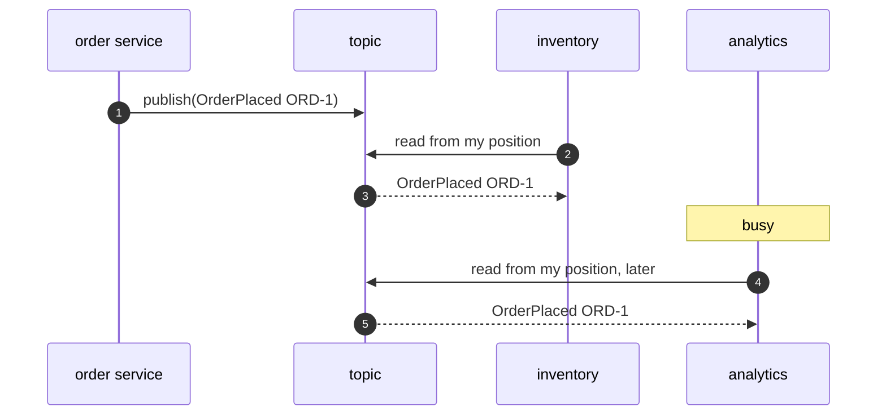

# Publisher-Subscriber Pattern — Sequence Diagram

Written for a listener with the screen off.

Say it in words. The order service publishes an order placed event to the topic, and does nothing else. Inventory reads the log, and handles the event. Email reads the log and handles it too. Analytics is busy, and reads later. Each has its own position in the log, so the order service and the other subscribers are not held up by analytics being slow.

Mermaid source

The load-bearing sentence: **the publisher writes once, and each reader has its own position.**
