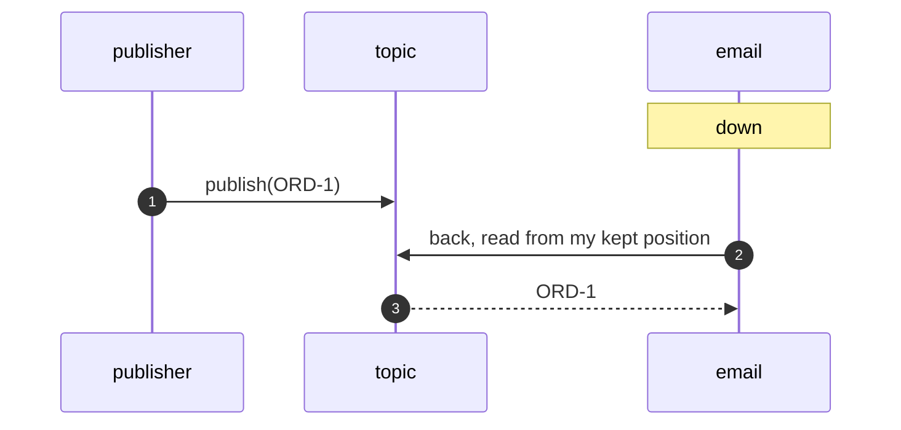

# Publisher-Subscriber Pattern — UML Sequence Diagrams

Four sequences.

## 1. An Absent Subscriber

Mermaid source

```mermaid
sequenceDiagram
    autonumber
    participant P as publisher
    participant T as topic
    participant E as email
    Note over E: down
    P->>T: publish(ORD-1)
    E->>T: back, read from my kept position
    T-->>E: ORD-1
```

