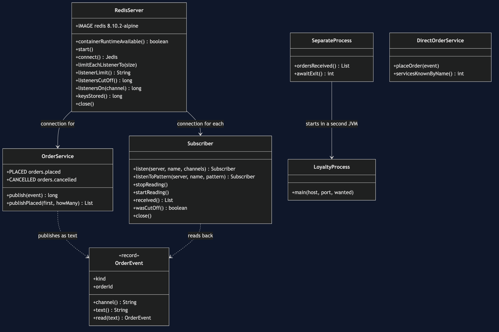
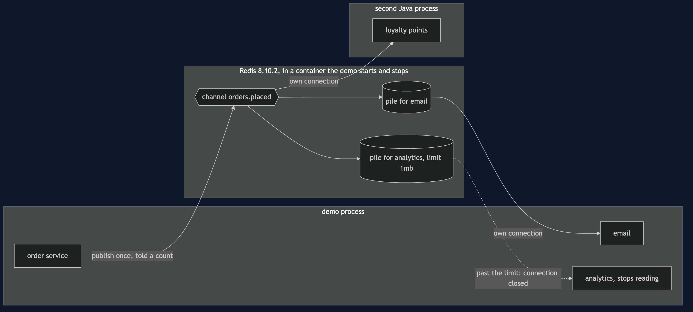
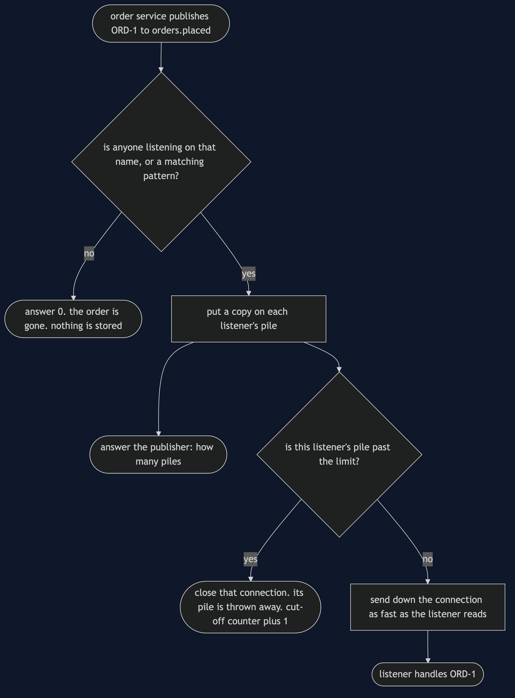
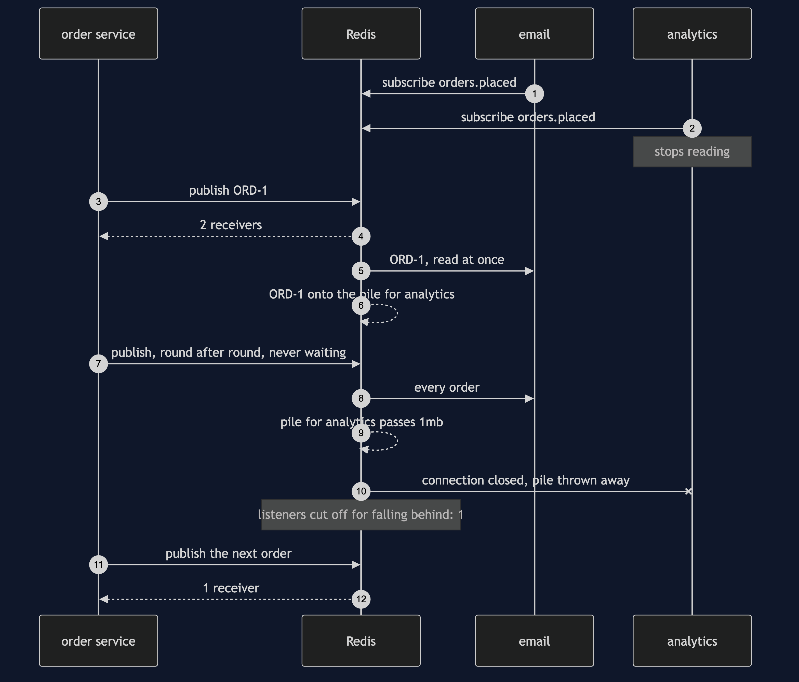
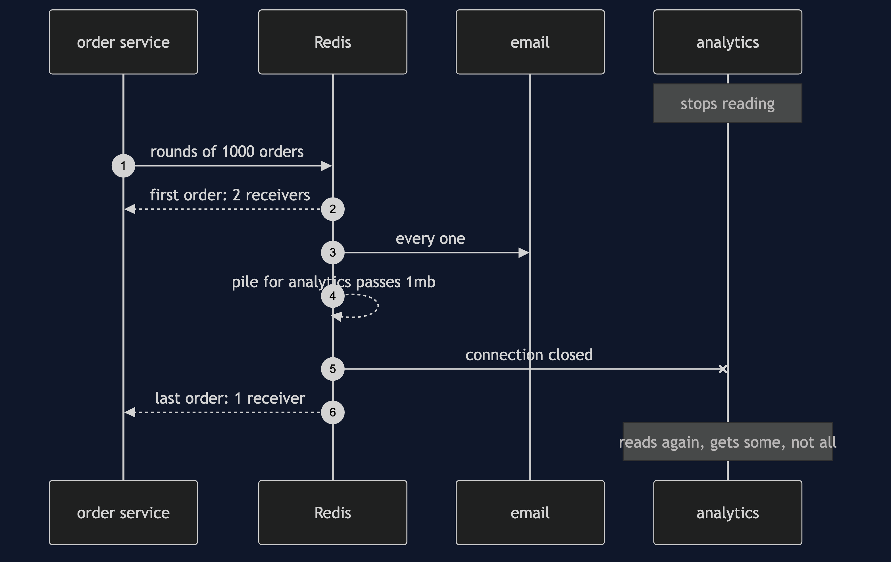
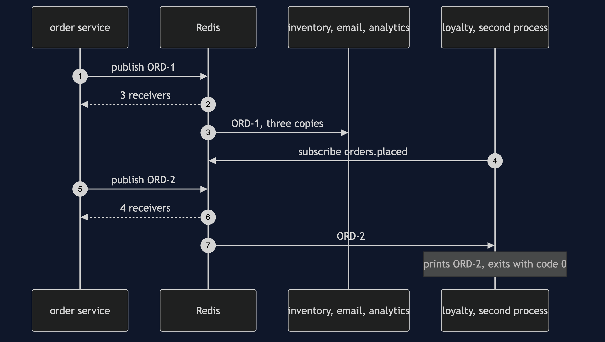
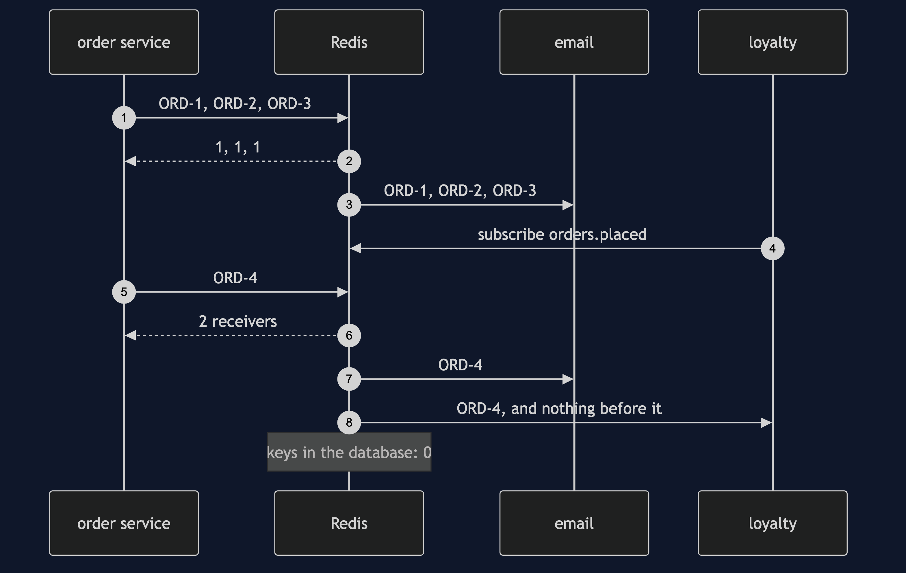
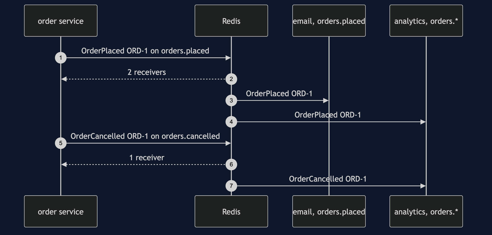

# Publisher-Subscriber with Redis Pattern

```
src/main/java/com/jk/explore/pubsubredis/
├── RedisPubSubDemo.java     the six acts
├── RedisServer.java         starts and stops a real Redis container; reads its counters
├── OrderService.java        the publisher: publish once, get a count back
├── Subscriber.java          one listener, on its own connection and thread; can stop reading
├── LoyaltyProcess.java      a listener that runs as a second Java program
├── SeparateProcess.java     starts that program and reads what it prints
├── OrderEvent.java          the message, and the text it travels as
├── DirectOrderService.java  the version with no pattern: calls each service by name
└── Poll.java                every wait is a question asked until the answer is yes
```

**On Redis, publishing hands a message to whoever is listening at that instant and tells you how many that was. It keeps nothing for anybody else — and a listener that stops reading is not waited for: once its pile of unread messages passes a limit, Redis cuts it off.**

**This project needs a container runtime.** Docker Desktop, or anything Docker-compatible, must be running before you start. The demo brings a Redis server up in a container and takes it down again at the end; nothing is installed and nothing is left behind. With no runtime, the demo prints two sentences saying what to do, and stops, rather than a stack trace.

This project is the real-infrastructure version of the plain-Java Publisher-Subscriber project in this course. That project built the topic as an object inside one Java program. This one puts the topic in Redis, a separate server, gives every subscriber its own network connection — one of them in a second Java process — and shows what a real server does that an object inside one program cannot.

## Run

```bash
./gradlew run
```

Six acts, against a real Redis. Every number quoted below, and in every document and slide in this project, comes from this program's own output. Two runs back to back print exactly the same thing.

```
ONE. The order service calls each one.
  inventory [ORD-1], email [ORD-1], analytics [ORD-1].
  the order service knows 3 services by name. a fourth, loyalty points, means editing it.
TWO. Publish once, and Redis fans it out.
  the order service published OrderPlaced ORD-1 once. Redis answered: 3 receivers.
  inventory [ORD-1], email [ORD-1], analytics [ORD-1]. each on a connection of its own.
  loyalty points starts as a separate Java process. ORD-2 is published: 4 receivers.
  the loyalty process printed [ORD-2] and exited with code 0. the order service was not changed.
THREE. A subscriber that arrives late.
  3 orders published while only email listened. Redis answered: [1, 1, 1].
  loyalty starts listening, and ORD-4 is published: 2 receivers.
  email saw [ORD-1, ORD-2, ORD-3, ORD-4]. loyalty saw [ORD-4].
  there is no reading from the start. Redis stored none of the 4 orders: keys in the database: 0.
FOUR. Each takes what it wants.
  OrderPlaced ORD-1 reached 2 receivers. OrderCancelled ORD-1 reached 1.
  email listened to orders.placed: [OrderPlaced ORD-1].
  analytics listened to orders.*: [OrderPlaced ORD-1, OrderCancelled ORD-1].
FIVE. A subscriber that cannot keep up.
  Redis keeps a pile of unsent messages for each listener, with a limit. out of the box: 32mb, or 8mb for 60 seconds.
  this demo lowers it to 1mb. analytics stops reading, and orders are published in rounds of 1000 until Redis acts.
  more than 10,000 orders later, Redis cut analytics off. listeners cut off for falling behind: 1.
  the first order reached 2 receivers, the last reached 1. email kept up and received every one.
  analytics started reading again and got some of them, not all, then its connection ended.
  the publisher was never slowed down, and never told. the orders analytics missed are gone.
SIX. The bill.
  email was down when ORD-1 was placed. Redis told the order service: 0 receivers.
  email came back and got: []. there is nothing to catch up from.
  the count says how many connections were listening. not which ones, and not whether any finished the work.
  and Redis is a separate program to run and watch: this demo needed 1 container and 2 Java processes.
```

The fifth act prints descriptions — "more than 10,000", "some of them, not all" — where the exact count depends on the machine. How many orders it takes before Redis acts depends on how much the network between the demo and the container holds before Redis's own pile starts to grow, so it differs from machine to machine and from run to run. What never changes is the outcome: exactly one listener cut off, the fast one untouched, and the stalled one short of what was published. The tests assert those as ranges.

The first run pulls the Redis image, about 120 MB once unpacked. After that a run takes about ten seconds.

## Test

```bash
./gradlew test
```

3 test classes, 13 test methods. `PlainPartsTest` (7) needs nothing installed. `RealRedisTest` (5) starts one Redis for the whole class and asks it directly: publishing answers with the number of listeners, a message nobody hears is gone for good, a star in a subscription matches every channel that fits, a listener in another process is handed the same message, and a listener that stops reading is cut off and loses what was waiting. `DemoRunsTest` (1) runs the demo and asserts every figure the documents quote.

There is no `Thread.sleep` anywhere under `src/test`. Every wait is a poll on something that can actually be asked — a subscriber's count, Redis's own counters, whether a process has exited — with a sixty-second limit that fails the test rather than hanging it. The tests that need Redis are skipped when no container runtime is there; the rest still run.

## What the simulation got right, and what it left out

**What the plain-Java Publisher-Subscriber project got right.** All of the shape. The publisher announces once and names nobody. A fourth subscriber joins without the publisher changing. Each subscriber chooses what it hears — here by an exact channel name or by a name with a star in it. A slow subscriber does not hold up the publisher or the fast one. And the publisher never learns whether the work was done. Every one of those holds on Redis, and the first, second and fourth acts reproduce them.

**Headline find: a subscriber that falls behind is cut off, and what was waiting for it is thrown away.** The simulation kept a backlog per subscriber in its log, and a slow subscriber simply caught up later, however far behind it was. Redis has no log. What a listener has not read yet waits in a pile Redis keeps for that one connection — Redis calls it the client output buffer — and that pile has a limit: out of the box 32mb, or 8mb for 60 seconds. The fifth act lowers the limit to 1mb, stops analytics reading, and publishes a flash sale. Redis never slows the publisher and never waits: once the pile passes the limit it closes analytics' connection, its own counter of listeners cut off for falling behind reads 1, and the answer to the next publish drops from 2 receivers to 1. When analytics reads again, it gets some of the orders, not all, then the connection ends. The publisher is never told. The simulation cannot produce this, because an object in one program has no pile, no limit and no connection to close.

**Second: publishing answers with a number.** The simulation's publisher was told nothing at all. Redis's `PUBLISH` answers with how many listeners it handed the message to, at that instant: 3, then 4 when loyalty joined, and 0 in the sixth act when email was down. That is more than the simulation gave, and less than it looks: it is a count of connections, not names, and not a confirmation that any work was done.

**Third: a late or absent subscriber gets nothing.** The simulation kept a log, so a late subscriber could read from the start and a subscriber that was down caught up when it came back. Redis keeps no copy. In the third act loyalty joined after three orders and saw only [ORD-4]; in the sixth, email came back and got []. Redis stored none of the orders: keys in the database: 0.

**Fourth: a subscriber in another process.** Everything in the simulation lived in one program. Here the second act starts loyalty points as a second Java program that shares nothing with the order service except Redis's address; it prints [ORD-2] and exits with code 0.

**What the simulation had that Redis does not.** A place to catch up from. If a missed order matters, Redis's publish-and-subscribe is the wrong tool, and a tool that keeps a log is the right one.

The course's NATS event-bus project already shows a server that keeps nothing for a listener who is not there. This project's own finds are the ones that are particular to Redis: the count `PUBLISH` hands back, and the output buffer limit that cuts a slow listener off.

## Technologies and versions

| What | Version | Why it is here |
| --- | --- | --- |
| Java | 21 | The repository standard, via the Gradle toolchain block |
| Gradle | 9.2.1 | The wrapper in this directory; no separate install needed |
| Redis | 8.10.2 | The server, as the official `redis:8.10.2-alpine` image; the newest release |
| Jedis | 8.0.1 | `redis.clients:jedis`, the newest release of the Redis Java client |
| Testcontainers | 2.0.5 | `org.testcontainers:testcontainers`; starts and stops the Redis container from inside the demo, on a random free port |
| slf4j-simple | 2.0.17 | Logging for the libraries above, turned off so the demo's own output is the only output |
| JUnit 5 | 5.10.2 | Test runner |
| A container runtime | Docker 24 or later, or compatible | Runs Redis. Must be running before you start |

Nothing is held back: every version is the newest generally available release. See [`docs/dependencies.md`](docs/dependencies.md) and [`docs/prerequisites.md`](docs/prerequisites.md).

## Learning Material

| Document | What it covers |
| --- | --- |
| [`docs/problem-statement.md`](docs/problem-statement.md) | The partner's version, and what is new |
| [`docs/publisher-subscriber-with-redis-pattern-explained.md`](docs/publisher-subscriber-with-redis-pattern-explained.md) | Redis's words in plain language, and six acts |
| [`docs/class-diagram.md`](docs/class-diagram.md) | The types |
| [`docs/architecture-diagram.md`](docs/architecture-diagram.md) | Separate programs, and where a message lives |
| [`docs/data-flow-diagram.md`](docs/data-flow-diagram.md) | What Redis does with one published order |
| [`docs/sequence-diagram.md`](docs/sequence-diagram.md) | Written for a listener with the screen off |
| [`docs/uml-diagram.md`](docs/uml-diagram.md) | Four sequences |
| [`docs/animation.html`](docs/animation.html) | The six acts in a browser |
| [`docs/prerequisites.md`](docs/prerequisites.md) | What you need installed, and what you need to know |
| [`docs/session.md`](docs/session.md) | A one-hour taught session |
| [`docs/dependencies.md`](docs/dependencies.md) | What Redis, Jedis and Testcontainers are, what they cost, and that skipping this project loses none of the pattern |
| [`docs/spec.md`](docs/spec.md) | The generated specification |
| [`docs/youtube.md`](docs/youtube.md) | Title, description and chapters |

### The pattern in one picture



### Where each piece sits



### How one request moves



### Who calls whom, in order



### All four sequences









### Video

Built from [`video/scenes.py`](video/scenes.py) by
[`video/build_video.sh`](video/build_video.sh). The rendered file is not
committed; see the repository README for why.

## Where you have already met this

Live notifications that are worthless when late: a price ticker on a product page, "someone else is viewing this item", a signal telling every server to drop a cached price. Redis publish-and-subscribe is common for exactly these, often beside Redis's own data, and just as often replaced by a tool that keeps a log the moment somebody asks what happens to a message nobody was listening for.

## When this is too much

If every subscriber lives in one program, a topic in memory, like the partner project's, costs nothing to run. And if a lost order matters, Redis publish-and-subscribe is too little rather than too much: it keeps nothing and waits for nobody, so the work belongs on a queue or a log that does.

## Where this sits

This project pairs with the plain-Java Publisher-Subscriber project, and is the real-infrastructure version in [`micro-services-design-patterns`](..).
