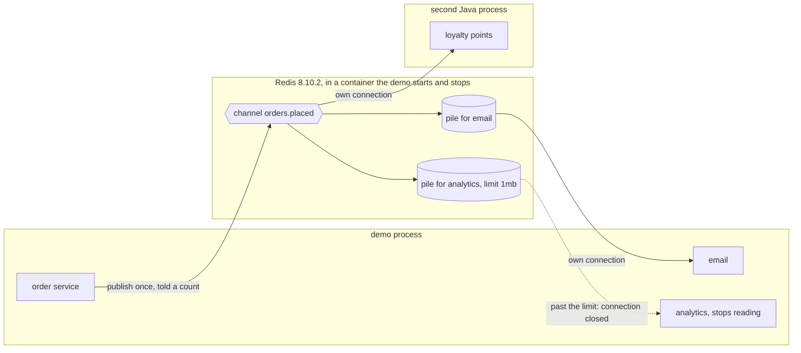

# Publisher-Subscriber with Redis Pattern — Architecture Diagram

Separate programs. The order service and every subscriber reach Redis over connections of their own, one of them from a second Java process. Redis keeps a pile of unread messages for each subscriber, and nothing else.

Mermaid source

