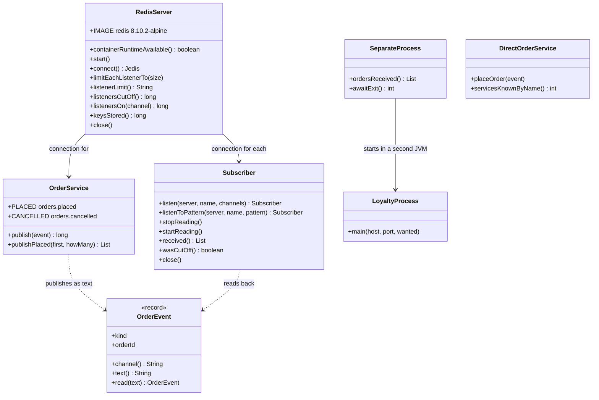

# Publisher-Subscriber with Redis Pattern — Class Diagram

The pattern is two classes: `OrderService` publishes, `Subscriber` listens. `RedisServer` owns the container and reads Redis's counters; `LoyaltyProcess` is a subscriber that runs as a program of its own.

Mermaid source

