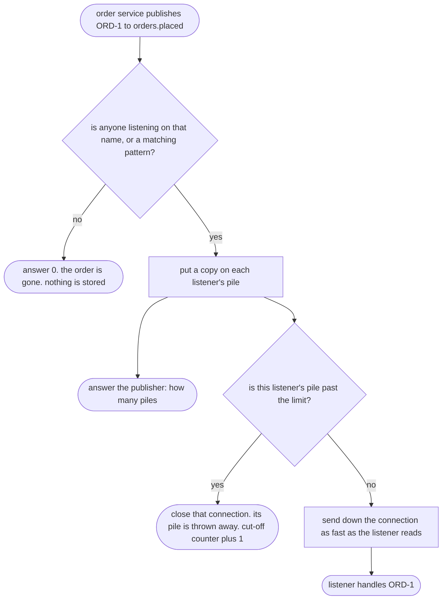

# Publisher-Subscriber with Redis Pattern — Data Flow Diagram

What Redis does with one published order, from the moment the order service publishes it to the moment every copy is gone.

Mermaid source

