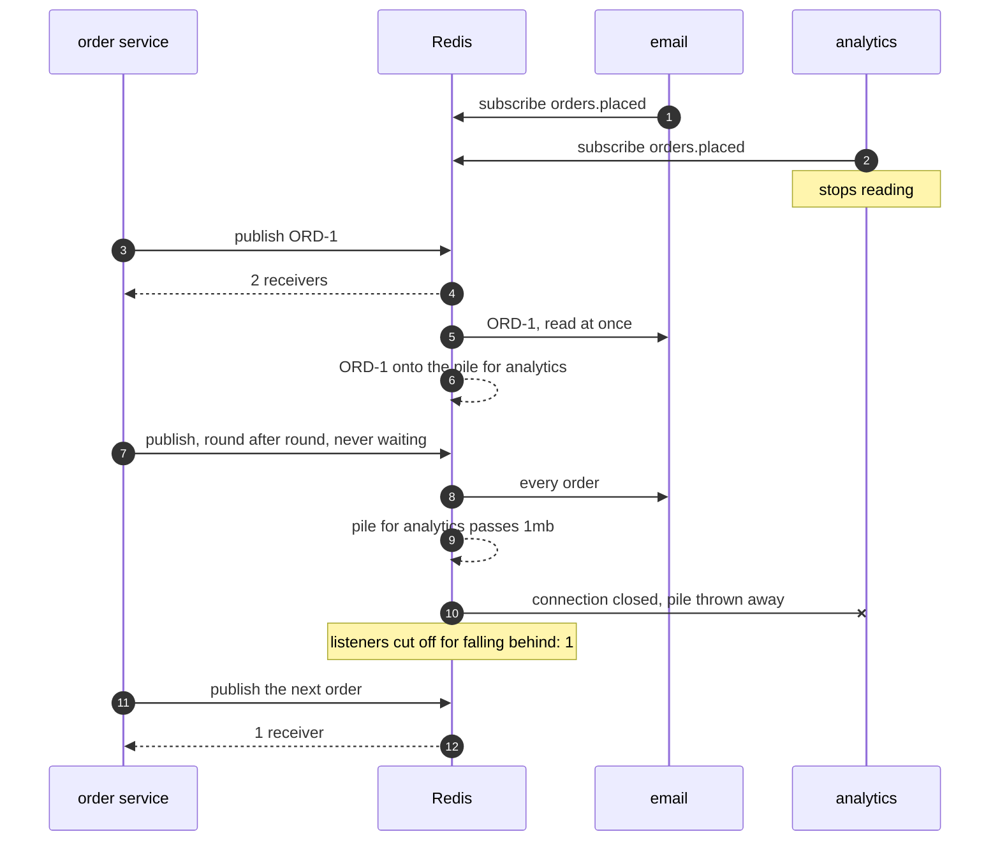

# Publisher-Subscriber with Redis Pattern — Sequence Diagram

Written for a listener with the screen off.

Say it in words. Email and analytics each open their own connection to Redis and subscribe to the name orders dot placed. Then analytics stops reading. The order service publishes the first order of a flash sale, and Redis answers two receivers. Email reads it straight away. Analytics does not, so Redis puts it on a pile it keeps for analytics alone. The order service keeps publishing and never waits. Email keeps reading every order. The pile for analytics keeps growing until it passes the limit of one megabyte. At that moment Redis closes the connection to analytics, throws the pile away, and adds one to its counter of listeners cut off. The next publish is answered with one receiver, not two. Nobody tells the order service.

Mermaid source

The load-bearing sentence: **Redis never waits for a slow subscriber, and past the limit it cuts that subscriber off — the publisher only ever sees a smaller number.**

For the second process, the late subscriber and the patterns, see [`uml-diagram.md`](uml-diagram.md).
