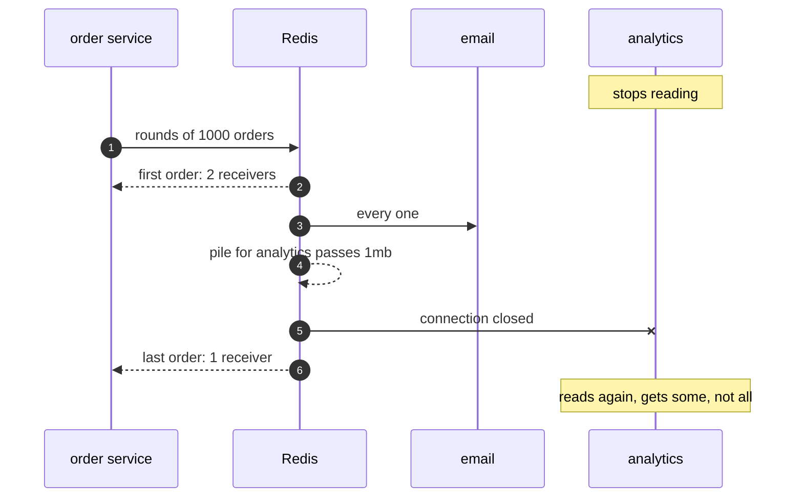
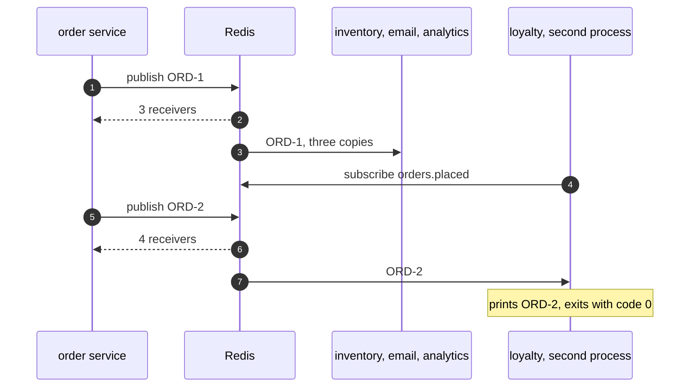
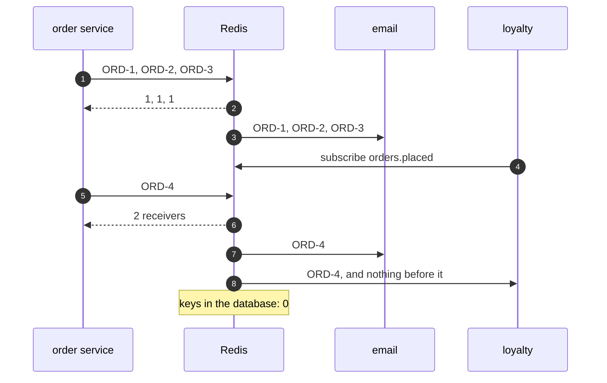
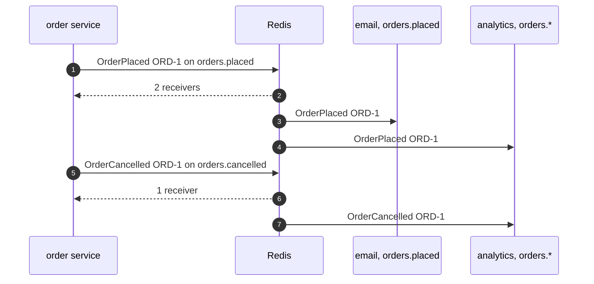

# Publisher-Subscriber with Redis Pattern — UML Sequence Diagrams

Four sequences. The cut-off comes first, because it is the one thing a topic inside one program can never show.

## 1. A Subscriber That Cannot Keep Up

Analytics stops reading during a flash sale. Redis keeps its unread orders in a pile, and when the pile passes the limit, closes the connection.

Mermaid source

## 2. Publish Once, To Another Process

Three subscribers in the demo's own program, and a fourth in a second Java process. The order service publishes once each time.

Mermaid source

## 3. A Subscriber That Arrives Late

Three orders go out while only email listens. Loyalty joins, and sees only what comes after.

Mermaid source

## 4. By Name, Or By A Star

Email listens to one exact name. Analytics listens to every name starting with orders.

Mermaid source

