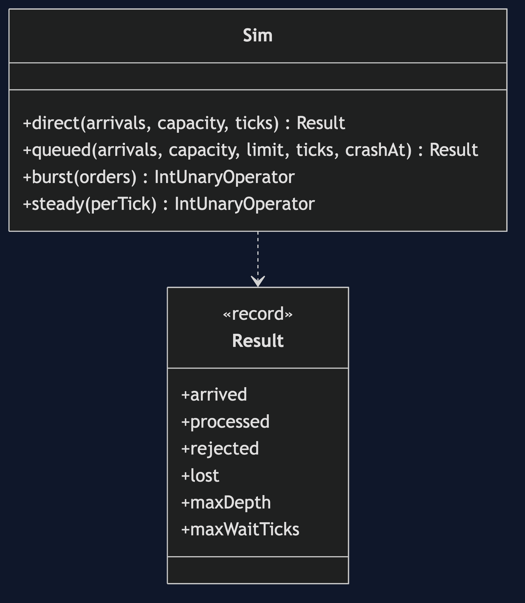
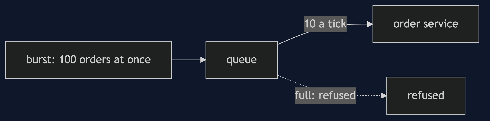
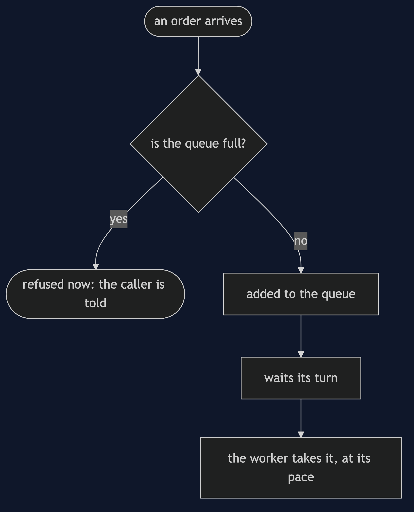
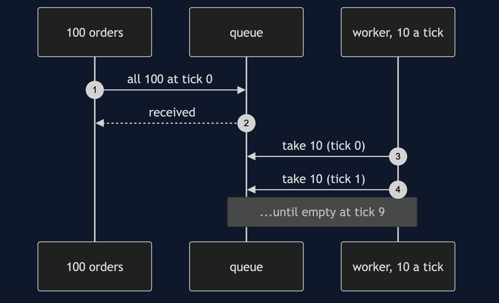
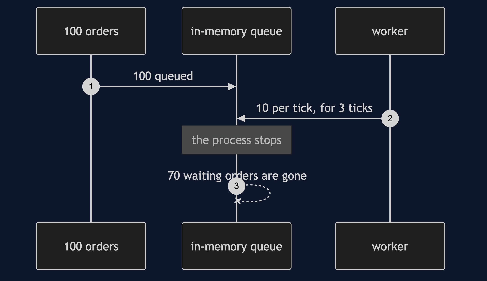

# Queue-Based Load Leveling Pattern

```
src/main/java/com/jk/explore/loadleveling/
├── LoadLevelingDemo.java            the six acts
├── Sim.java                         the model: arrivals, a queue, a worker; integer arithmetic
└── Result.java                      counts and waits from a run
```

**A queue between a burst and a worker lets the worker keep its own pace, and makes the burst wait.**

This project is in [micro-services-design-patterns](..). It is the smoothing partner of [Competing Consumers](../competing-consumers-pattern), which is how the queue is drained faster, and of [Rate Limiter](../rate-limiter-pattern), which is the alternative of refusing the burst.

## Run

```bash
./gradlew run
```

Six acts. Every number quoted below comes from this program's own output.

```
ONE. A burst, straight to the worker.
  100 orders arrive at once. the order service handles 10 a tick. processed: 10, refused: 90.
  ninety customers were told to try again, on the busiest moment the shop had.
TWO. A queue in between.
  the same 100 orders. processed: 100, refused: 0. the deepest the queue got: 100.
  the worker never did more than 10 a tick. the burst was spread over 10 ticks.
THREE. What the queue costs: waiting.
  the first order waited 0 ticks. the last waited 9. on average: 4.5.
  no order was lost, and none was fast except the first ten.
FOUR. A queue with no end, and one with a limit.
  orders arrive at 15 a tick and the worker does 10, for 100 ticks. an unbounded queue: 500 orders waiting, and still growing.
  a queue limited to 50: 40 waiting, 460 refused, longest wait 4 ticks.
  a queue does not fix a worker that is too slow. it hides it, until the limit says so.
FIVE. Size the worker for the average, not the peak.
  a worker of 10 a tick clears the burst with a longest wait of 9. a worker of 20 clears it with a longest wait of 4.
  to serve a peak of 100 at once with no queue you would need a worker of 100, idle almost all day.
SIX. The bill: an in-memory queue forgets.
  the process holding the queue stops at tick 3, with the queue in memory. processed: 30, lost: 70.
  70 customers were told their order was accepted, and it never happened.
  a queue that must not lose orders has to be kept somewhere that survives.
```

## Test

```bash
./gradlew test
```

2 test classes, 9 test methods, offline, with nothing installed and no framework.

## Technologies and versions

| What | Version | Why it is here |
| --- | --- | --- |
| Java | 21 | The repository standard, via the Gradle toolchain block |
| Gradle | 9.2.1 | The wrapper in this directory; no separate install needed |
| JUnit 5 | 5.10.2 | Test runner |

No framework. A hand-built project stays plain Java so the mechanism is the whole lesson.

## Learning Material

| Document | What it covers |
| --- | --- |
| [`docs/problem-statement.md`](docs/problem-statement.md) | A burst and a worker with a fixed speed |
| [`docs/queue-based-load-leveling-pattern-explained.md`](docs/queue-based-load-leveling-pattern-explained.md) | The pattern, and six acts |
| [`docs/class-diagram.md`](docs/class-diagram.md) | The types |
| [`docs/architecture-diagram.md`](docs/architecture-diagram.md) | A burst, a queue and a worker |
| [`docs/data-flow-diagram.md`](docs/data-flow-diagram.md) | What happens to an order that arrives |
| [`docs/sequence-diagram.md`](docs/sequence-diagram.md) | Written for a listener with the screen off |
| [`docs/uml-diagram.md`](docs/uml-diagram.md) | Four sequences |
| [`docs/animation.html`](docs/animation.html) | The six acts in a browser |
| [`docs/prerequisites.md`](docs/prerequisites.md) | What you need to know |
| [`docs/session.md`](docs/session.md) | A one-hour taught session |
| [`docs/spec.md`](docs/spec.md) | The generated specification |
| [`docs/youtube.md`](docs/youtube.md) | Title, description and chapters |

### The pattern in one picture



### Where each piece sits



### How one request moves



### Who calls whom, in order



### All four sequences




### Video

Built from [`video/scenes.py`](video/scenes.py) by
[`video/build_video.sh`](video/build_video.sh). The rendered file is not
committed; see the repository README for why.

## Where you have already met this

Every checkout that says 'we have received your order' and then emails you later.

## When this is too much

If load is steady and the service copes, a queue is one more thing to run. If the caller needs the answer now, a queue is the wrong shape.

## Where this sits

This project is in [`micro-services-design-patterns`](..), and is meant to be read with its neighbours there.
