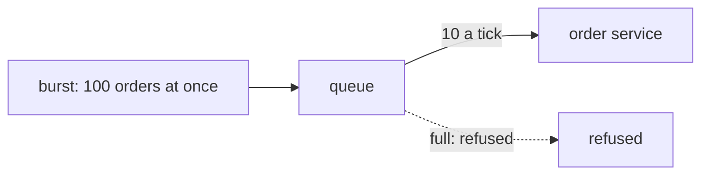

# Queue-Based Load Leveling Pattern — Architecture Diagram

The burst goes into the queue. The worker takes from it at its own pace.

Mermaid source

```mermaid
flowchart LR
    B["burst: 100 orders at once"] --> Q["queue"]
    Q -->|10 a tick| W["order service"]
    Q -.->|full: refused| R["refused"]
```

