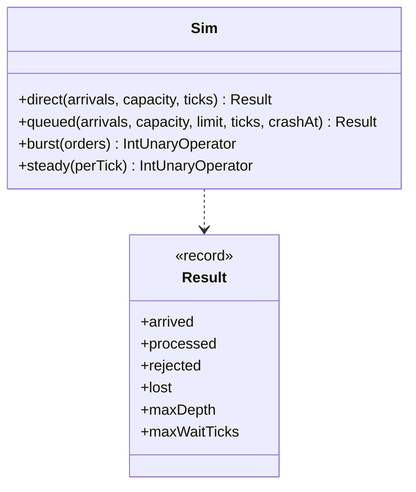

# Queue-Based Load Leveling Pattern — Class Diagram

A model with two entry points: straight to the worker, or through a queue.

Mermaid source

```mermaid
classDiagram
    class Sim {
        +direct(arrivals, capacity, ticks) Result
        +queued(arrivals, capacity, limit, ticks, crashAt) Result
        +burst(orders) IntUnaryOperator
        +steady(perTick) IntUnaryOperator
    }
    class Result {
        <<record>>
        +arrived
        +processed
        +rejected
        +lost
        +maxDepth
        +maxWaitTicks
    }
    Sim ..> Result
```

