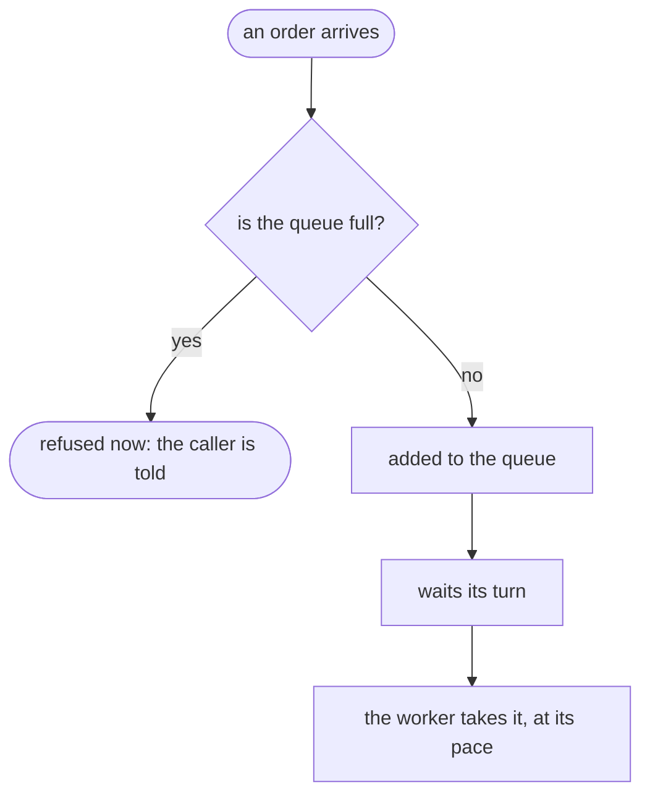

# Queue-Based Load Leveling Pattern — Data Flow Diagram

What happens to one order.

Mermaid source

```mermaid
flowchart TD
    Arr(["an order arrives"])
    Full{"is the queue full?"}
    Ref(["refused now: the caller is told"])
    Add["added to the queue"]
    Wait["waits its turn"]
    Take["the worker takes it, at its pace"]
    Arr --> Full
    Full -- yes --> Ref
    Full -- no --> Add --> Wait --> Take
```

