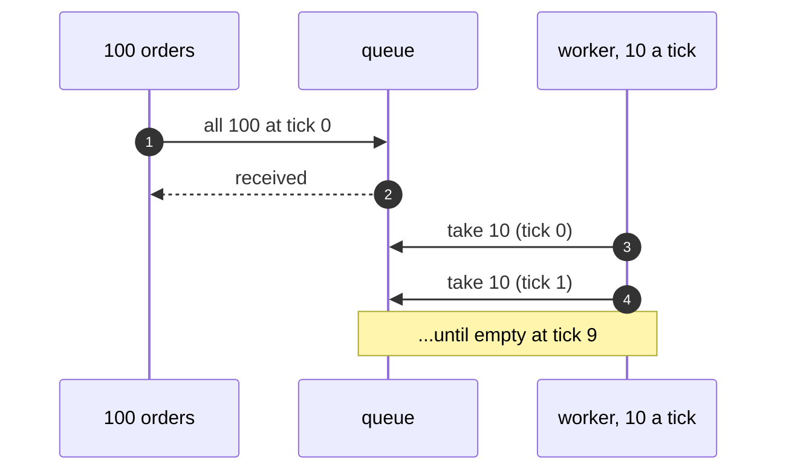

# Queue-Based Load Leveling Pattern — Sequence Diagram

Written for a listener with the screen off.

Say it in words. A hundred orders arrive at the start of a sale. Each is put in the queue, and each customer is told the order was received. The worker takes ten in the first tick, ten in the next, and so on, so that after ten ticks the queue is empty. The last order waited nine ticks, and nothing was refused.

Mermaid source

The load-bearing sentence: **the queue absorbs the difference between the burst and the worker's pace.**
