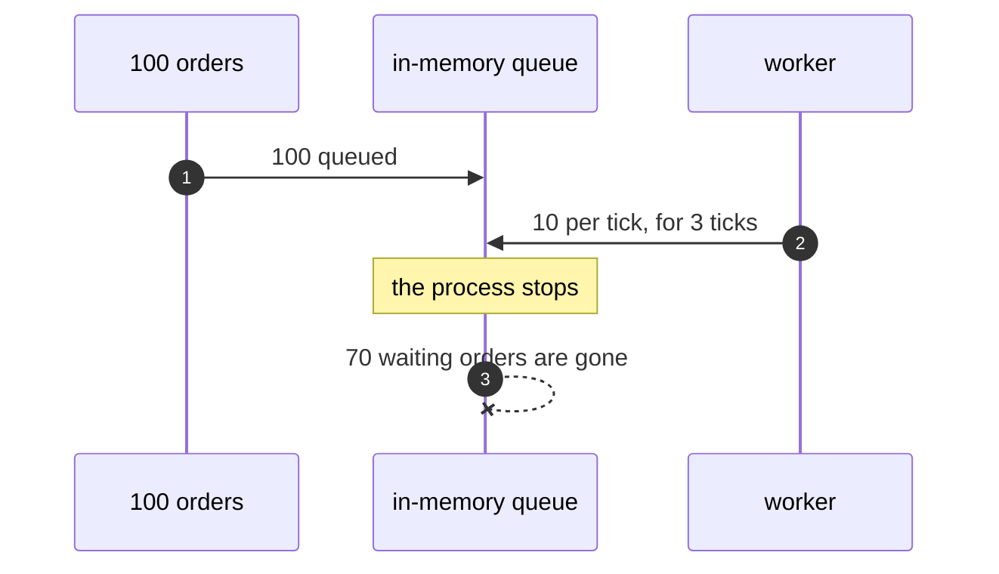

# Queue-Based Load Leveling Pattern — UML Sequence Diagrams

Four sequences.

## 1. A Crash

Mermaid source

```mermaid
sequenceDiagram
    autonumber
    participant C as 100 orders
    participant Q as in-memory queue
    participant W as worker
    C->>Q: 100 queued
    W->>Q: 10 per tick, for 3 ticks
    Note over Q: the process stops
    Q--xQ: 70 waiting orders are gone
```

