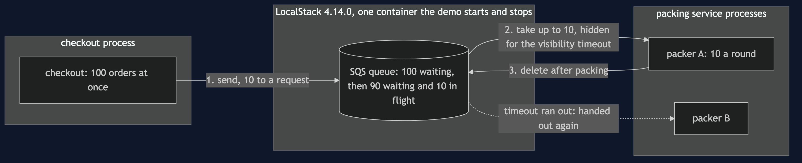
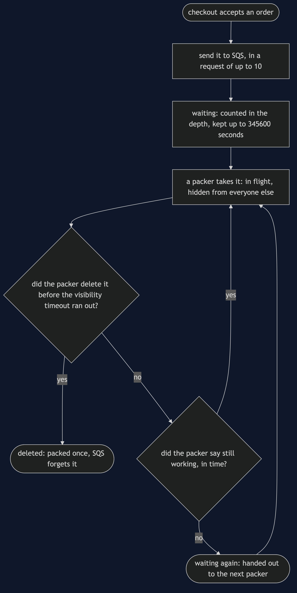
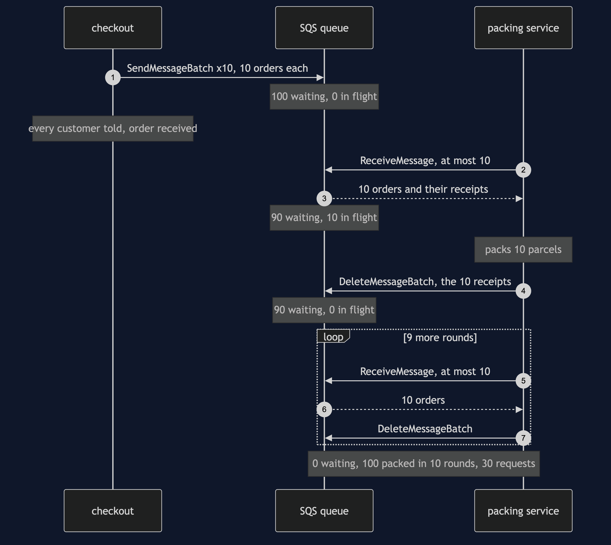

# Queue-Based Load Leveling with SQS Pattern

```
src/main/java/com/jk/explore/loadlevelingsqs/
├── LoadLevelingSqsDemo.java   the six acts
├── OrderQueue.java            one SQS queue: send 10 at a time, take, delete, say "still working", its depth
├── Packer.java                the worker: take up to 10, pack, then delete
├── Warehouse.java             counts every parcel, so an order packed twice shows
├── Checkout.java              numbers the orders in a burst
├── LocalStack.java            starts and stops LocalStack; counts every request
└── Poll.java                  every wait is a question asked until the answer is yes
```

**On real Amazon SQS a taken order is not removed, only hidden, and only for a while. A packer slower than that while — SQS calls it the visibility timeout — gets its order handed to a second packer, and ORD-3001 is packed 2 times. The same rule is why nothing is lost: when a packer's process stops half way through a round, SQS reports 90 waiting and 7 in flight, and the 7 come back on their own. The burst of 100 shows up in SQS's own depth count, and SQS will let that depth grow without limit.**

**This project needs a container runtime.** Docker Desktop, or anything Docker-compatible, must be running before you start. The demo brings LocalStack up in one container, playing Amazon SQS, and takes it down again at the end; nothing is installed, no AWS account is needed, and nothing is left behind. With no runtime, the demo prints two sentences saying what to do, and stops, rather than a stack trace.

This project is the real-infrastructure version of the plain-Java Queue-Based Load Leveling project in this course. That project built the queue and the worker itself, in memory, with a clock of ticks. This one puts the orders on Amazon's queue, through LocalStack, and shows what the real service decides that a simulation leaves to its author.

## The pattern, in plain words

Think of a busy post office on the day before a holiday. A crowd arrives at once. The clerk at the counter can serve one person at a time, at the clerk's own speed. A ticket machine at the door gives each person a number, and they wait. Nobody is sent home, and the clerk is never rushed; the crowd simply waits a little longer.

In the shop: a sale sends 100 orders in the same moment. The packing service can pack 10 a round. Checkout does not hand the orders straight to the packers. It puts each order on a queue and tells the customer "we have your order" at once. The packing service takes orders off the queue at its own pace. The queue is the ticket machine: it turns a burst into a steady line.

## Run

```bash
./gradlew run
```

Six acts, against the real SQS API. Every number quoted below, and in every document and slide in this project, comes from this program's own output. Two runs back to back print exactly the same thing.

```
ONE. A burst lands on the queue.
  100 orders arrive at once. checkout puts each one on a queue on Amazon SQS, played by LocalStack.
  11 orders in one request: Maximum number of entries per request are 10. You have sent 11.
  so the burst goes as 10 requests of 10. SQS reports 100 waiting and 0 in flight.
  nobody was refused. SQS keeps an order nobody takes for 345600 seconds, which is 4 days.
TWO. The packer keeps its own pace.
  the packing service asks for 11 at once: Value 11 for parameter MaxNumberOfMessages is invalid. Reason: Must be between 1 and 10, if provided.
  it takes 10. SQS now reports 90 waiting and 10 in flight: taken, not yet finished.
  it packs and deletes them. waiting after each round: 90, 80, 70, 60, 50, 40, 30, 20, 10, 0.
  100 packed in 10 rounds, never more than 10 at once. the deepest the queue got: 100.
THREE. Taken is not removed.
  SQS hides a taken order for a while, then hands it out again. it calls that time the visibility timeout. the default is 30 seconds.
  this queue's timeout is 2 seconds. a packer takes ORD-2001 and stops before it finishes. SQS reports 0 waiting and 1 in flight.
  a second packer asks at once, and is given 0 orders.
  it keeps asking. ORD-2001 comes back once the 2 seconds have passed, not before: true. SQS has now handed it out 2 times.
  SQS never knew the first packer stopped. it only knew the time ran out.
FOUR. A slow packer.
  packer A takes ORD-3001 and needs longer than 2 seconds. the time runs out, and packer B is given ORD-3001 too.
  both pack it and both delete it. ORD-3001 was packed 2 times: two parcels for one order.
  next, packer A takes ORD-3002 and, before its time runs out, tells SQS it is still working: hide it 10 seconds more.
  packer B asks SQS to hold its question open for 3 seconds, past the old timeout. it is given 0 orders.
  packer A finishes and deletes. ORD-3002 was packed 1 time.
FIVE. The packer stops half way through a round.
  100 orders on a queue with a 2-second timeout. the packer takes 10, finishes 3, and its process stops.
  SQS reports 90 waiting and 7 in flight. nothing is lost; 7 are only hidden.
  when the timeout runs out they come back: 97 waiting. a new packer drains the queue.
  packed: 100, lost: 0, packed twice: 0. orders SQS handed out a second time: 7.
  the queue outlived the process reading it.
SIX. The bill.
  asked for a queue that holds at most 50 orders, SQS answers: Unknown Attribute MaximumDepth.
  orders arrive at 15 a round and the packer does 10, for 20 rounds. SQS refused none. waiting: 100, and growing.
  nothing warns you. the depth is a number you ask SQS for, and act on: more packers, or a limit of your own.
  100 orders, 10 to a request: 30 requests (SendMessageBatch x10, ReceiveMessage x10, DeleteMessageBatch x10). one at a time: 300.
  a taken order can come back, so packing one twice must do no harm. this demo needed 1 container for 1 queue service.
```

The LocalStack image is about 1.15 GB once unpacked, and the first run downloads it. After that a run takes about twenty seconds, of which a few are LocalStack starting and several more are the demo genuinely waiting for SQS's 2-second timeouts to run out, and for one 3-second long poll. LocalStack listens on a free port Testcontainers picks, so it does not collide with anything else on 4566.

**The one figure that is a description rather than a number** is when ORD-2001 comes back in act three. It returns a little after the 2 seconds, and exactly how long after depends on the machine, so the demo prints whether it came back only after the timeout had passed — which is always true — rather than the milliseconds.

## Test

```bash
./gradlew test
```

3 test classes, 10 test methods. `PlainPartsTest` needs nothing installed: the order ids, the warehouse's parcel count, and SQS's 10-per-request ceiling. `RealSqsTest` starts one LocalStack container for the whole class and asks SQS directly: 10 orders go in one request and 11 are refused, both ways; a burst builds its full depth and drains at most 10 a round; a taken order is hidden and then handed out a second time; saying "still working" keeps it hidden past the old timeout; orders held by a packer that stops come back and none is lost; and there is no setting for the deepest a queue may get. `DemoRunsTest` runs the demo and asserts every figure the documents quote.

How many orders one receive hands out is SQS's choice, not the caller's; the caller only sets the ceiling. So `RealSqsTest` asserts the ceiling of 10 and the total of 100, not the size of each round. LocalStack hands out a full 10 every time, which is why the demo's depth readings fall by exactly 10.

There is no `Thread.sleep` anywhere under `src/test`. Every wait is a poll on something SQS can be asked — how many orders are waiting, how many are in flight, whether an order has been handed out — with a sixty-second limit that fails the test rather than hanging it, or SQS's own long poll, where SQS itself holds the question open for a set number of seconds. The tests that need LocalStack are skipped when no container runtime is there; the rest still run. Every container is removed at the end of the demo and of each test class.

## What the simulation got right, and what it left out

This is the reason this project exists, so it comes before anything else.

**What the plain-Java Queue-Based Load Leveling project got right.** All of the shape. A burst of 100 goes on a queue instead of at the worker, nobody is refused, the worker keeps its pace of 10 a round, and the burst is spread over 10 rounds with the queue at its deepest, 100, at the start. The cost is waiting, and a queue fed faster than it is drained grows for ever. Every one of those holds on SQS, and this project's first, second and sixth acts reproduce them with the same numbers: 100 waiting, 10 rounds, and 100 still waiting after 20 rounds of 15 in and 10 out.

**What it left out, first, and the headline find: taken is not removed.** In the simulation an order was either on the queue or done. SQS has a third state. When a packer takes an order, SQS does not remove it; it hides it from everyone else, and SQS reports it as in flight. Only the packer's delete removes it. If the delete does not come within the visibility timeout — 30 seconds by default, 2 seconds in this demo — SQS hands the order out again. Act three shows it: 0 waiting and 1 in flight, a second packer given 0 orders, and then ORD-2001 handed out a second time. SQS never knew the first packer had stopped. It only knew the time had run out.

**Second: a slow packer packs an order twice.** The same rule has a sharp edge. Act four's packer A takes ORD-3001 and is slower than the timeout, so packer B is given ORD-3001 too, and both pack it: 2 parcels for one order. The cure is for the packer to tell SQS, before the time runs out, that it is still working — SQS calls this changing the message's visibility — and then ORD-3002 is packed 1 time. The simulation's worker could never be too slow for its own queue, because the queue had no clock.

**Third: the queue outlives the packer.** The simulation's final act stopped the process holding the in-memory queue at tick 3 and lost 70 orders. On SQS the queue is not in anybody's process. Act five stops the packer part way through a round, holding 10: SQS reports 90 waiting and 7 in flight, the 7 come back when the timeout runs out, and a new packer finishes the job. Packed: 100, lost: 0. The 7 are handed out a second time, which is safe here only because the stopped packer had not packed them yet.

**Fourth: there is no limit to set.** The simulation offered a queue limited to 50 orders that refused the rest. SQS has no such setting: asked for one, it answers "Unknown Attribute MaximumDepth." It accepts every order and keeps it for 345600 seconds, 4 days. A limit, if you want one, is yours to keep, by asking SQS for its depth and acting on it.

**Fifth: 10 at a time, both ways.** The simulation's worker could take any number in a tick. SQS hands out at most 10 orders to one request, and takes at most 10 in one send, and says so in its own words when asked for 11. That ceiling is also the bill: 100 orders cost 30 requests in tens and 300 one at a time.

**What the simulation had that SQS does not.** Exact, repeatable waits in ticks, and a strict first-in, first-out line. On SQS the time until a hidden order returns is only "after the timeout", and an ordinary SQS queue promises to hand orders out in roughly, not exactly, the order they came. LocalStack happens to keep the order and to hand out a full 10 each time, and this project says so wherever it relies on it.

## Technologies and versions

| What | Version | Why it is here |
| --- | --- | --- |
| Java | 21 | The repository standard, via the Gradle toolchain block |
| Gradle | 9.2.1 | The wrapper in this directory; no separate install needed |
| LocalStack | 4.14.0 | Plays Amazon SQS in one container. **Held back:** later images refuse to start without a LocalStack account token |
| AWS SDK for Java v2 | 2.55.4 | The `sqs` module through the BOM, the newest release; the same code runs against Amazon itself |
| Testcontainers | 2.0.5 | `testcontainers-localstack`; starts and stops LocalStack from inside the demo |
| slf4j-simple | 2.0.17 | Logging for the libraries above, turned off so the demo's own output is the only output |
| JUnit 5 | 5.10.2 | Test runner |
| A container runtime | Docker 24 or later, or compatible | Runs LocalStack. Must be running before you start |

Every version is the newest generally available release except LocalStack, which is held at 4.14.0 for the reason above. See [`docs/dependencies.md`](docs/dependencies.md) and [`docs/prerequisites.md`](docs/prerequisites.md).

## Learning Material

| Document | What it covers |
| --- | --- |
| [`docs/problem-statement.md`](docs/problem-statement.md) | A sale's burst, a packer with a fixed pace, and what is new |
| [`docs/queue-based-load-leveling-with-sqs-pattern-explained.md`](docs/queue-based-load-leveling-with-sqs-pattern-explained.md) | SQS's words in plain language, and six acts |
| [`docs/class-diagram.md`](docs/class-diagram.md) | The types |
| [`docs/architecture-diagram.md`](docs/architecture-diagram.md) | Checkout, one queue in one container, and the packers |
| [`docs/data-flow-diagram.md`](docs/data-flow-diagram.md) | What happens to one order |
| [`docs/sequence-diagram.md`](docs/sequence-diagram.md) | Written for a listener with the screen off |
| [`docs/uml-diagram.md`](docs/uml-diagram.md) | Four sequences |
| [`docs/animation.html`](docs/animation.html) | The six acts in a browser |
| [`docs/prerequisites.md`](docs/prerequisites.md) | What you need installed, and what you need to know |
| [`docs/session.md`](docs/session.md) | A one-hour taught session |
| [`docs/dependencies.md`](docs/dependencies.md) | What LocalStack, the AWS SDK and Testcontainers are, what they cost, and why LocalStack is held back |
| [`docs/spec.md`](docs/spec.md) | The generated specification |
| [`docs/youtube.md`](docs/youtube.md) | Title, description and chapters |

### The pattern in one picture


### Where each piece sits



### How one request moves



### Who calls whom, in order



### All four sequences


### Video

Built from [`video/scenes.py`](video/scenes.py) by
[`video/build_video.sh`](video/build_video.sh). The rendered file is not
committed; see the repository README for why.

## Where you have already met this

Every "thank you, we have received your order" page that is followed by an email some minutes later. Amazon SQS in front of AWS Lambda or a fleet of workers that scales on queue depth, Azure Storage Queues and Service Bus, Google Cloud Tasks, and a RabbitMQ or Kafka topic in front of a slow downstream system are the same pattern.

## When this is too much

If load is steady and the service copes, a queue is one more service to run and pay for. If the caller needs the answer now — a price, a stock check — a queue is the wrong shape. And every consumer of an SQS queue must be safe to run twice on the same order, because the visibility timeout guarantees that one day it will be.

## Where this sits

This project is the real-infrastructure version of the plain-Java Queue-Based Load Leveling project, and sits in the micro-services design patterns category of this course.
