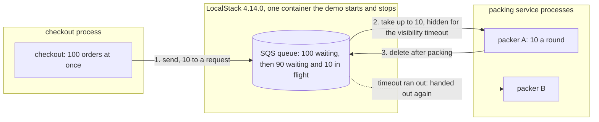

# Queue-Based Load Leveling with SQS Pattern — Architecture Diagram

The queue is not in anybody's process. Checkout puts orders on it, packers take them off, and it lives in SQS, played by LocalStack in one container the demo starts and stops.

Mermaid source

