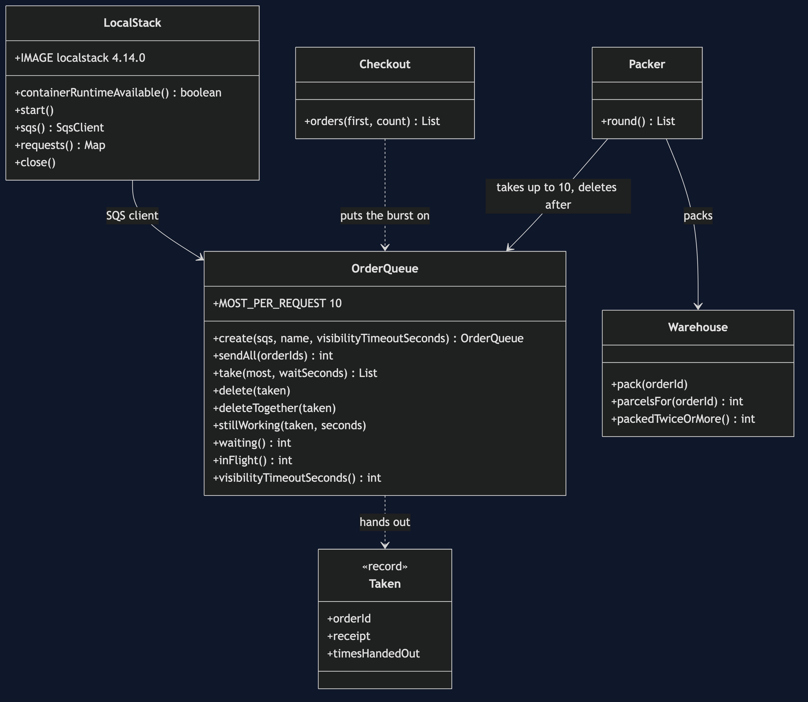
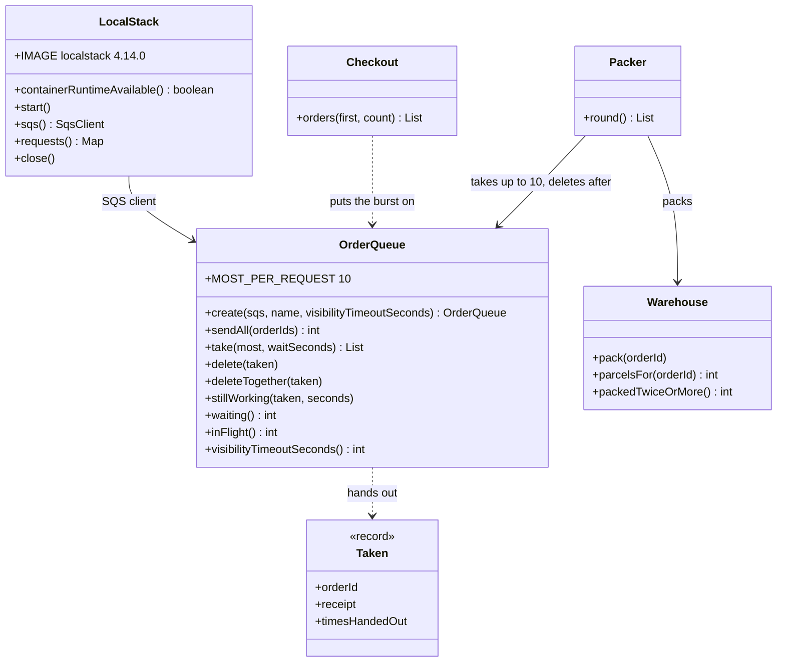

# Queue-Based Load Leveling with SQS Pattern — Class Diagram

The pattern is three small pieces: `Checkout` puts orders on the queue, `OrderQueue` is the queue on Amazon SQS, and `Packer` takes them off at its own pace and deletes them only after packing. `Warehouse` counts parcels so an order packed twice shows; `LocalStack` owns the container.

Mermaid source

