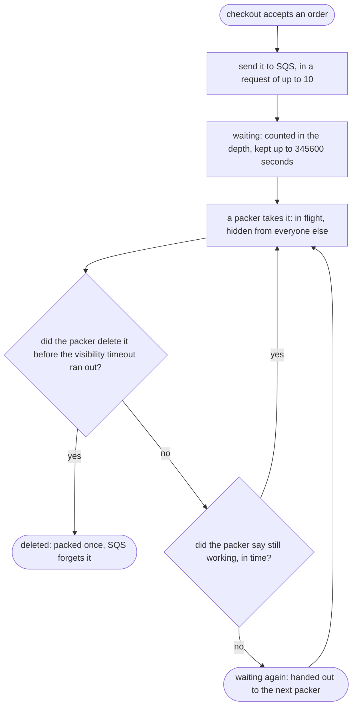

# Queue-Based Load Leveling with SQS Pattern — Data Flow Diagram

What happens to one order, from the moment checkout accepts it to the moment SQS may forget it.

Mermaid source

```mermaid
flowchart TD
    In(["checkout accepts an order"])
    Send["send it to SQS, in a request of up to 10"]
    Wait["waiting: counted in the depth, kept up to 345600 seconds"]
    Take["a packer takes it: in flight, hidden from everyone else"]
    Done{"did the packer delete it before the visibility timeout ran out?"}
    Long{"did the packer say still working, in time?"}
    Gone(["deleted: packed once, SQS forgets it"])
    Again(["waiting again: handed out to the next packer"])
    In --> Send --> Wait --> Take --> Done
    Done -- yes --> Gone
    Done -- no --> Long
    Long -- yes --> Take
    Long -- no --> Again --> Take
```

