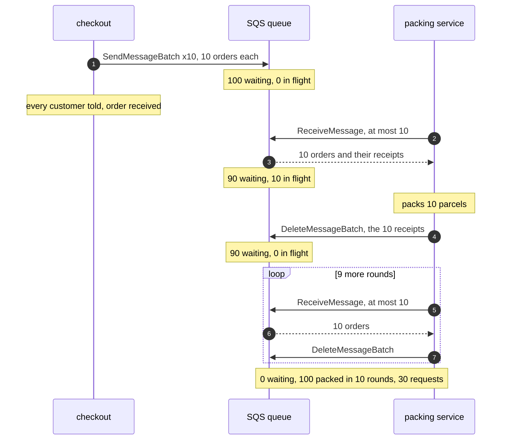

# Queue-Based Load Leveling with SQS Pattern — Sequence Diagram

Written for a listener with the screen off.

Say it in words. A sale begins, and a hundred orders arrive at checkout in the same moment. Checkout does not call the packing service. It sends the orders to the SQS queue, ten to a request, so ten requests in all, and tells each customer at once that the order is received. SQS now reports a hundred orders waiting. The packing service asks SQS for ten orders. SQS hands over ten, and hides them from everyone else: ninety are waiting and ten are in flight. The packing service packs the ten parcels. Only then does it tell SQS they are finished, by deleting them. Ninety are waiting and none is in flight. It asks for ten more, and so on, round after round. After ten rounds the queue is empty and a hundred parcels are packed, and the packing service never did more than ten at once.

Mermaid source

The load-bearing sentence: **a taken order is only hidden, so delete it after the work, never before.**

For the order handed out again, the slow packer, the stopped packer and the refused limit, see [`uml-diagram.md`](uml-diagram.md).
