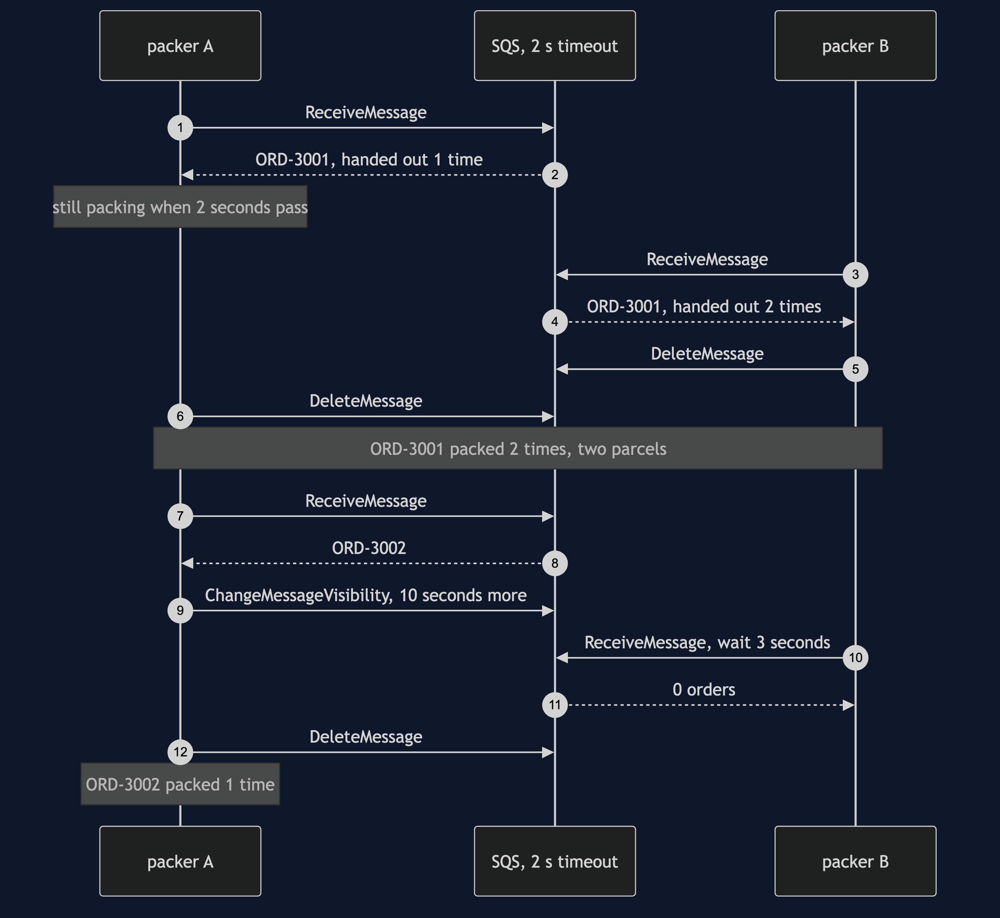
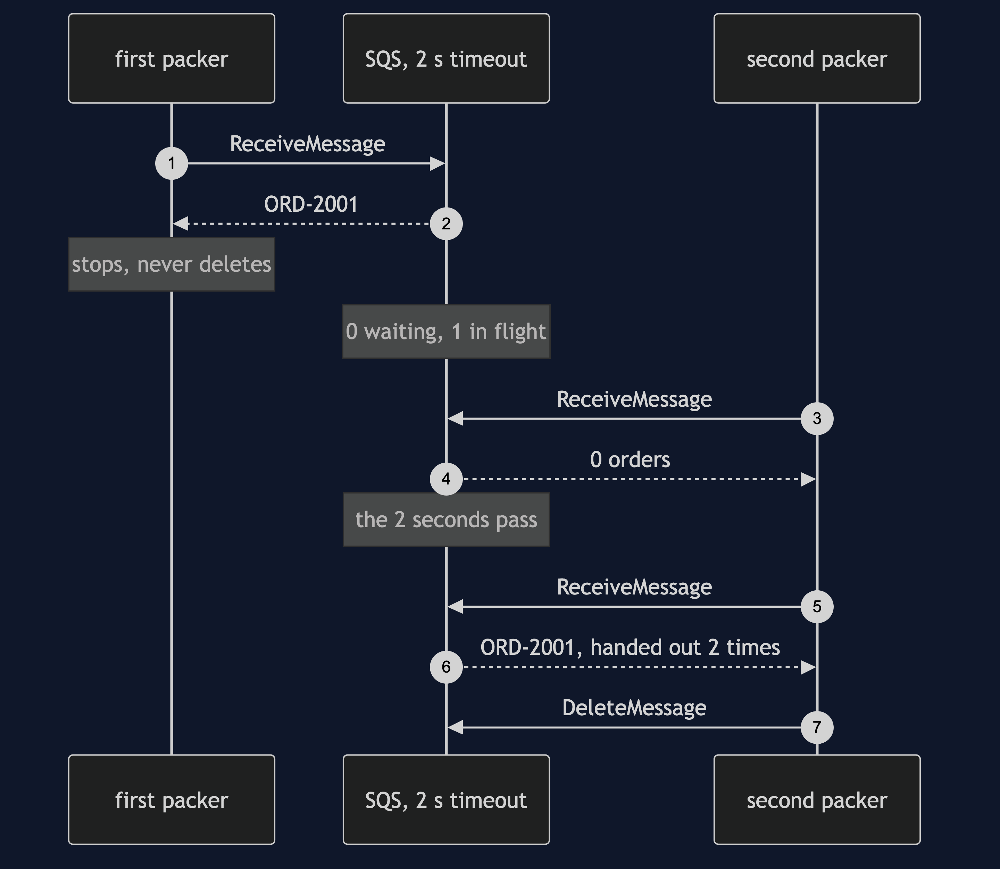
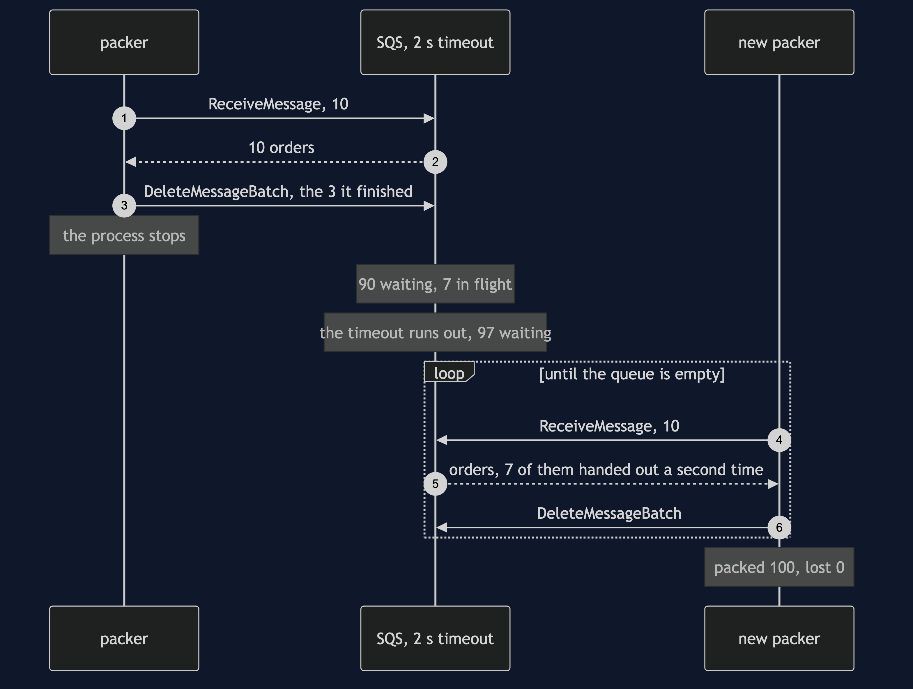
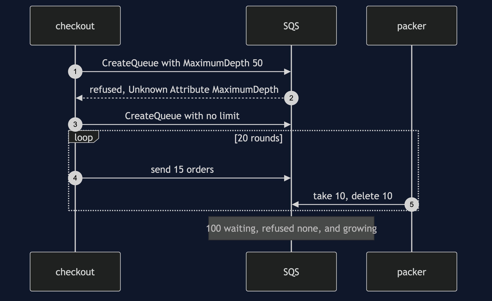

# Queue-Based Load Leveling with SQS Pattern — UML Sequence Diagrams

Four sequences. The slow packer comes first, because two parcels for one order is the one thing the hand-built version could never show.

## 1. A Slow Packer Packs An Order Twice

A queue that hides a taken order for 2 seconds. Packer A takes ORD-3001 and is slower than that. SQS hands the same order to packer B, and both pack it. Then packer A takes ORD-3002 and, in time, tells SQS it is still working; packer B's three-second long poll finds nothing.

## 2. Taken Is Not Removed

A packer takes ORD-2001 and stops without deleting it. SQS hides it, then hands it out again once the 2 seconds have passed.

## 3. The Packer Stops Half Way Through A Round

The packer holds 10 orders, finishes 3, and its process stops. Nothing is lost.

## 4. No Limit To Set

Checkout asks for a queue that holds at most 50 orders, and SQS does not know the setting. Fed at 15 a round and drained at 10, the queue grows and nothing refuses it.

