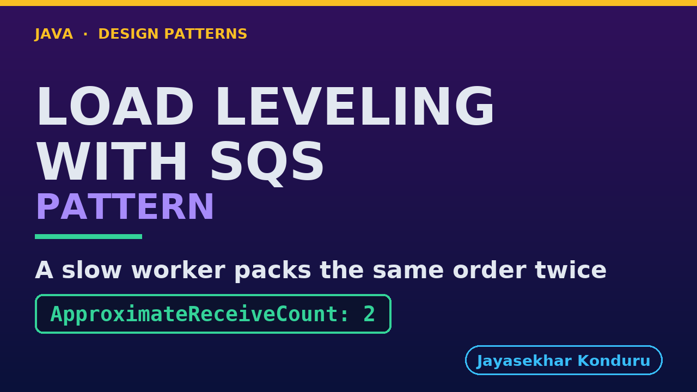

# YouTube — Queue Based Load Leveling With Sqs Pattern

Everything needed to publish `video/queue-based-load-leveling-with-sqs-pattern-explained.mp4`. Copy the fields straight out of this file.

Chapter timings are generated from the video's `.srt`. Re-run `python3 docs/make_youtube_docs.py queue-based-load-leveling-with-sqs` after any change to the narration, or they will be wrong.

## Title

```
Queue-Based Load Leveling with SQS
```

34 characters — under the 60 YouTube shows before truncating in search results.

## Description

The first two lines are what a viewer sees above the fold, so they carry the hook rather than the boilerplate.

```
Learn the Queue-Based Load Leveling pattern in Java with a real Amazon SQS queue running on your own machine. When work arrives in bursts faster than a service can handle, a queue in between lets the burst wait in line while the service keeps its own pace, like numbered tickets at a busy post office. In our online store a sale sends a hundred orders at once, checkout queues them all, and the packer takes ten at a time. We watch the depth a burst builds, learn why a taken message is hidden rather than removed, and see what happens to a slow packer and to one that stops half way.

CHAPTERS
00:00 Introduction
01:08 The Scenario
01:46 A Burst Lands On The Queue
02:28 The Service's Words
03:17 The Packer Keeps Its Own Pace
03:58 Where The Orders Live
04:35 Taken Is Not Removed
05:15 Why Hide, And Not Remove?
05:56 A Slow Packer
06:27 Still Working
07:04 The Packer Stops Half Way
07:49 The Bill
08:34 What The Simulation Left Out
09:14 The Verdict
09:51 What Is Real, And When Not
10:40 Thanks for Watching

SOURCE CODE, WRITTEN NOTES AND AN INTERACTIVE ANIMATION
https://github.com/jk-boot-up/java-design-patterns/tree/main/gradle-java/micro-services-design-patterns/queue-based-load-leveling-with-sqs-pattern

WHAT YOU NEED FIRST
Java 21 and a working knowledge of classes and interfaces. No prior design-pattern knowledge is assumed. The full prerequisites are in docs/prerequisites.md in the repository.
```

## Chapters

YouTube renders these as chapters only if there are at least three and the first is at `00:00`.

```
00:00 Introduction
01:08 The Scenario
01:46 A Burst Lands On The Queue
02:28 The Service's Words
03:17 The Packer Keeps Its Own Pace
03:58 Where The Orders Live
04:35 Taken Is Not Removed
05:15 Why Hide, And Not Remove?
05:56 A Slow Packer
06:27 Still Working
07:04 The Packer Stops Half Way
07:49 The Bill
08:34 What The Simulation Left Out
09:14 The Verdict
09:51 What Is Real, And When Not
10:40 Thanks for Watching
```

## Tags

```
queue based load leveling, amazon sqs, visibility timeout, localstack, design patterns, java design patterns, gang of four, java 21, software design, clean code, object oriented design, java tutorial, ecommerce, programming tutorial
```

232 characters, under YouTube's 500 limit.

## Thumbnail



**Upload `docs/thumbnail.png`** — 1280×720, the size YouTube recommends, generated by `docs/make_thumbnails.py`. It is deliberately not the same image as the video's opening frame: a thumbnail is judged at about 360 pixels wide in a search result, so this one carries only the pattern name, one line of promise and one short piece of code, each set large enough to survive the shrink.

`video/poster.png` is the 1920×1080 opening frame, produced by the video build. It stays in the repository as the title card; it is not what gets uploaded.

YouTube will not pick the thumbnail up on its own — upload it under **Details → Thumbnail → Upload file**. A custom thumbnail requires a verified channel.

## Upload checklist

- [ ] Upload `video/queue-based-load-leveling-with-sqs-pattern-explained.mp4` (1080p, H.264, 30 fps, AAC 48 kHz — already YouTube's recommended settings, no re-encode needed)
- [ ] Set the video language to **English** first, or the subtitle option may not appear
- [ ] Add subtitles: *Video elements → Add subtitles → Upload file → With timing* → `video/queue-based-load-leveling-with-sqs-pattern-explained.srt`
- [ ] Upload `docs/thumbnail.png` as the thumbnail — do not let YouTube auto-pick a frame
- [ ] Paste the title, description and tags from above
- [ ] Add to the **Java Design Patterns** playlist, in learning order
- [ ] Wait for 1080p processing before sharing the link — code slides are unreadable at 360p

## Cards and end screen

End screen links to whichever pattern video goes up next — set it at upload time rather than assuming an order.

Add a card partway through pointing at the playlist, so a viewer who arrives at this pattern from search can find the rest of the series.

## Runtime

Approximately 11:19, narrated at 145 words per minute.
