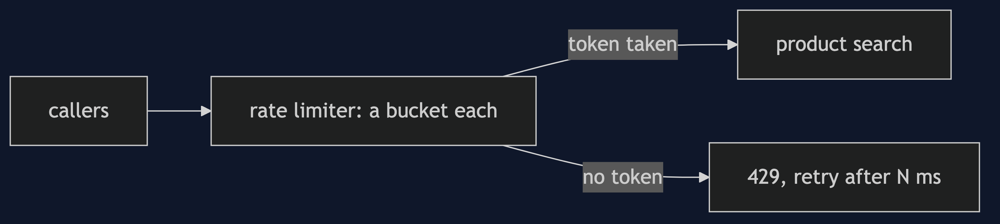
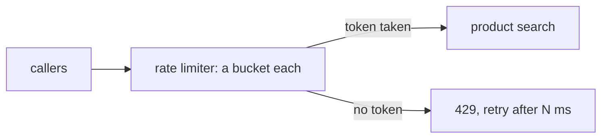

# Rate Limiter Pattern — Architecture Diagram

Requests pass the limiter before they reach the service.

Mermaid source

```mermaid
flowchart LR
    C["callers"] --> L["rate limiter: a bucket each"]
    L -->|token taken| S["product search"]
    L -->|no token| R["429, retry after N ms"]
```

