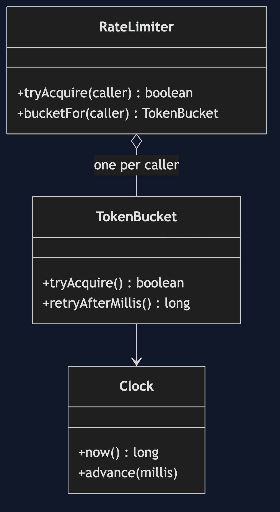
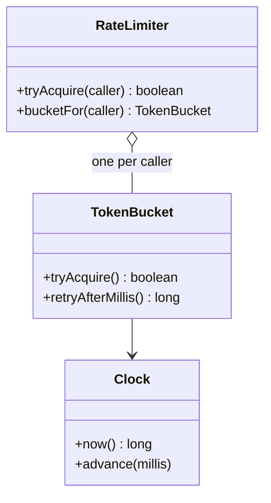

# Rate Limiter Pattern — Class Diagram

A bucket per caller, each with a capacity and a refill rate.

Mermaid source

```mermaid
classDiagram
    class RateLimiter {
        +tryAcquire(caller) boolean
        +bucketFor(caller) TokenBucket
    }
    class TokenBucket {
        +tryAcquire() boolean
        +retryAfterMillis() long
    }
    class Clock {
        +now() long
        +advance(millis)
    }
    RateLimiter o-- TokenBucket : one per caller
    TokenBucket --> Clock
```

