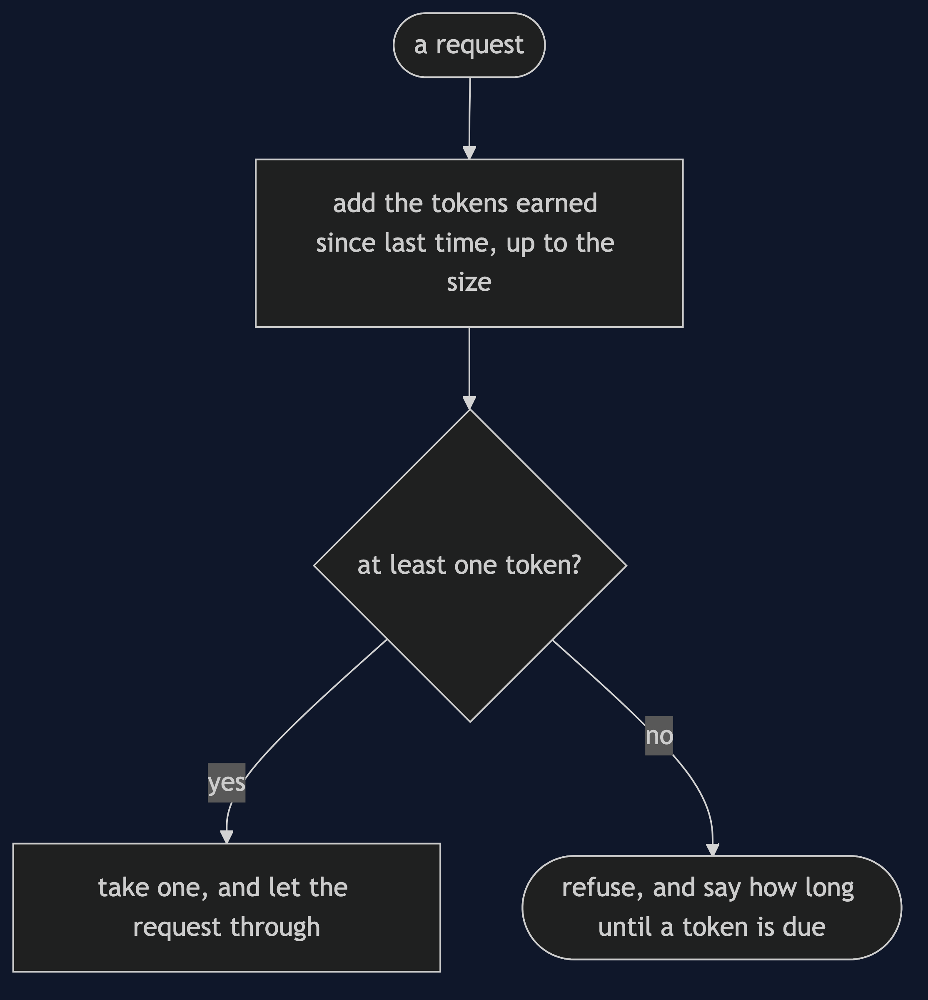
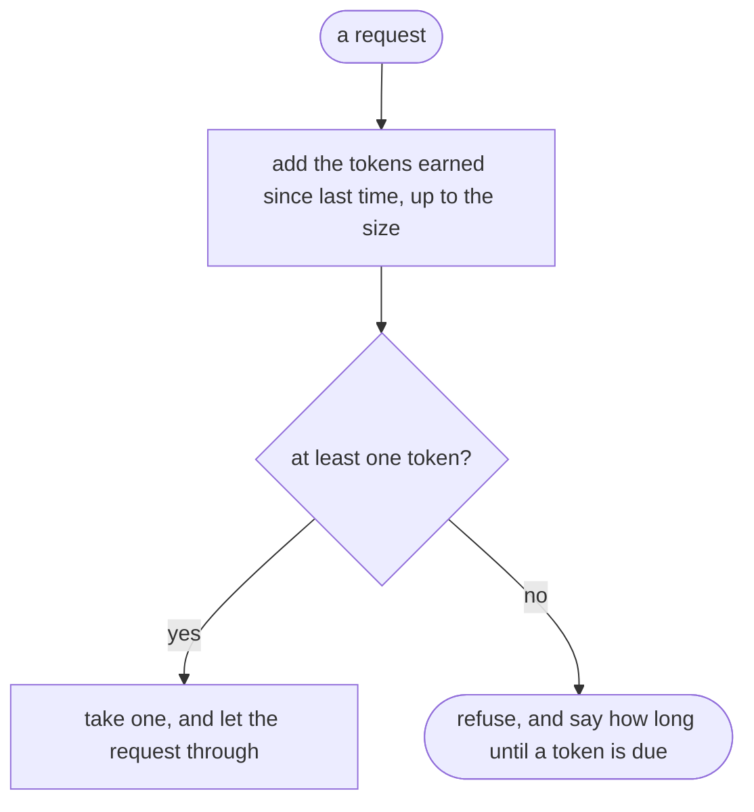

# Rate Limiter Pattern — Data Flow Diagram

What a request does to the bucket.

Mermaid source

```mermaid
flowchart TD
    Req(["a request"])
    Fill["add the tokens earned since last time, up to the size"]
    Has{"at least one token?"}
    Take["take one, and let the request through"]
    No(["refuse, and say how long until a token is due"])
    Req --> Fill --> Has
    Has -- yes --> Take
    Has -- no --> No
```

