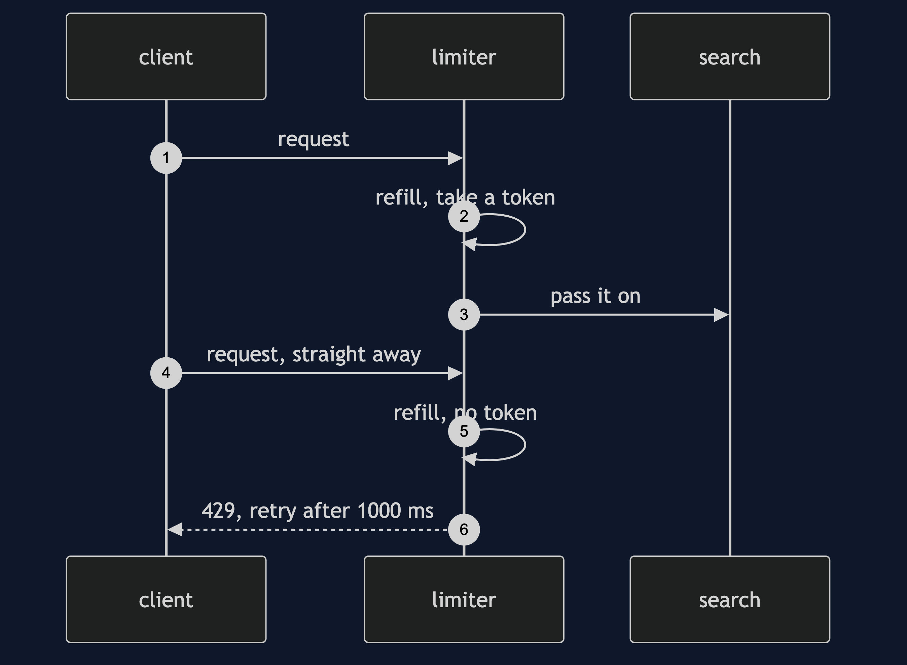
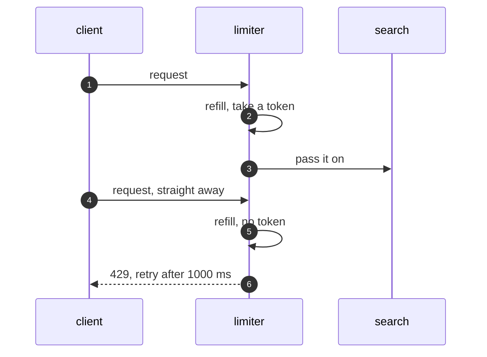

# Rate Limiter Pattern — Sequence Diagram

Written for a listener with the screen off.

Say it in words. A client sends a request. The limiter finds that client's bucket and works out how many tokens have been earned since the last request, without going over the size. There is one token, so it takes it and passes the request on. The client sends another at once. There is none, so the limiter refuses, and works out that one token will be due in a thousand milliseconds, and says so.

Mermaid source

The load-bearing sentence: **the limiter says no early, and says when to come back.**
