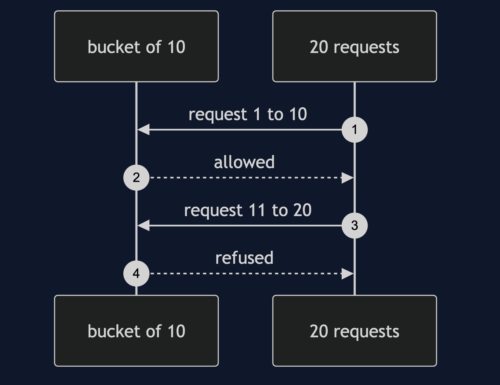
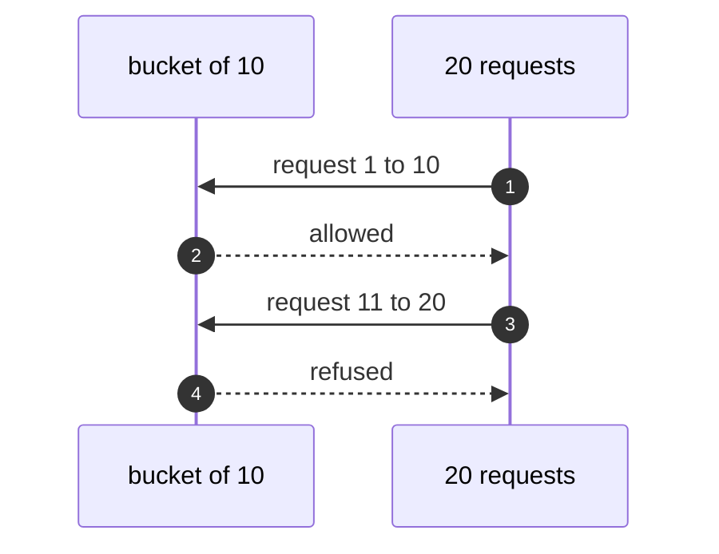

# Rate Limiter Pattern — UML Sequence Diagrams

Four sequences.

## 1. A Full Bucket Empties

Mermaid source

```mermaid
sequenceDiagram
    autonumber
    participant B as bucket of 10
    participant R as 20 requests
    R->>B: request 1 to 10
    B-->>R: allowed
    R->>B: request 11 to 20
    B-->>R: refused
```

