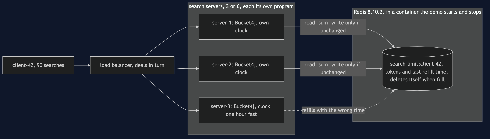
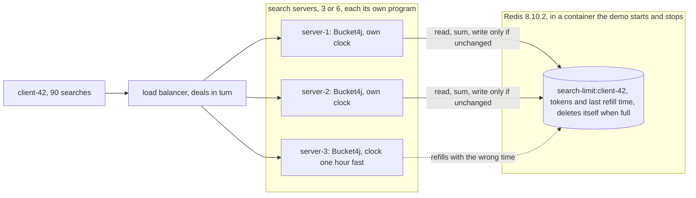

# Rate Limiter with Redis Pattern — Architecture Diagram

Many servers, one Redis. The bucket lives in Redis; the arithmetic on it happens in each server, with that server's clock.

Mermaid source

