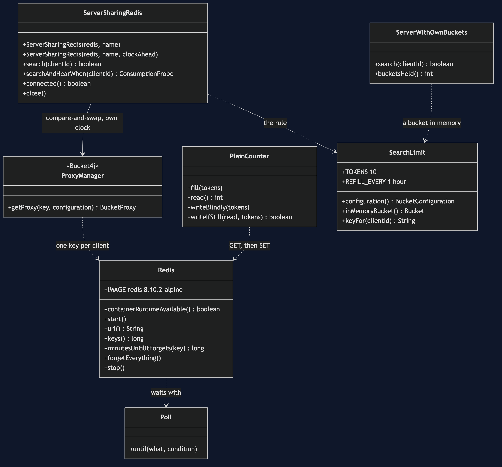

# Rate Limiter with Redis Pattern — Class Diagram

The pattern is one class, `ServerSharingRedis`: a server that keeps no bucket of its own and asks Redis, through Bucket4j, on every search. `ServerWithOwnBuckets` is the twin's limiter, kept for the first act. `PlainCounter` exists only to show the mistake Bucket4j avoids.

