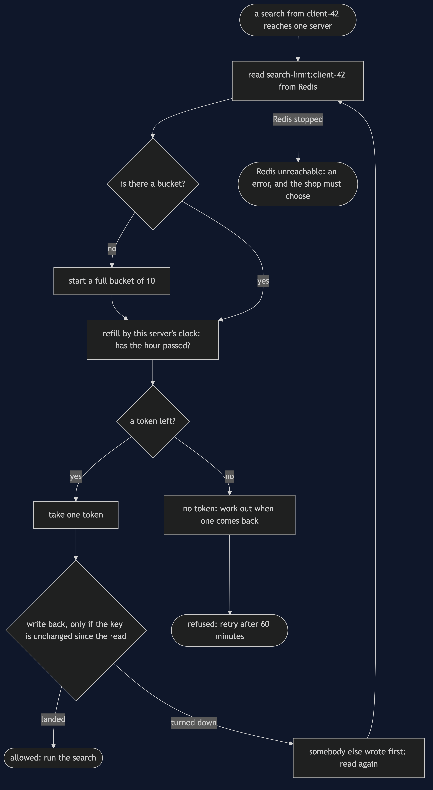
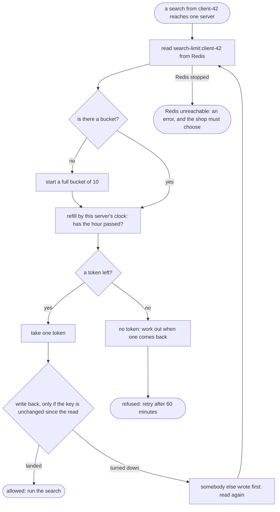

# Rate Limiter with Redis Pattern — Data Flow Diagram

What one search does to the bucket in Redis, from the moment it reaches a server to the moment the server answers.

Mermaid source

```mermaid
flowchart TD
    In(["a search from client-42 reaches one server"])
    Read["read search-limit:client-42 from Redis"]
    None{"is there a bucket?"}
    Full["start a full bucket of 10"]
    Sum["refill by this server's clock: has the hour passed?"]
    Tok{"a token left?"}
    Take["take one token"]
    No["no token: work out when one comes back"]
    Swap{"write back, only if the key is unchanged since the read"}
    Again["somebody else wrote first: read again"]
    Yes(["allowed: run the search"])
    Ref(["refused: retry after 60 minutes"])
    Down(["Redis unreachable: an error, and the shop must choose"])
    In --> Read
    Read -- "Redis stopped" --> Down
    Read --> None
    None -- no --> Full --> Sum
    None -- yes --> Sum
    Sum --> Tok
    Tok -- yes --> Take --> Swap
    Tok -- no --> No --> Ref
    Swap -- "landed" --> Yes
    Swap -- "turned down" --> Again --> Read
```

