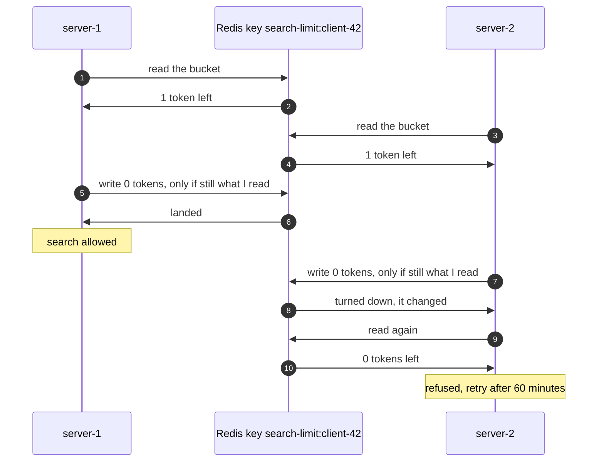

# Rate Limiter with Redis Pattern — Sequence Diagram

Written for a listener with the screen off.

Say it in words. A price-comparison robot called client-42 has one search left of its 10. Two of the shop's search servers get a search from it at almost the same moment. Server one asks Redis for client-42's bucket, and Redis answers: one token left. Server two asks too, before server one has written anything, and also hears: one token left. Server one takes the token and writes back a bucket with none left, but only on one condition: that the bucket in Redis is still exactly the one it read. It is, so the write lands and server one runs the search. Server two now tries the same conditional write. The bucket has changed since server two read it, so Redis turns the write down. Server two reads again, finds no tokens, and refuses the search, telling client-42 to come back in 60 minutes. One token, one search served, one refused.

Mermaid source

The load-bearing sentence: **every server spends from the one bucket in Redis, and a server's write lands only if nobody changed the bucket since it read it, so the last token is spent once.**

For the plain count that spends it twice, the fast clock and the rest of the failure modes, see [`uml-diagram.md`](uml-diagram.md).
