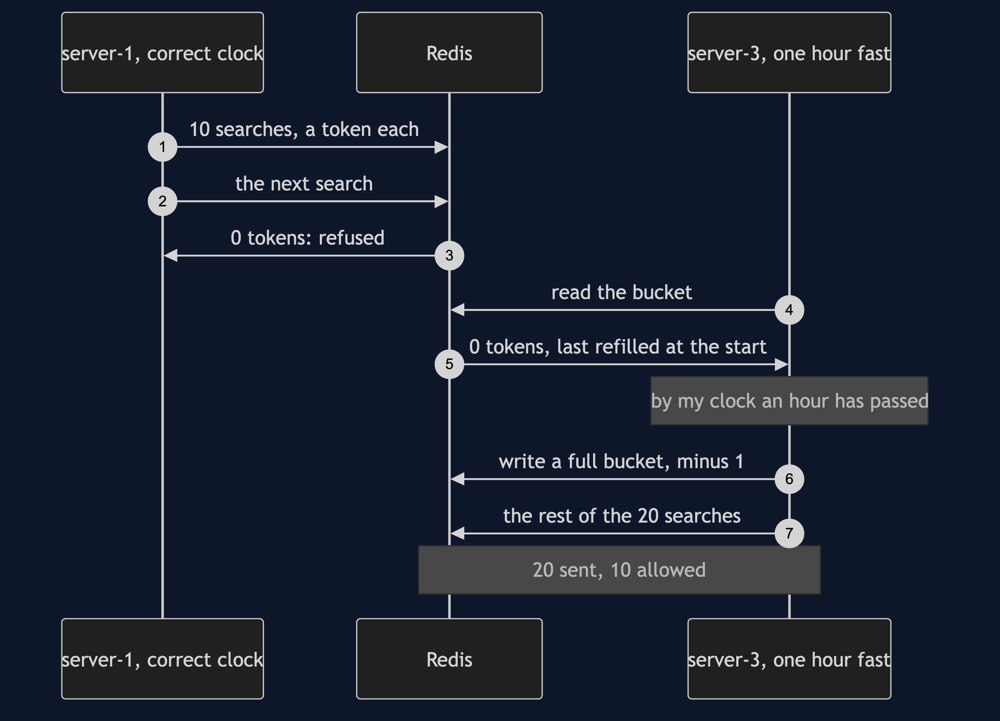
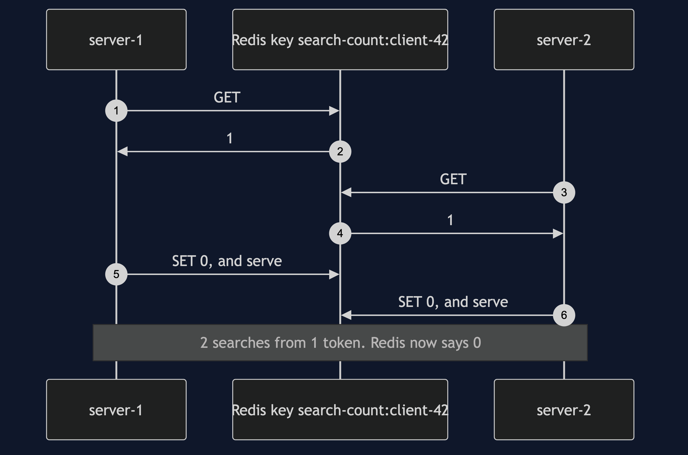
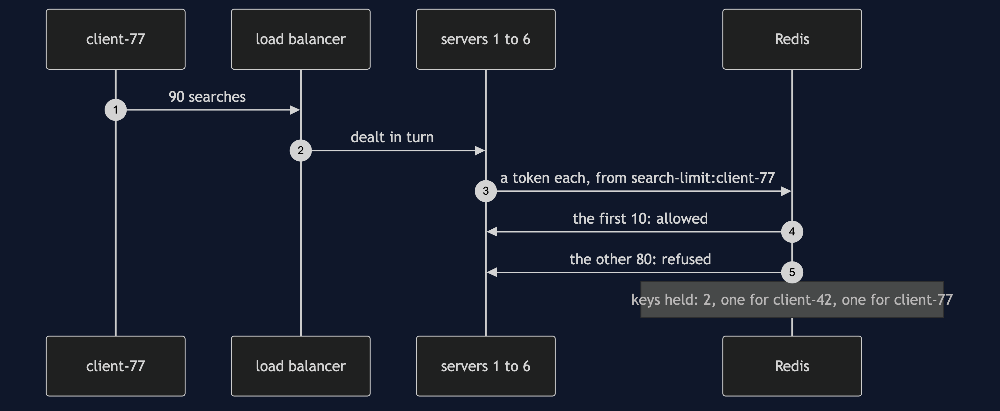
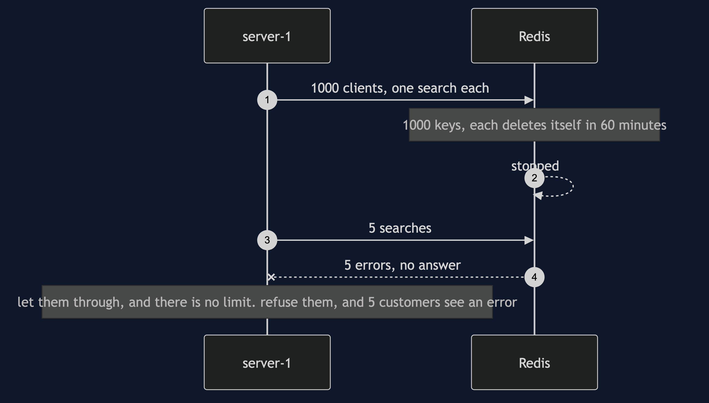

# Rate Limiter with Redis Pattern — UML Sequence Diagrams

Four sequences. The fast clock comes first, because it is the one thing a limiter with a single clock can never show.

## 1. Whose Clock?

Two servers with correct clocks spend client-42's 10 searches, and the next is refused. A third server's clock runs one hour fast. It reads the empty bucket, decides the hour is up, refills it, and lets 10 more searches through. Redis stores whatever the server writes.

## 2. A Number Read And Written In Two Steps

The count is a plain number in Redis. Both servers read it before either writes, so both see the last token and both spend it. Afterwards Redis says 0, and nothing looks wrong.

## 3. Scaled Out, Still One Bucket

Six servers share one bucket. client-77 sends 90 searches, dealt to the servers in turn. 10 are allowed, whichever servers they landed on. Redis holds one key per client, not per server.

## 4. Redis Is Stopped

The shared store is a separate program, and it can go away. A server sends 5 searches to the limiter and gets 5 errors: no yes, and no no. The shop has to decide what an error means.

