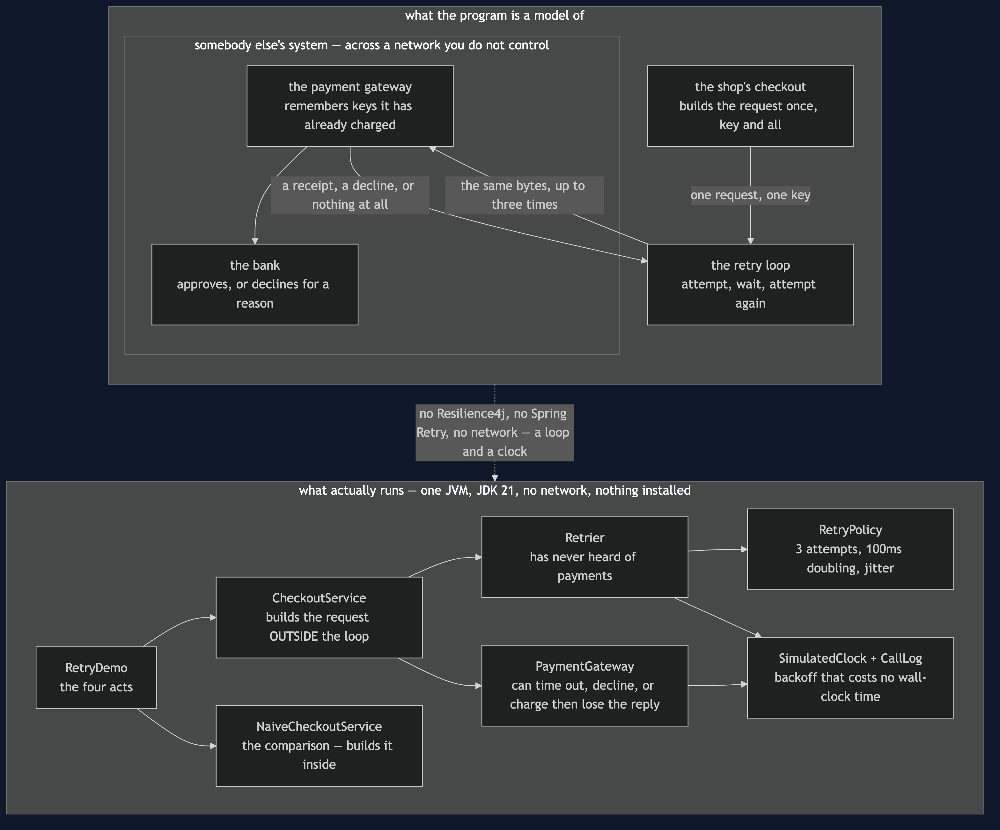
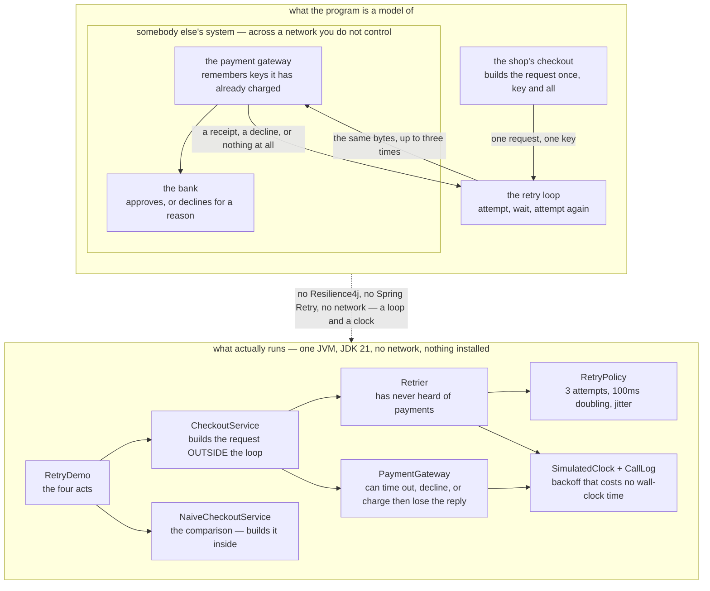

# Retry with Backoff — Architecture Diagram

Where each piece of this project sits, and — because this project starts nothing — what
each piece *stands for*. The class diagram shows the types and the sequence diagrams show
the order of attempts; this one answers the question those two cannot, which is **who is
responsible for what, and which side of the network each responsibility lives on**.

Read the picture as two halves stacked. The upper half is what the program is a model of:
a checkout in the shop, a payment gateway somewhere else run by somebody else, and a bank
behind it. The lower half is the literal truth — one Java program, a retry loop, a fake
gateway that can be told to misbehave, and a clock that only moves when the retrier moves
it.

There are two things to look for, and they are both about boundaries.

The first is that **the retrier does not know what it is retrying**. It takes something
that might work, a policy about waiting, and a rule for telling a temporary failure from a
permanent one. It has never heard of payments. That is why it is a separate box and not a
method on the checkout.

The second is the **key**, drawn crossing the boundary with the request. It is made once,
on the shop's side, before any attempt. Everything that keeps a shopper from paying twice
depends on that key being the same on the second attempt as on the first — and no amount
of cleverness inside the retrier can supply it, because by the time the retrier is involved
the request already exists.

Mermaid source

## What the diagram is telling you to count

**The key is created in the top box and nowhere else.** `CheckoutService` builds the
`PaymentRequest` before entering the retry; `NaiveCheckoutService` builds it inside the
loop, so every attempt carries a new one. That is a one-line difference between the two
boxes in the lower half, and it is the entire difference between charging a card once and
charging it twice.

**The memory that saves you is on the far side.** The gateway is the thing that recognises
a key it has seen before and replays the original receipt. The shop cannot do that for
itself — it cannot even tell whether its lost request arrived. Retry is only safe when the
receiver is prepared for it, which is why "is this operation idempotent" is a question
about somebody else's system.

**`Retrier` has no arrow to `PaymentGateway`.** It calls something that might work and
consults a rule about which failures are worth repeating. Payments happen to be what it is
pointed at in this project, and nothing about the class says so.

**`RetryPolicy` is a box of its own because the waiting is a policy, not a detail.** Three
attempts, 100ms doubling to 200 and 400, plus jitter. Those numbers are configuration in
one place rather than sprinkled through the code, which is what lets a test assert the
sequence exactly.

## What it deliberately leaves out

**There is no circuit breaker here**, and a retry loop without one has a failure mode of
its own: when a service is properly down, every caller politely retrying turns a slow
system into a dead one. That is the next pattern along,
[Circuit Breaker](../circuit-breaker-pattern), and it exists largely because of this one.

There is no budget or deadline either. Three attempts with backoff is up to 700
milliseconds of shopper patience, and a real checkout usually has an overall time limit
that can cut the loop short. Adding it would not change the shape of this picture, only the
numbers in the policy box.

And there is no second instance. The most natural retry in a real system is a retry against
a *different* machine — which is why this pattern sits directly after
[Load Balancing](../load-balancing-pattern). Here the gateway is a single box, so the retry
goes back to the same place, which keeps the diagram about waiting and idempotency rather
than about choosing.
