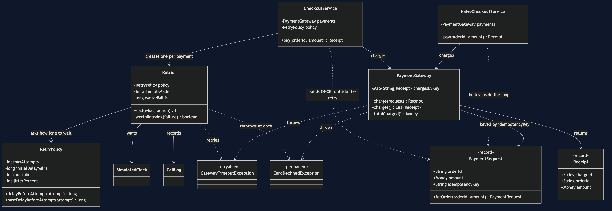
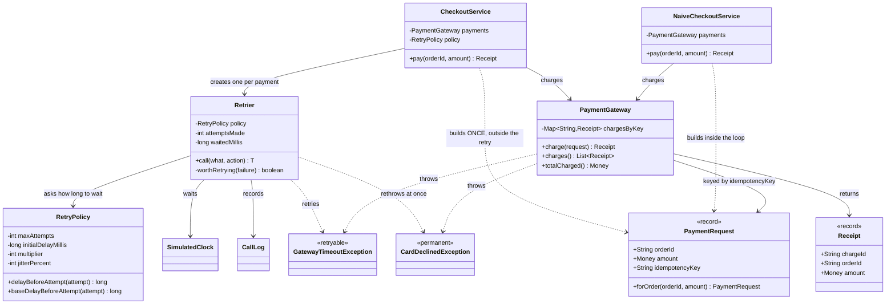

# Retry with Backoff — Class Diagram

Mermaid source

## What the arrows are saying

**`CheckoutService` builds a `PaymentRequest` and then creates the `Retrier`.**
The order of those two things is the entire safety property. The request — and
therefore the idempotency key — exists before the first attempt, so every attempt
carries the same one. `NaiveCheckoutService` has the same two arrows in the
opposite order, and that is the double charge.

**`Retrier` depends on `RetryPolicy`, not the other way round.** The retrier knows
*that* it must wait; the policy knows *how long*. Swapping three attempts with
backoff for three attempts with none is a constructor argument, which is what makes
the "what is jitter worth?" exercise a one-line change.

**`Retrier` points at both exception types, and points at them differently.**
`GatewayTimeoutException` is the one it catches and retries.
`CardDeclinedException` is the one it rethrows immediately. That asymmetry is half
of the pattern, and it is one line of code:
`failure instanceof GatewayTimeoutException`.

**`PaymentGateway` holds a map keyed by the idempotency key.** That map is the
entire idempotency mechanism — the gateway checks it *before* it charges, so a
repeated key returns the charge it already made rather than making another one.
Everything the caller does with keys is only useful because something at the other
end keeps this map.

**Nothing points from `Retrier` to `PaymentRequest`.** The retrier runs a
`Supplier<T>`; it has never heard of payments, keys, or orders, and it could
equally retry a database write or an HTTP GET. That generality is deliberate, and
it is also the pattern's blind spot: the retrier is structurally incapable of
noticing that what it is retrying is unsafe to repeat.

**`NaiveCheckoutService` has no arrow to `Retrier` or `RetryPolicy` at all.** It
sits beside the pattern rather than inside it, kept in the project on purpose so
that the comparison is something you can run rather than something a document
asserts. All five of its tests pass.

**Both exception classes are marked with what they mean, not with what they
extend.** `<<retryable>>` and `<<permanent>>` are the only classification in the
system. A team that adds a third failure type has to decide which of the two it is,
and the decision is deliberately impossible to avoid.
