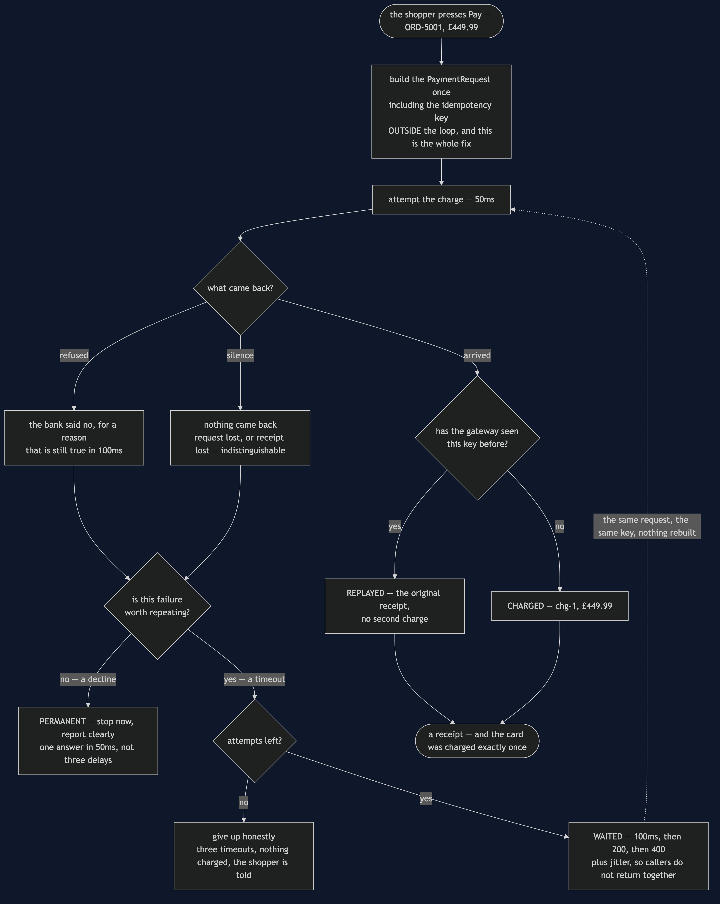
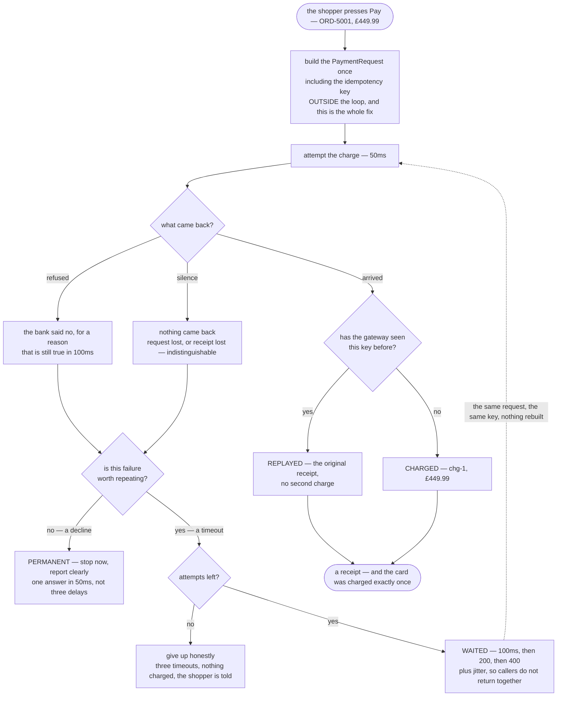

# Retry with Backoff — Data Flow Diagram

One checkout, followed from the moment the shopper presses Pay to the moment the shop has
a receipt or an honest failure. The architecture diagram says who is responsible for what;
this one says **what decision is taken after each failure, and what is carried unchanged
into the next attempt**.

The single most important feature of the picture is where the request is built. It is at
the top, **outside the loop**, and every arrow that goes back round re-sends the same
object with the same idempotency key. Move that one box inside the loop and the diagram
still works, the tests still pass, nothing throws — and the shopper is charged twice.

The second thing to follow is the fork after a failure. There are two questions, asked in
this order: *is this the kind of failure that might not happen again*, and *have I any
attempts left*. Answering the first one wrongly is how a declined card gets asked three
times; answering the second one wrongly is how a retry loop becomes an outage.

Mermaid source

## What the picture is telling you

**The loop carries the same key round, not a copy of the work.** That dotted arrow is the
only thing standing between a lost reply and a double charge. `CheckoutService` builds
above the loop. `NaiveCheckoutService` builds inside it — and act four of the demo ends
with £899.98 leaving a customer's account, with no exception, no error log and no failing
test to show for it.

**Two of the three outcomes look identical from the shop's side.** A request that never
arrived and a receipt that was lost on the way home produce exactly the same silence. The
caller cannot tell them apart and — this is the point — does not need to, because the key
makes both cases safe. Any design that depends on telling them apart is a design that
cannot be built.

**The permanent branch is short on purpose.** A declined card leaves in 50 milliseconds
with a clear answer, rather than after three delays with a vague one. Telling a timeout
apart from a decline is half of what this pattern is, and the half people notice.

**The waits double, and they are not round numbers.** 100, 200, 400 — plus a small random
addition, which is why the demo prints `WAITED 103ms` rather than 100. Jitter exists
because a thousand callers who failed at the same instant will otherwise all come back at
the same instant, and the resulting second surge is frequently worse than the original
failure.

**Giving up is an ending, not a gap.** Three timeouts produce a clean failure with nothing
charged, and there is a test for it. A retry loop with no floor under it does not become
more reliable, it becomes a way of never returning.

## The same checkout without any of this

Delete the loop and the diagram is four boxes: press Pay, attempt, succeed or fail, done.
With a gateway that fails about one call in five, that means one shopper in five is turned
away over a dropped connection — money the shop had earned and threw away.

Delete only the *thinking* and keep the loop — the three-line version everybody writes
first — and you get something worse than either. It rebuilds the request each time, so the
key changes. It waits not at all, so when the gateway is slow because it is overloaded,
this loop is the overload. And it cannot tell a timeout from a decline, so it asks the bank
three times whether the card is still refused. Every one of those is invisible in testing.
The only evidence is on a bank statement, and it arrives as a phone call two days later.
