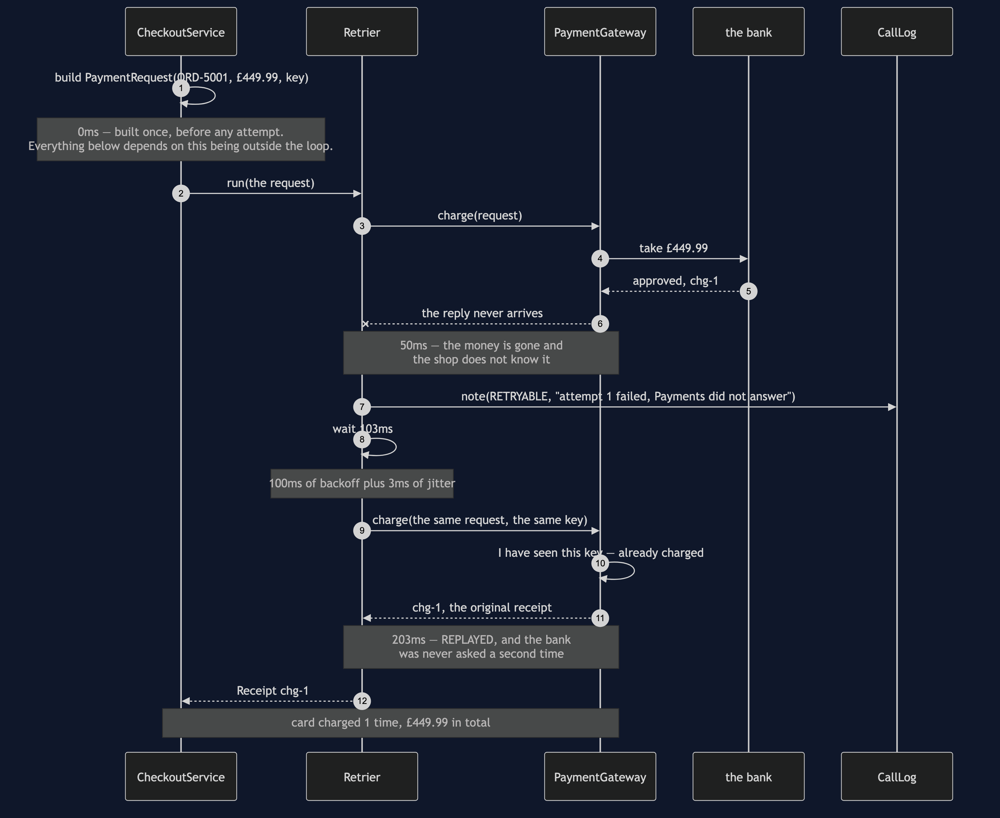
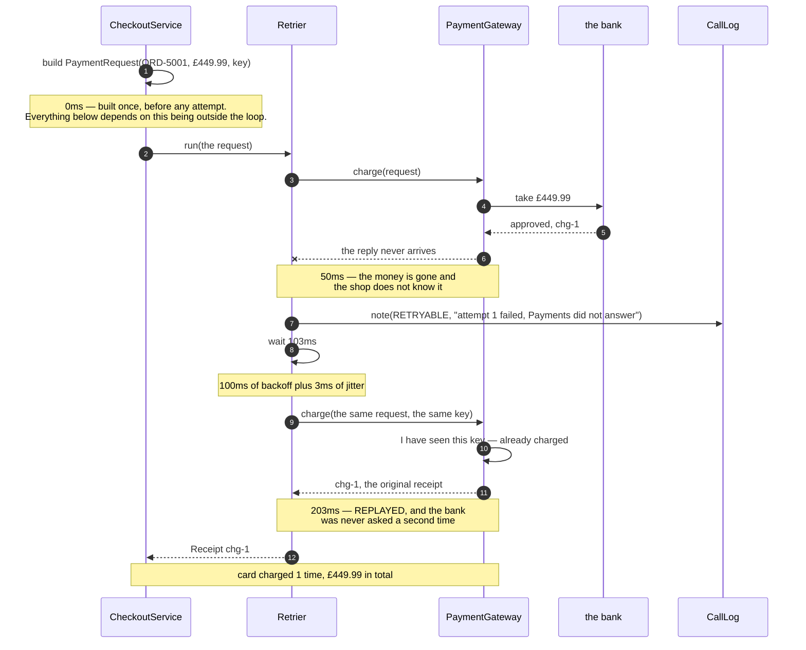

# Retry with Backoff — Sequence Diagram

The one sequence worth having in your head before the others make sense: the card is
charged, the receipt is lost on the way home, the shop times out and tries again — and the
shopper is charged once.

[`uml-diagram.md`](uml-diagram.md) holds the full set of five — a timeout that recovers, a
decline that is not retried, this lost reply, the same failure with a plain loop, and why
jitter exists. This document takes the lost reply, because it is the failure that actually
happens in production and the one the naive loop gets wrong in the most expensive way.

The clock runs in the notes, and the figures are the ones the demo prints: the charge taken
at 50ms, the wait of 103 milliseconds rather than 100, and the replayed receipt arriving at
203ms. The three extra milliseconds are jitter, and they are not a rounding error — they
are the reason a thousand shops that all failed together do not all come back together.

Mermaid source

## Reading the timings

**At 50ms the shop is already wrong about the world.** The money has left the customer's
account and the checkout believes nothing happened. No design can prevent that gap; the
network does not offer a way to lose a reply politely. What a design can do is make the
gap harmless, and the key is how.

**The second attempt never reaches the bank.** Look for an arrow from the gateway to the
bank after 203ms; there isn't one. The gateway recognised the key, skipped the work, and
returned the receipt it had made the first time. That is idempotency doing its job, and
notice where it happens — on the far side, in somebody else's system. The shop cannot
provide it, only rely on it.

**From the caller's side this is indistinguishable from an ordinary timeout.** Act one of
the demo — a request that never arrived at all — produces the same `TIMEOUT`, the same
`RETRYABLE`, the same wait. The shop cannot tell whether it lost the question or the
answer, and the whole point of carrying the key is that it does not have to find out.

**103ms, not 100.** The jitter is small and it is the difference between a recovery and a
second stampede. Every caller that failed at 50ms would otherwise return at exactly 150ms,
which is a thundering herd arriving at a service that has just demonstrated it is having
difficulty.

## What changes when the loop is written the obvious way

Replace `CheckoutService` with `NaiveCheckoutService` and one line moves: the request is
built inside the loop. The diagram then shows a **new key** on the second attempt, the
gateway does not recognise it, and there is a second arrow to the bank. `chg-2` is created,
£899.98 leaves the account, and the sequence ends with a receipt that looks perfectly
normal.

Nothing throws. Nothing is logged as an error. `NaiveCheckoutServiceTest` passes in full,
including the test that asserts the double charge — which is precisely why that test is
written down. This is not a bug you find by asking "did it throw".

Replace the lost reply with a **declined card** and the diagram gets shorter instead of
longer. One attempt, one clear `PERMANENT` note at 50ms, and no wait at all. A card refused
for a reason is refused for the same reason a hundred milliseconds later, and asking the
bank three times turns one clear answer into three delays and a vague one.
