# Retry with Backoff — UML Sequence Diagrams

Five sequences over the same checkout, the same £449.99, and the same gateway.
What changes is only which way the network fails — and in the last one, where a
single line of code sits.

Throughout: one attempt at the gateway costs 50 milliseconds whether it works or
not, and the policy is three attempts with a 100ms wait that doubles, plus up to
20% jitter.

## One Attempt That Recovers, Step By Step

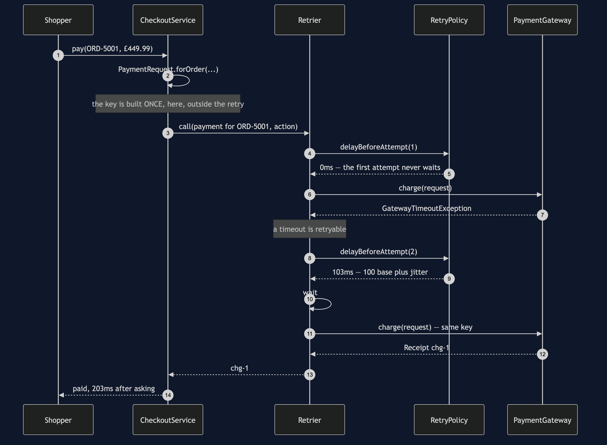

Mermaid source

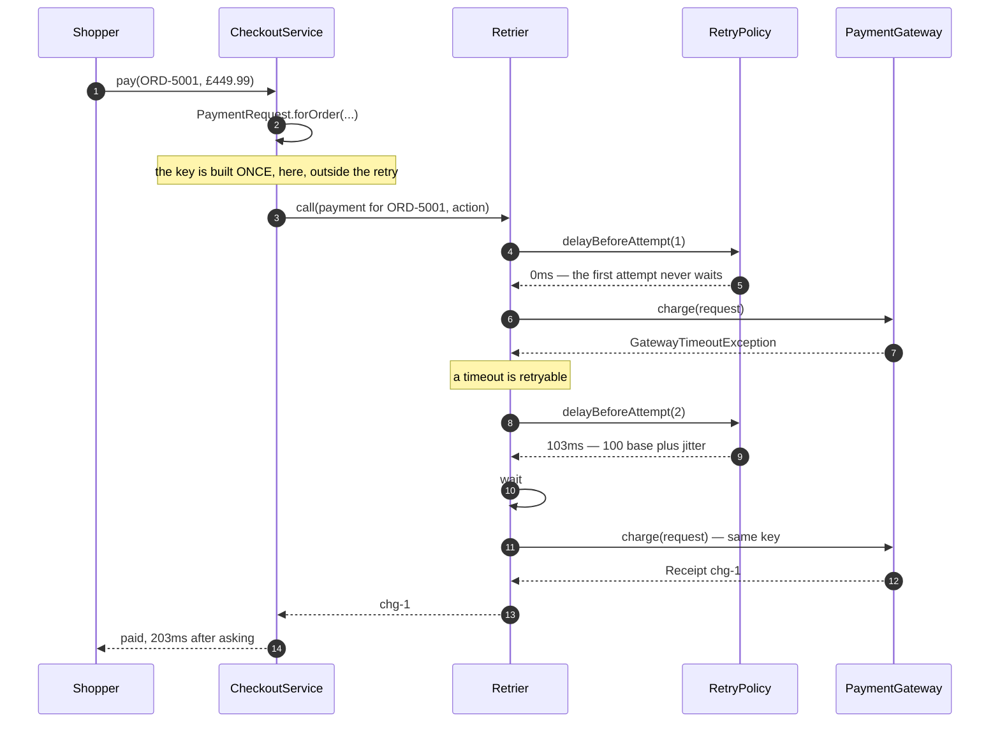

The shopper waited 203 milliseconds instead of 50, and got a completed order
instead of an error page. That trade is the whole reason the pattern exists.

## Act One: A Timeout That Recovers

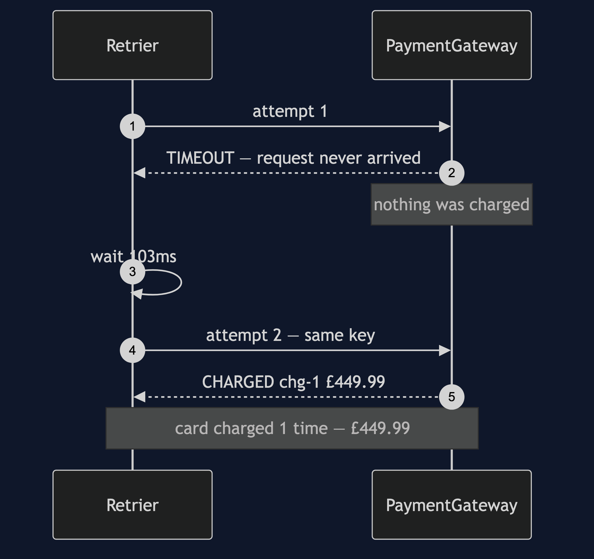

Mermaid source

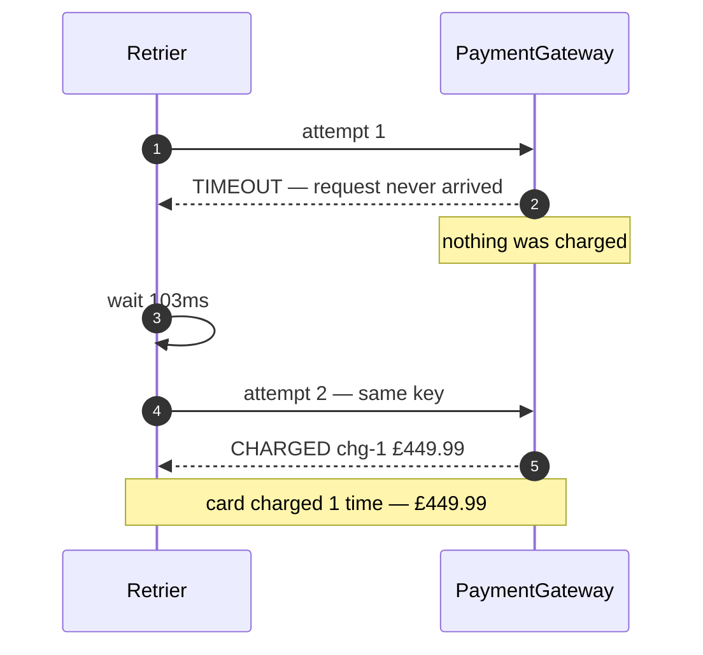

The simple case, and the one everybody has in mind when they write a retry. The
request never reached the gateway, so no money moved, so trying again is plainly
safe.

Note the wait: 103 milliseconds, not 100. Those three extra milliseconds are the
jitter, and with one caller they look like noise. They are not — see act five.

## Act Two: A Declined Card

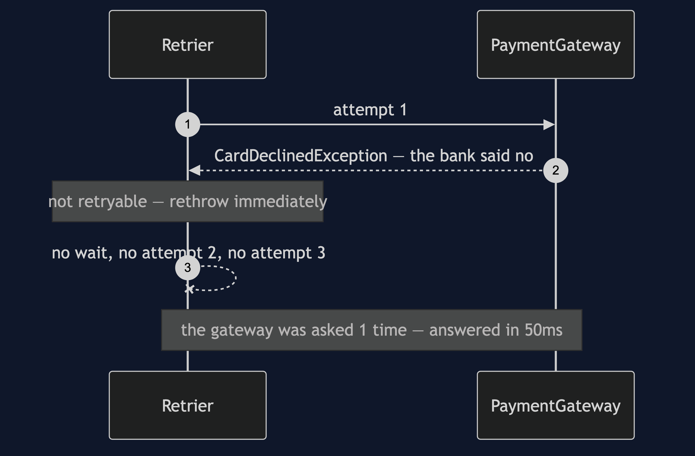

Mermaid source

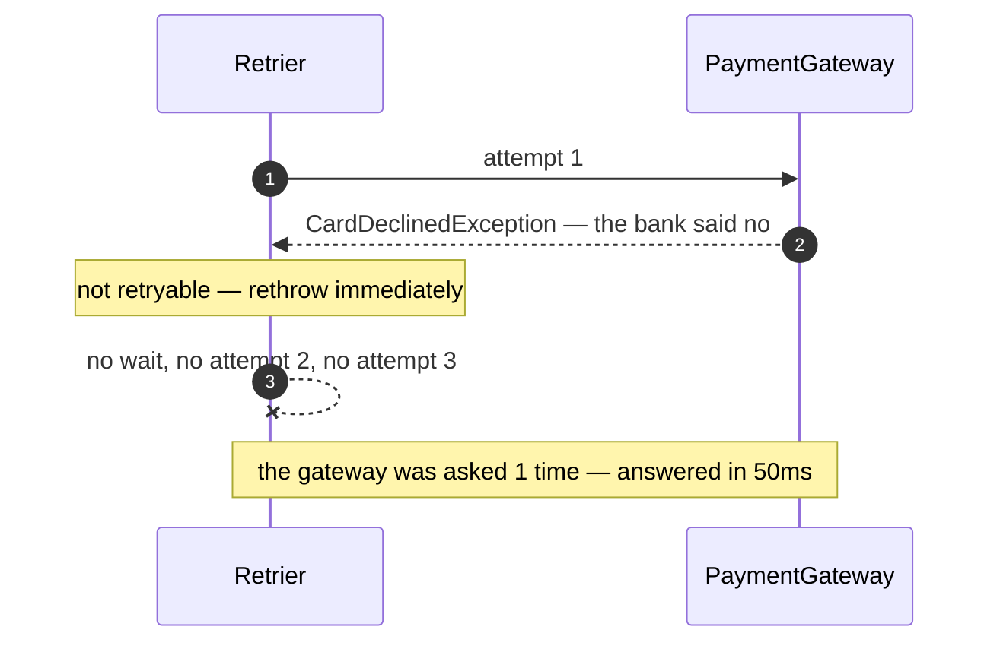

A refused card is refused for a reason, and the reason is still true a hundred
milliseconds later. The naive loop asks three times and takes three delays to
arrive at the same "no".

Telling this diagram apart from the one above it is half of what the pattern is,
and in the code it is one line: `failure instanceof GatewayTimeoutException`.

## Act Three: The Reply That Got Lost

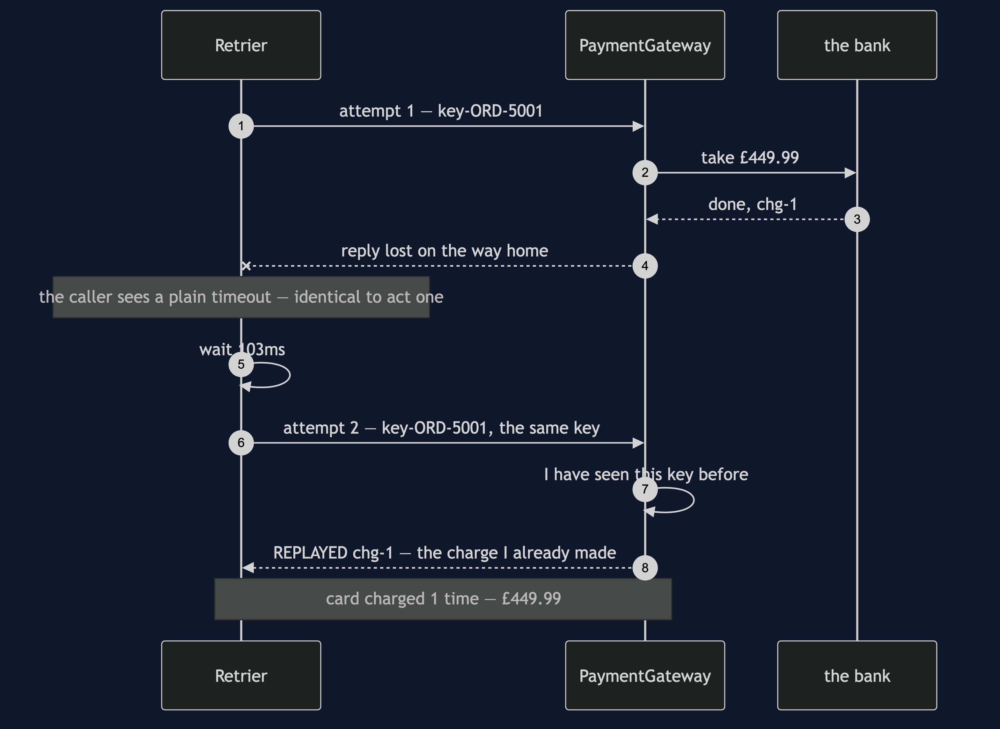

Mermaid source

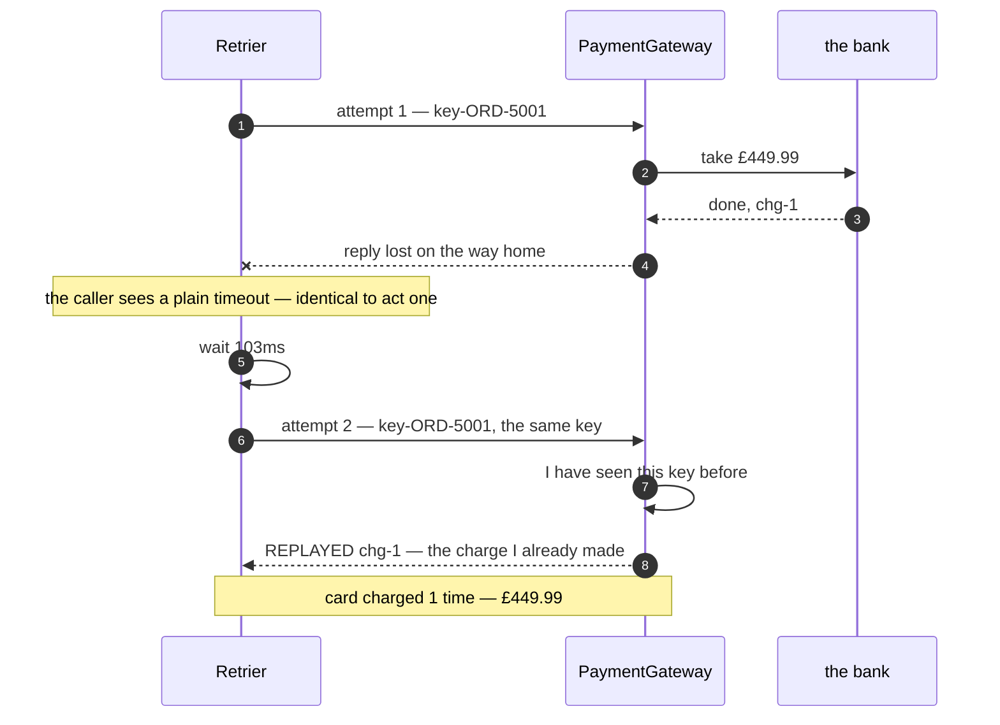

This is the realistic failure and the dangerous one, and the note in the middle is
the sentence to take away: **from the caller's side this is identical to act one.**
There is no flag to check and no clever code that can tell "the request was lost"
from "the receipt was lost". That is a property of networks, not a gap in this
project.

So the careful caller stops trying to tell them apart. It carries the same key,
and the gateway — which checks its key map *before* it charges — recognises the
repeat and hands back the charge it already made.

## Act Four: The Same Failure, With A Plain Loop

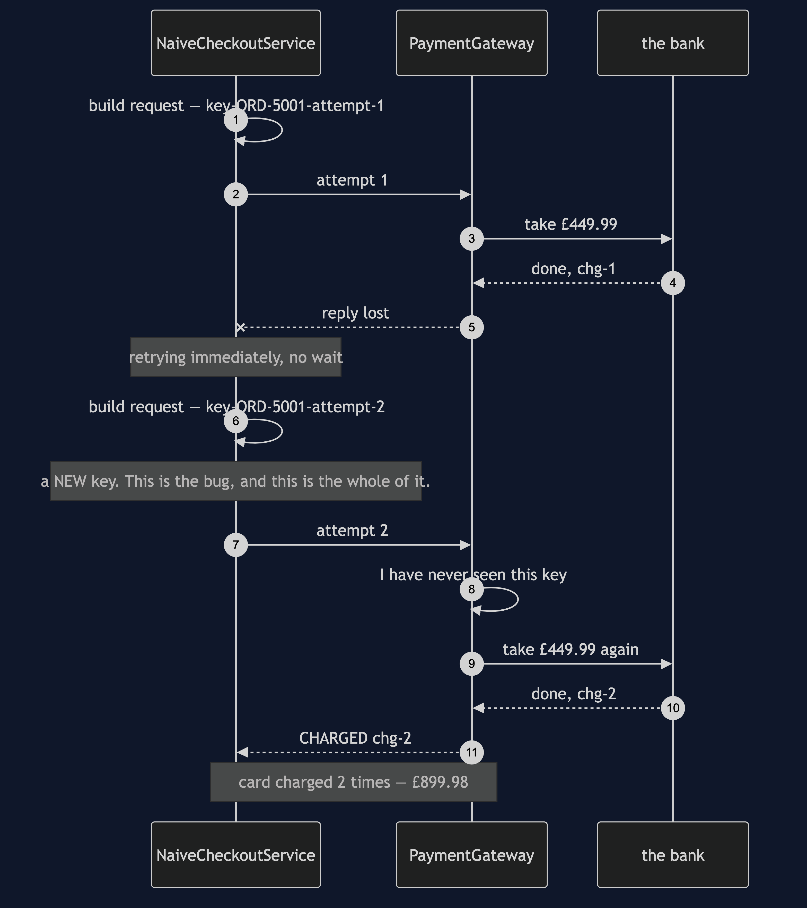

Mermaid source

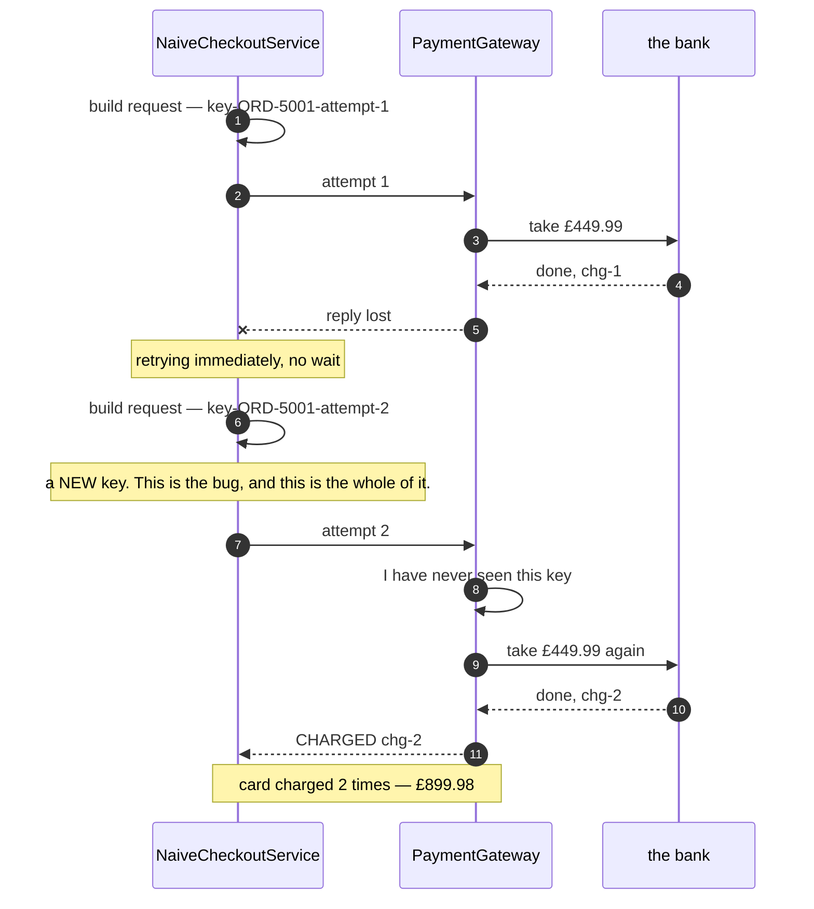

Read the diagram for what is *not* in it. No exception escapes. No error is logged.
The checkout returns a valid receipt and the order looks perfect. The only evidence
that anything went wrong is on a bank statement, and it surfaces as a phone call
two days later.

The gateway did nothing wrong either. It was handed a key it had never seen, which
by definition means a new job. Every double charge in this project is the caller's
doing.

## Act Five: Why Jitter Exists

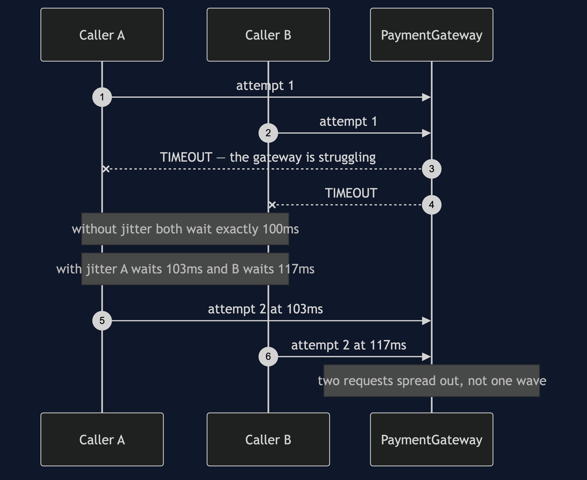

Mermaid source

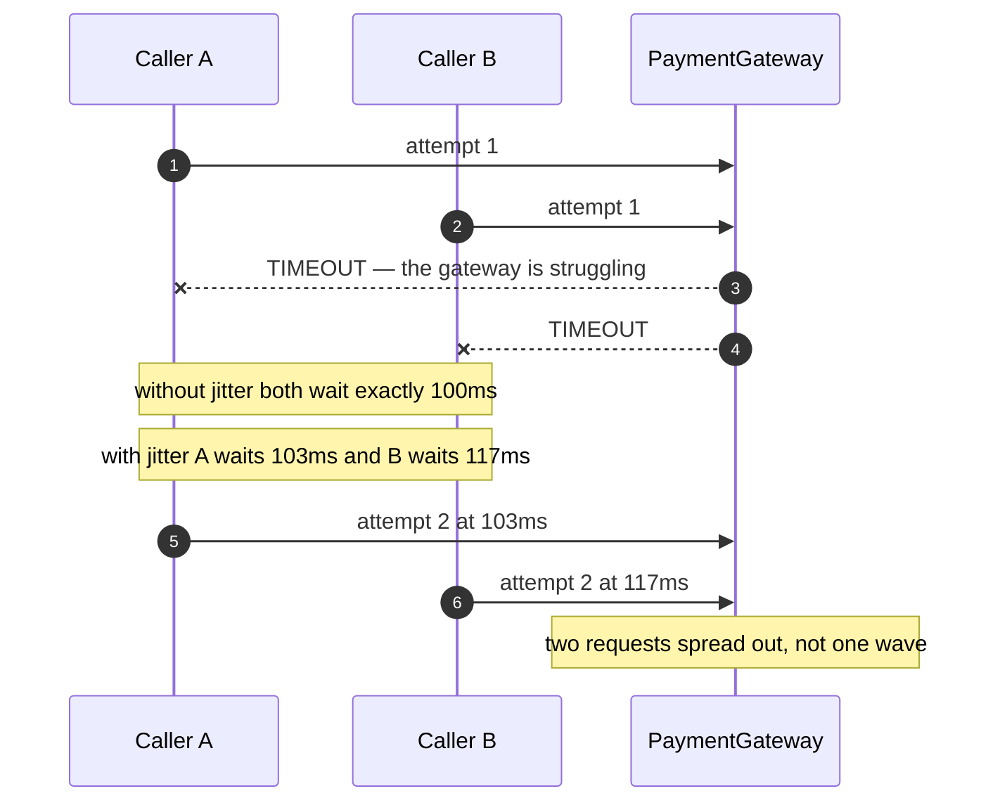

With two callers this is a curiosity. With a thousand callers who all failed at the
same instant it is the difference between a trickle and a stampede that repeats
itself on a timer.

A struggling service is usually struggling because of load. A retry policy without
jitter reliably re-applies that load in synchronised waves, which is the opposite
of what backoff was trying to achieve.

## Notes

- Acts one to four are the *same* gateway object with different faults scripted
  onto it. Nothing about the gateway changes between them, and the gateway is
  correct throughout.
- `Retrier` never sees a `PaymentRequest`. It runs a `Supplier<T>` and has no idea
  what it is retrying — which is what makes it reusable, and also why it cannot
  possibly warn you that the thing it is retrying is unsafe to repeat.
- Every millisecond in these diagrams comes out of `SimulatedClock`, which moves
  only when the retrier or the gateway moves it. The backoff costs no real time, so
  the whole test suite finishes in about a second and every number is exact rather
  than approximately reproducible.
- The jitter values (103ms, 117ms) come from a seeded `Random`, so they are the
  same on every run and on every machine. In production the seed comes from the
  machine, and it should.
