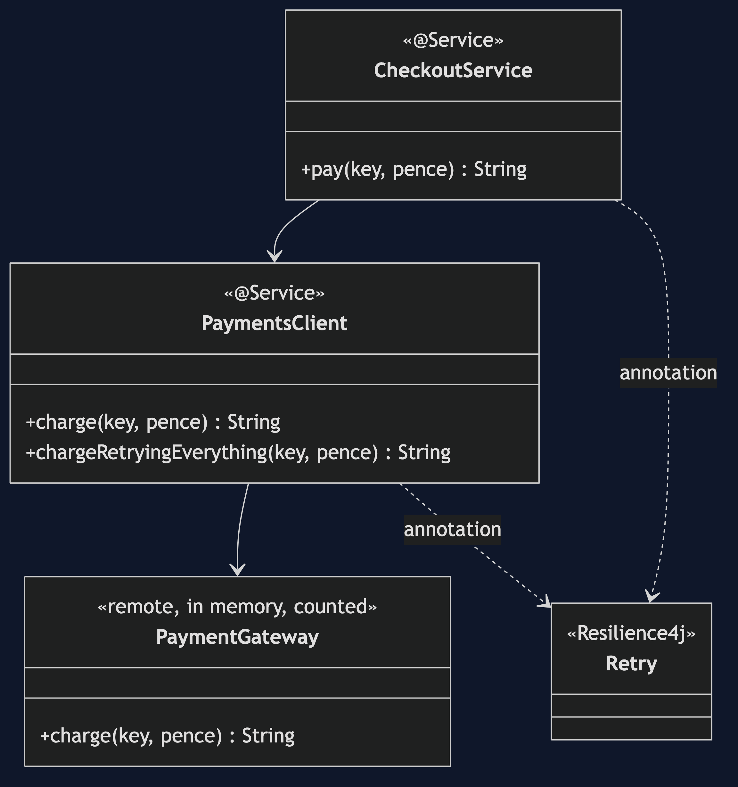
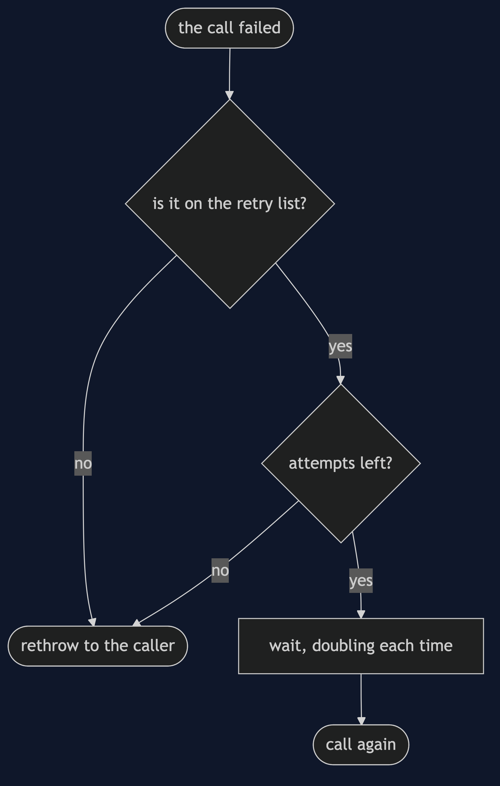
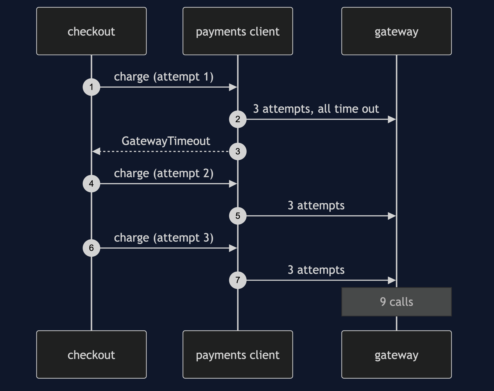
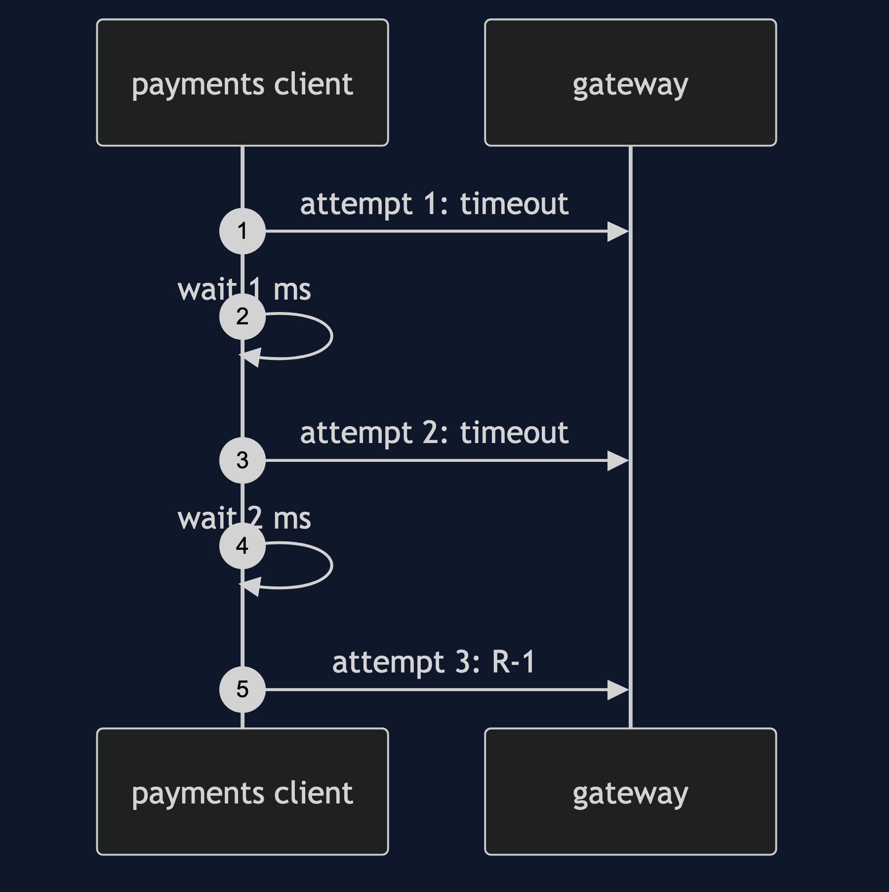
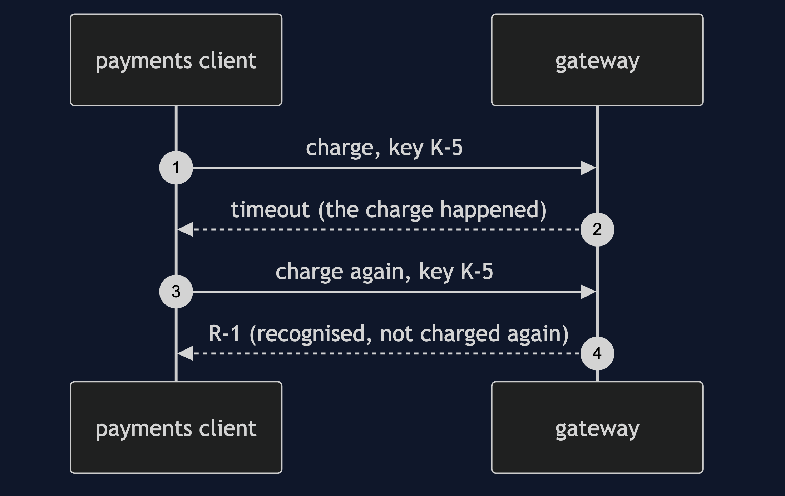

# Retry with Resilience4j Pattern

```
src/main/java/com/jk/explore/retryr4j/
├── PaymentsApplication.java   the Spring Boot entry point and the six acts
├── PaymentsClient.java        the annotated methods
├── CheckoutService.java       a second layer that also retries
├── PaymentGateway.java        the remote gateway, in memory, counted
└── GatewayTimeout.java  CardDeclined.java
src/main/resources/application.properties   the attempts, waits and exception lists
```

**In Resilience4j a retry is an annotation and four settings. What to retry, and whether the call is safe to repeat, are still your decisions.**

This project is the framework version of [Retry with Backoff](../retry-pattern). That project built the mechanism by hand. This one shows the same idea inside Resilience4j. It does not re-teach the pattern. It shows what Resilience4j adds, the failures that are its own, and what it costs.

## Run

```bash
./gradlew run
```

Six acts. The partner project, Retry with Backoff, built the mechanism by hand. Here the same idea runs through Resilience4j, and every count comes from real output.

```
ONE. A flaky call, retried.
  the gateway times out twice. the caller gets: R-1. gateway calls: 3.
TWO. Backoff.
  waits before each retry, in milliseconds: [1, 2].
  each wait is twice the one before, so a struggling gateway is given room.
THREE. Giving up.
  the gateway never answers. after 3 attempts the caller gets: GatewayTimeout.
FOUR. Not everything is worth retrying.
  a declined card, retried only on timeouts: 1 attempt.
  the same card, retrying everything: 3 attempts against a card that will decline again.
FIVE. A retry can charge twice.
  the charge went through but the answer was lost. no idempotency key. charges made: [4999, 4999].
  the same failure, with an idempotency key. charges made: [4999].
SIX. Retries multiply.
  checkout retries three times, and each of those retries the gateway three times.
  one dead gateway, one customer: 9 calls.
```

## Test

```bash
./gradlew test
```

2 test classes, 7 test methods, offline, with each Spring context started inside the test, and no server.

## Technologies and versions

| What | Version | Why it is here |
| --- | --- | --- |
| Java | 21 | The repository standard, via the Gradle toolchain block |
| Gradle | 9.2.1 | The wrapper in this directory; no separate install needed |
| Spring Boot | 4.1.1 | The container and its proxies |
| resilience4j-spring-boot4 | 2.4.0 | The retry and its Spring Boot module |
| JUnit 5 | 5.10.2 | Test runner |

See [`docs/dependencies.md`](docs/dependencies.md).

## Learning Material

| Document | What it covers |
| --- | --- |
| [`docs/problem-statement.md`](docs/problem-statement.md) | The partner's retry, and what is new |
| [`docs/retry-with-resilience4j-pattern-explained.md`](docs/retry-with-resilience4j-pattern-explained.md) | A retry as an annotation and settings |
| [`docs/class-diagram.md`](docs/class-diagram.md) | The types |
| [`docs/architecture-diagram.md`](docs/architecture-diagram.md) | Checkout, client and gateway |
| [`docs/data-flow-diagram.md`](docs/data-flow-diagram.md) | What the retry decides after a failure |
| [`docs/sequence-diagram.md`](docs/sequence-diagram.md) | Written for a listener with the screen off |
| [`docs/uml-diagram.md`](docs/uml-diagram.md) | Four sequences |
| [`docs/animation.html`](docs/animation.html) | The six acts in a browser |
| [`docs/prerequisites.md`](docs/prerequisites.md) | What you need to know |
| [`docs/session.md`](docs/session.md) | A one-hour taught session |
| [`docs/spec.md`](docs/spec.md) | The generated specification |
| [`docs/youtube.md`](docs/youtube.md) | Title, description and chapters |
| [`docs/dependencies.md`](docs/dependencies.md) | What Resilience4j is, what it costs, and that skipping this project loses none of the pattern |

### The pattern in one picture



### Where each piece sits


### How one request moves



### Who calls whom, in order



### All four sequences






### Video

Built from [`video/scenes.py`](video/scenes.py) by
[`video/build_video.sh`](video/build_video.sh). The rendered file is not
committed; see the repository README for why.

## Where you have already met this

Any Spring service that calls a payment, email or shipping provider over the network.

## When this is too much

For a call that fails for a reason that will not go away, a retry only delays the error.

## Where this sits

This project pairs with [Retry with Backoff](../retry-pattern), and is a framework version in [`micro-services-design-patterns`](..).
