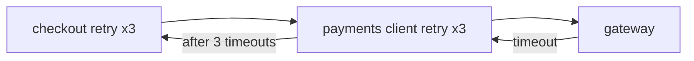

# Retry with Resilience4j Pattern — Architecture Diagram

Each annotated layer wraps its call in a retry loop.

Mermaid source

```mermaid
flowchart LR
    C["checkout retry x3"] --> P["payments client retry x3"]
    P --> G["gateway"]
    G -->|timeout| P
    P -->|after 3 timeouts| C
```

