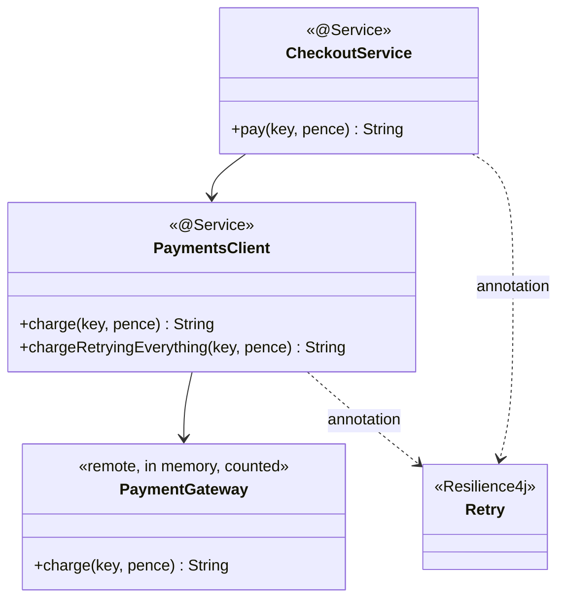

# Retry with Resilience4j Pattern — Class Diagram

Two beans carry the annotation. The settings live in configuration.

Mermaid source

```mermaid
classDiagram
    class CheckoutService {
        <<@Service>>
        +pay(key, pence) String
    }
    class PaymentsClient {
        <<@Service>>
        +charge(key, pence) String
        +chargeRetryingEverything(key, pence) String
    }
    class PaymentGateway {
        <<remote, in memory, counted>>
        +charge(key, pence) String
    }
    class Retry {
        <<Resilience4j>>
    }
    CheckoutService --> PaymentsClient
    PaymentsClient --> PaymentGateway
    CheckoutService ..> Retry : annotation
    PaymentsClient ..> Retry : annotation
```

