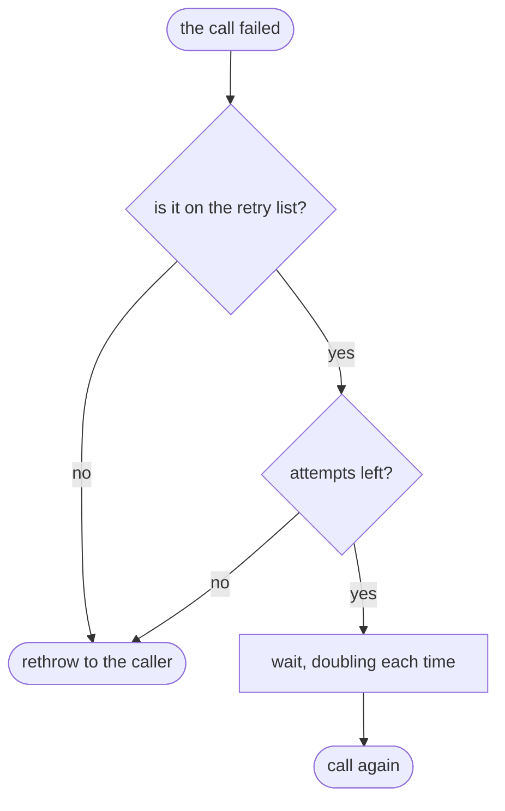

# Retry with Resilience4j Pattern — Data Flow Diagram

What the retry decides after a failure.

Mermaid source

```mermaid
flowchart TD
    Fail(["the call failed"])
    Kind{"is it on the retry list?"}
    Left{"attempts left?"}
    Wait["wait, doubling each time"]
    Again(["call again"])
    Stop(["rethrow to the caller"])
    Fail --> Kind
    Kind -- no --> Stop
    Kind -- yes --> Left
    Left -- no --> Stop
    Left -- yes --> Wait --> Again
```

