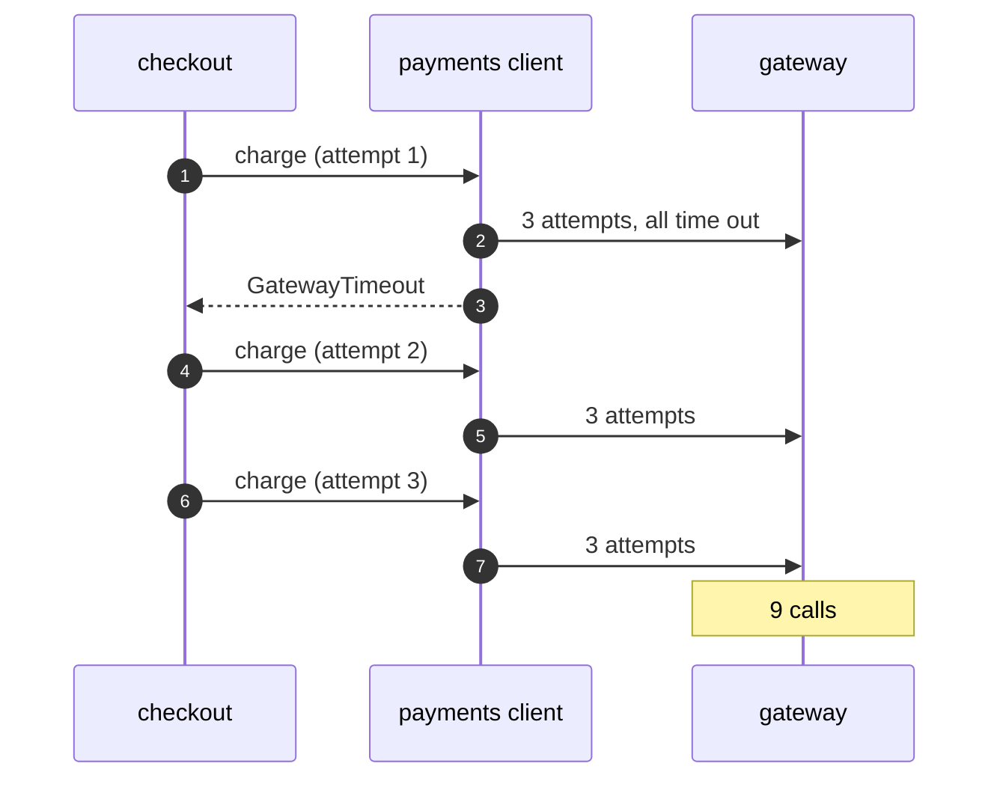

# Retry with Resilience4j Pattern — Sequence Diagram

Written for a listener with the screen off.

Say it in words. Checkout calls pay. The retry around pay calls the payments client. The retry around the client calls the gateway, which times out. The client waits and tries the gateway again, and again, three times in all, then throws. That failure reaches checkout's retry, which starts the whole thing again. The gateway is called nine times before the customer sees an error.

Mermaid source

The load-bearing sentence: **each retrying layer multiplies the one below it.**
