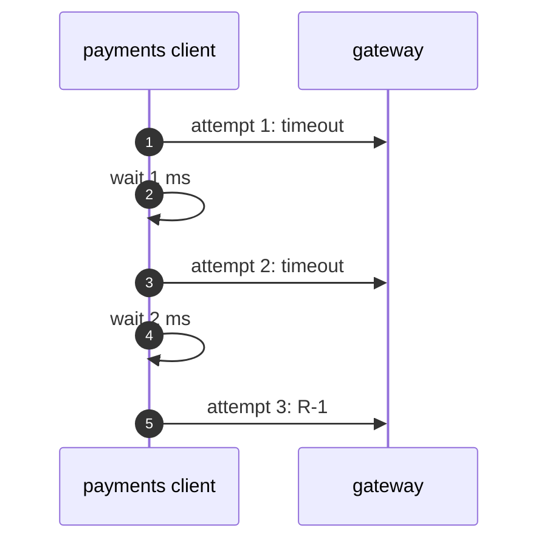
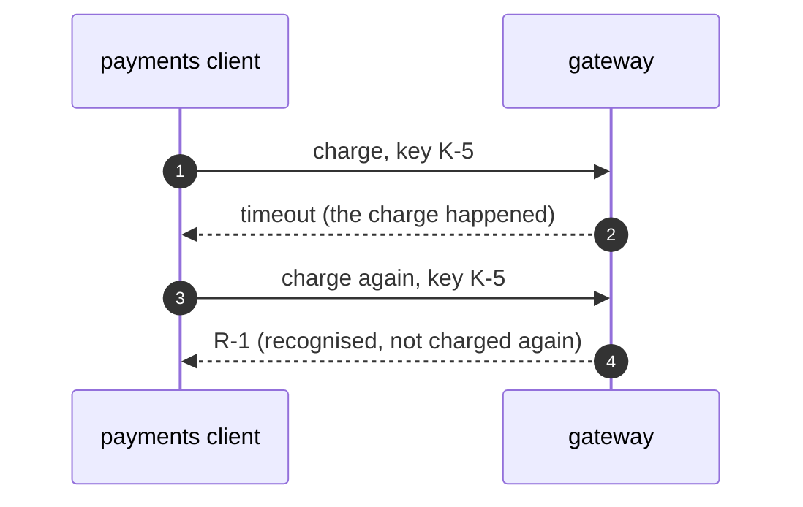

# Retry with Resilience4j Pattern — UML Sequence Diagrams

Four sequences.

## 1. A Recovered Call

Mermaid source

```mermaid
sequenceDiagram
    autonumber
    participant P as payments client
    participant G as gateway
    P->>G: attempt 1: timeout
    P->>P: wait 1 ms
    P->>G: attempt 2: timeout
    P->>P: wait 2 ms
    P->>G: attempt 3: R-1
```

## 2. A Lost Answer

Mermaid source

```mermaid
sequenceDiagram
    autonumber
    participant P as payments client
    participant G as gateway
    P->>G: charge, key K-5
    G-->>P: timeout (the charge happened)
    P->>G: charge again, key K-5
    G-->>P: R-1 (recognised, not charged again)
```

