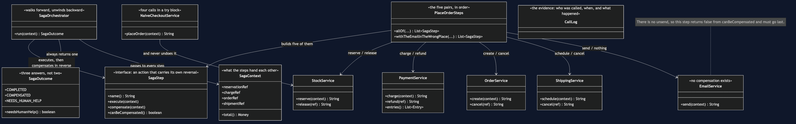
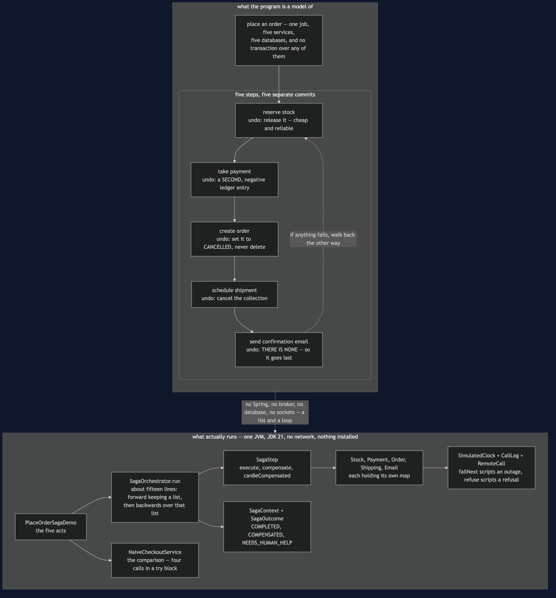
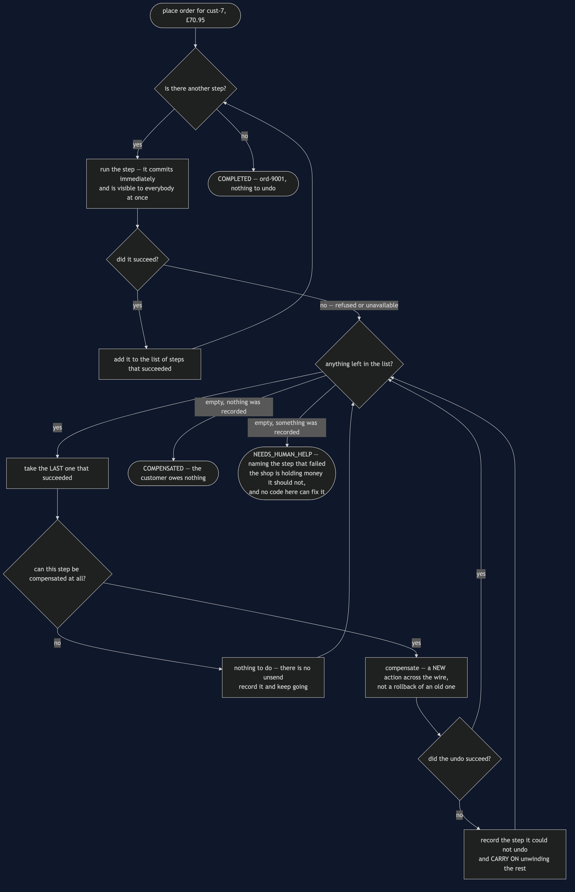
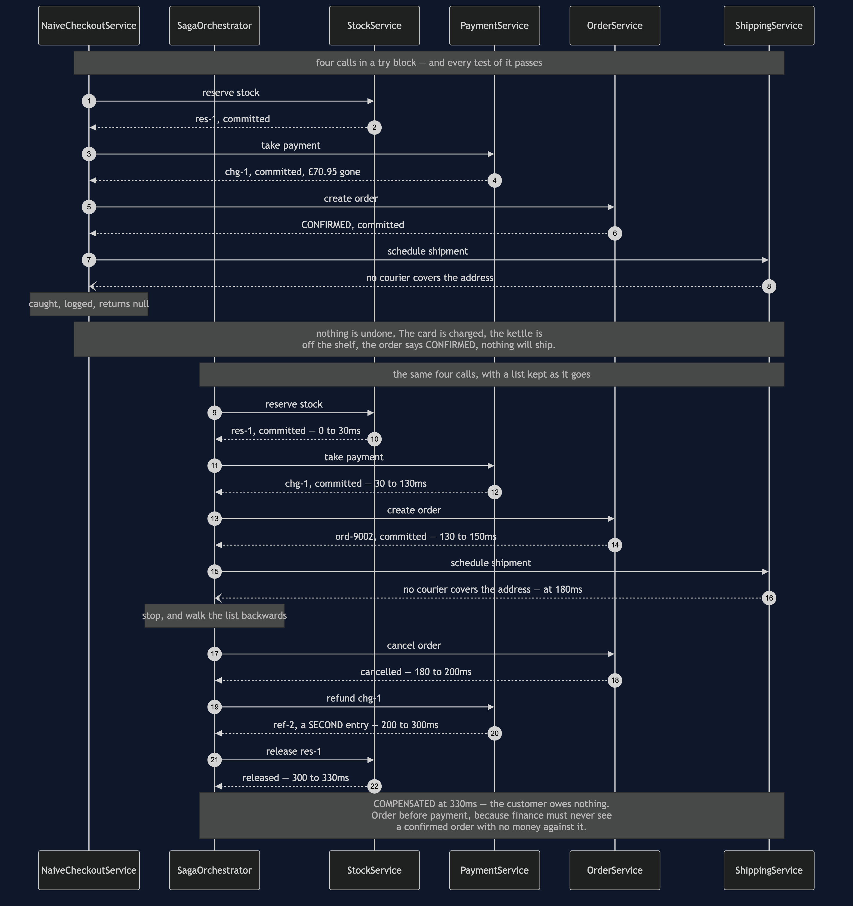

# Saga

**In plain words:** a job that spans several services is done as a series of small steps,
each of which commits on its own. There is no undo button, so every step is written
together with an action that cancels out its effect, and if a later step fails the earlier
ones are cancelled out in reverse order.

**Everyday analogy:** booking a holiday — a flight, a hotel and a hire car, from three
different companies. Each booking is confirmed the moment you make it; there is no way to
hold all three "pending" until you are sure of the third. So when the car company turns you
down, nobody rewinds time. You ring the hotel and cancel, and you ring the airline and
cancel. That is the idea people most often miss about this pattern: a cancellation is not
the booking being erased. It is a new event, it may cost you a fee, and it can itself fail
— the hotel might not pick up the phone.

In the shop, placing an order reserves stock, takes payment, creates the order, schedules a
shipment and emails the customer. Five services, five databases, and no transaction that
spans any of them.

## Five steps, five commits

```
      0ms ->    30ms  Stock            OK        res-1
     30ms ->   130ms  Payments         OK        chg-1
    130ms ->   150ms  Orders           OK        ord-9001
    150ms ->   210ms  Shipping         OK        shp-1
    210ms ->   250ms  Email            OK        emailed cust-7
    250ms ->   250ms  Saga             COMPLETED ord-9001 for £70.95
```

By the time payment is taken, the stock reservation is already committed and visible to
everybody. There is no point in the run where the five services agree to hold their breath.
That is not a shortcoming of this code — it is what having five databases means.

## When the fourth step refuses

```
    150ms ->   150ms  Saga             STEP-OK   create order
    180ms ->   180ms  Saga             STEP-FAILED schedule shipment: no courier covers ...
    180ms ->   200ms  Orders           OK        cancelled ord-9002
    200ms ->   300ms  Payments         OK        refunded chg-1
    300ms ->   330ms  Stock            OK        released res-1
    330ms ->   330ms  Saga             COMPENSATED everything undone, customer owes nothing
```

`SagaOrchestrator.run` is the whole pattern and it is about fifteen lines: walk the steps
forward keeping a list of the ones that succeeded, and if one throws, walk that list
backwards calling `compensate`.

**Backwards is not tidiness.** Later steps depend on earlier ones, so they have to come
apart in the opposite order — the order is cancelled before the payment is refunded, or
finance is briefly looking at a confirmed order with no money against it.

`SagaStep` is the same shape as the Command pattern's `execute` and `undo`, and reading it
that way is the fastest route in. Two differences matter, and both are about the network:
this `undo` crosses a wire, so it can fail; and it does not restore a snapshot, it performs
a new action.

## Compensation is not rollback

```
    CHARGE £70.95  chg-1
    REFUND -£70.95  ref-2
```

Two lines, not zero. `PaymentService.refund` never deletes the charge — it adds a second,
negative entry, exactly as a real payment provider does. So the customer's statement shows
the money leaving and coming back, and they may well ring up to ask why. A database
rollback would never have created that support call.

This is why `aRefundIsANewFactNotAnErasure` asserts two ledger entries rather than an empty
ledger. Everything downstream inherits it: cancelling an order sets its state to
`CANCELLED` rather than deleting the row, because the customer saw that order and finance
will report on it.

## The order of the steps is a design decision

Stock is reserved first because releasing it is the cheapest and most reliable compensation
in the set. Payment comes before the order exists, so a declined card costs nothing but a
released reservation — `anEarlyFailureIsCheap` pins that down. The general rule: **the
steps most likely to fail go early, while there is least to undo.**

## Some steps cannot be compensated at all

```
  outcome: ord-9004: schedule shipment failed and could not undo [send confirmation email]
  emails in the customer's inbox: 1
    "your order ord-9004 is confirmed"
```

`SendConfirmationEmail.canBeCompensated()` returns `false` and its `compensate` is
deliberately empty, because there is no unsend. That is not a bug to be fixed; it is a fact
about the world, and the only thing a saga can do with it is **put such a step last, after
everything that might fail**. `PlaceOrderSteps.withTheEmailInTheWrongPlace` exists to be
shown failing: move the email up one place and a later refusal leaves the shop having
promised in writing something it must then take back.

## When the undo fails too

```
    200ms ->   300ms  Payments         FAILED    no answer
    300ms ->   300ms  Saga             UNDO-FAILED take payment: Payments did not answer
    300ms ->   330ms  Stock            OK        released res-1
    330ms ->   330ms  Saga             NEEDS-HUMAN could not undo [take payment]
```

This is the case most saga tutorials leave out, so `SagaOutcome` has three values rather
than two. `NEEDS_HUMAN_HELP` means the shop is holding money it should not, and no code in
this project can fix it. Two things to notice: the unwinding **carried on** after the
failure, cancelling the order and releasing the stock anyway, and the outcome **names** the
step it could not undo. In a real shop that outcome is a row in a queue that a person works
through. Not building the queue does not make the case go away — it only removes your
chance of finding out.

## Orchestration, and the alternative

`SagaOrchestrator` is an orchestrator: one class holds the sequence, so the sequence can be
read in one file and tested in one file. The price is that it knows about all five services.

The alternative is **choreography**: no one is in charge, each service publishes an event
and the next reacts to it. That couples the services more loosely, and it means nobody can
answer "what happens when an order is placed?" without reading five codebases — including,
crucially, the person trying to work out why a compensation did not run. For a flow this
important, being able to read it in one place is usually worth more than the looser
coupling.

## The try block everybody writes instead

```
  returned: null
  card charged: £70.95
  kettles still reserved: 1
  order state: CONFIRMED
  shipments scheduled: 0
```

`NaiveCheckoutService` makes the four calls in a row inside a `try`. **Every test in
`NaiveCheckoutServiceTest` passes**, and that is the lesson: nothing threw. The card was
charged, the kettle is off the shelf, the order says CONFIRMED, nothing will ever ship, and
a line went into a log that somebody reads three weeks later while investigating a
complaint.

A `@Transactional` annotation on that method — where the comment sits in the source — is
the most dangerous thing you could add. It does exactly what it says: it wraps the method
in a transaction on *this service's own database*. It has no reach into Stock's database,
none into Payments, and none at all over the card network. Rolling back a transaction that
never touched the money does not bring the money back.

## One JVM, no infrastructure

No Spring, no broker, no database, no sockets, and nothing sleeps. `SimulatedClock` advances
only when a call is made, so the timelines above are exact and free. `RemoteCall.failNext`
scripts an outage; `refuseEveryPostcode` and `declineEverything` script a refusal, which is
a different thing and must not be retried. The saga's state lives in `SagaContext`; in a
real shop that would be a row written after every step, so the saga could be picked up again
if the process running it died mid-way.

## Technologies and versions

Nothing here is a range and nothing is `latest`: a course that worked last year and does
not work today is worse than one that never took the dependency.

| What | Version | Why it is here |
| --- | --- | --- |
| Java | 21 | The repository standard, requested through the Gradle toolchain block |
| Gradle | 9.2.1 | The wrapper in this directory; no separate install needed |
| JUnit 5 | 5.10.2 | The 24 tests, through `junit-bom` so the Jupiter artefacts cannot disagree |

That is the entire list, and the short version of it is the point. **This project has no
runtime dependency at all** — the `dependencies` block in `build.gradle` names nothing but
JUnit, and JUnit is `testImplementation`. There is no Spring, no broker, no database, no
transaction manager and no container; the orchestrator is a loop over a list, and the five
services each hold a map. Every one of the twelve projects in this category is built the
same way, so a reader who can run one can run all of them, offline, with a JDK and nothing
else.

## Learning Material

| Document | What it covers |
| --- | --- |
| [`docs/problem-statement.md`](docs/problem-statement.md) | Four calls in a `try` block, and the customer who paid for a parcel that will never be sent |
| [`docs/saga-pattern-explained.md`](docs/saga-pattern-explained.md) | The holiday booking, the five acts, and the three costs of undoing that most treatments skip |
| [`docs/class-diagram.md`](docs/class-diagram.md) | The step, the orchestrator, the outcome, and the one service with no compensation |
| [`docs/architecture-diagram.md`](docs/architecture-diagram.md) | What each step commits to, what undoing it actually means, and why the email is last |
| [`docs/data-flow-diagram.md`](docs/data-flow-diagram.md) | The list of successful steps, the three endings, and why a failed undo does not stop the unwinding |
| [`docs/sequence-diagram.md`](docs/sequence-diagram.md) | The same failure at 180ms with and without a saga — identical first halves, and only one second half |
| [`docs/uml-diagram.md`](docs/uml-diagram.md) | All five acts as sequences: the happy path, the unwinding, the failed undo, the email, and no saga at all |
| [`docs/animation.html`](docs/animation.html) | Five steps committing one at a time in a browser, and then being walked backwards |
| [`docs/prerequisites.md`](docs/prerequisites.md) | What you need to know, what you explicitly do not (two-phase commit, any broker), and 60-second primers |
| [`docs/session.md`](docs/session.md) | A one-hour taught session with exercises |
| [`docs/spec.md`](docs/spec.md) | The generated specification, with measured test counts and timings |
| [`docs/youtube.md`](docs/youtube.md) | Title, description and chapters for the video |
| [`video/README.md`](video/README.md) | The video pipeline, the scene list, and how to rebuild it |

### The pattern in one picture

The class diagram — the step, the orchestrator, the outcome. The thing to look for is that
`compensate` sits on the same interface as `execute`, which is the pattern's one real
demand: you may not write a step without writing its undo at the same time.



### What runs where

The lower half is the literal truth: one JVM, a list and a loop. The upper half is the
checkout across five services, each step labelled with what undoing it actually means —
including the one where the honest answer is that there is no undo.



### How the data moves

The list of steps that succeeded, walked forward and then backward, with the three endings
it can reach. Note the branch where an undo fails and the unwinding carries on anyway.



### Who calls whom, in order

The same checkout failing at the same step, with and without a saga. The first halves are
identical; only one of them has a second half.



### All five acts

The full set from [`docs/uml-diagram.md`](docs/uml-diagram.md), in the order that document
argues them.

**One. Five steps, no transaction.** Every arrow back says committed, and nothing is being
held open for anybody.


**Two. The courier refuses, and everything unwinds.** The bottom half is the exact reverse
of the top half, and the order matters.


**Three. The refund fails too.** The stock is still released, and the outcome names the step
it could not undo.


**Four. The email in the wrong place.** The order is cancelled, the money comes back, and
the confirmation stays in the inbox.


**Five. The same failure, without a saga.** There is no second half to this diagram, and
that is the whole comparison.


### Video

The narrated walkthrough is built from [`video/scenes.py`](video/scenes.py) by
[`video/build_video.sh`](video/build_video.sh). It runs about eighteen minutes
across sixteen scenes, and the rendered file is not committed — see the
repository README for why — so producing it takes about ten minutes on macOS.
