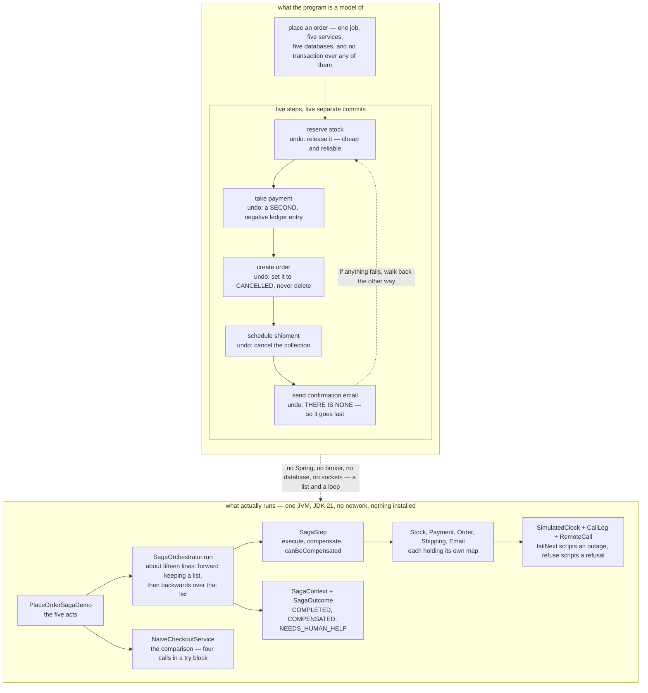

# Saga — Architecture Diagram

Where each piece of this project sits, and — because this project starts nothing — what
each piece *stands for*. The class diagram shows the types and the sequences show the
order of the calls; this one answers the question those two cannot, which is **what each
step commits to, and what it costs to take that back**.

Read the picture as two halves stacked. The upper half is what the program is a model of:
one checkout crossing five services, each with its own database, and no transaction
anywhere in sight. The lower half is the literal truth: one Java program, a list of steps,
a fifteen-line loop, and a clock that only moves when a call is made.

The upper half is labelled with the only thing that matters about each step, which is what
undoing it actually means.

Stock is reserved first because releasing a reservation is the cheapest and most reliable
compensation in the set. Payment comes before the order exists, so a declined card costs
nothing but a released reservation. The order is cancelled rather than deleted, because the
customer saw it and finance will report on it. And the email sits last, with **no
compensation at all**, because there is no unsend — that is not a bug to be fixed, it is a
fact about the world, and the only thing a saga can do with it is put such a step after
everything that might fail.

Mermaid source

## What the diagram is telling you to count

**Five commits, and not one of them is provisional.** By the time payment is taken, the
stock reservation is already final and visible to everybody. There is no point in the run
where the five services hold their breath together. That is not a shortcoming of this code —
it is what having five databases means, and it is why compensation is the only tool
available.

**Backwards is not tidiness, it is dependency order.** Later steps rest on earlier ones, so
they have to come apart in the opposite order. The order is cancelled before the payment is
refunded, or finance is briefly looking at a confirmed order with no money against it.

**A compensation is a new action, not an erasure.** `PaymentService.refund` never deletes
the charge; it adds a second, negative entry, exactly as a real payment provider does. The
customer's statement shows the money leaving and coming back, and they may well ring up to
ask why. A database rollback would never have created that support call, and a test asserts
two ledger entries rather than an empty ledger precisely so the point cannot be lost.

**The steps most likely to fail go early, while there is least to undo.** That is the
general rule the ordering encodes, and it is a design decision made once, in
`PlaceOrderSteps`, rather than improvised during an incident.

**There are three outcomes, not two.** `NEEDS_HUMAN_HELP` is the case most treatments leave
out: the undo failed too, the shop is holding money it should not, and no code in this
project can fix it. Two details matter — the unwinding *carries on* past the failure, and
the outcome *names* the step it could not undo. In a real shop that is a row in a queue a
person works through. Not building the queue does not make the case go away; it only
removes your chance of finding out.

## What it deliberately leaves out

**The saga's state is not persisted.** `SagaContext` lives in memory, so a process that
dies mid-run forgets everything it had done. In a real shop that context would be a row
written after every step, so the saga could be picked up and finished by whoever restarts.
That is the single biggest difference between this project and production.

**There is no choreography.** `SagaOrchestrator` is an orchestrator: one class holds the
sequence, so it can be read in one file and tested in one file, at the price of knowing all
five services. The alternative is for each service to publish an event and the next to react
to it, which couples them more loosely and means nobody can answer "what happens when an
order is placed?" without reading five codebases — including the person trying to work out
why a compensation did not run. For a flow this important, reading it in one place is
usually worth more than the looser coupling.

**There is no retry and no idempotency.** A compensation that is attempted twice would
refund twice here. Both of those are the last two projects in this category:
[Transactional Outbox](../transactional-outbox-pattern) and
[Idempotent Consumer](../idempotent-consumer-pattern).

**And there is no `@Transactional` that would help.** Putting one on
`NaiveCheckoutService` — where the comment sits in the source — is the most dangerous thing
you could add. It does exactly what it says: it wraps the method in a transaction on *this
service's own database*. It has no reach into Stock's database, none into Payments, and
none at all over the card network. Rolling back a transaction that never touched the money
does not bring the money back.
