# Saga — Class Diagram

```mermaid
classDiagram
    class SagaOrchestrator {
        <<walks forward, unwinds backward>>
        +run(context) SagaOutcome
    }
    class SagaStep {
        <<interface: an action that carries its own reversal>>
        +name() String
        +execute(context)
        +compensate(context)
        +canBeCompensated() boolean
    }
    class SagaOutcome {
        <<three answers, not two>>
        +COMPLETED
        +COMPENSATED
        +NEEDS_HUMAN_HELP
        +needsHumanHelp() boolean
    }
    class SagaContext {
        <<what the steps hand each other>>
        +reservationRef
        +chargeRef
        +orderRef
        +shipmentRef
        +total() Money
    }
    class PlaceOrderSteps {
        <<the five pairs, in order>>
        +allOf(...) List~SagaStep~
        +withTheEmailInTheWrongPlace(...) List~SagaStep~
    }
    class StockService {
        +reserve(context) String
        +release(ref) String
    }
    class PaymentService {
        +charge(context) String
        +refund(ref) String
        +entries() List~Entry~
    }
    class OrderService {
        +create(context) String
        +cancel(ref) String
    }
    class ShippingService {
        +schedule(context) String
        +cancel(ref) String
    }
    class EmailService {
        <<no compensation exists>>
        +send(context) String
    }
    class NaiveCheckoutService {
        <<four calls in a try block>>
        +placeOrder(context) String
    }
    class CallLog {
        <<the evidence: who was called, when, and what happened>>
    }

    SagaOrchestrator --> SagaStep : executes, then compensates in reverse
    SagaOrchestrator --> SagaOutcome : always returns one
    SagaOrchestrator --> SagaContext : passes to every step
    PlaceOrderSteps --> SagaStep : builds five of them
    PlaceOrderSteps --> StockService : reserve / release
    PlaceOrderSteps --> PaymentService : charge / refund
    PlaceOrderSteps --> OrderService : create / cancel
    PlaceOrderSteps --> ShippingService : schedule / cancel
    PlaceOrderSteps --> EmailService : send / nothing
    NaiveCheckoutService --> StockService : and never undoes it

    note for EmailService "There is no unsend, so this step returns false from canBeCompensated and must go last."
```

## The Shape Of It

Three small types carry the whole pattern.

`SagaStep` is an action paired with its reversal. `SagaOrchestrator` walks a list of them.
`SagaOutcome` says what happened. Everything else in the diagram is the shop.

The orchestrator knows nothing about kettles, couriers or card networks. It knows that a
step has a name, that it might throw, and that it might be undoable. That is the entire
contract, and it is why the same twenty lines would run a refund flow or a subscription
sign-up without modification.

## Why `SagaStep` Looks Like Command

`execute` and `compensate` are the Command pattern's `execute` and `undo` under different
names. The structure is deliberately the same, and so is the payoff: an operation that
carries its own reversal can be sequenced, logged and unwound by code that knows nothing
about what it does.

One difference matters more than everything else. An in-memory `undo` always works. A
compensation is a network call to somebody else's service, so it can be slow, it can be
refused, and it can fail outright. A saga must have an answer for that, and the honest
answer usually involves a human.

## The Note On `EmailService`

Every other service in the diagram has a pair — reserve and release, charge and refund,
create and cancel, schedule and cancel. Email has one method.

That asymmetry is the whole of act four. `canBeCompensated()` returns false, the
orchestrator records the step as one it could not undo, and the saga reports
`NEEDS_HUMAN_HELP`. Because that is true, the email step has to be sequenced last, after
everything that might fail.

## `SagaContext`

A compensation needs to know what to compensate — you cannot refund a payment without its
charge reference — so each service hands back a reference and the context keeps it as the
saga runs.

In a real shop this would be a row in a database, written after every step, so that a saga
can be picked up again if the process running it dies half way through. That persistence is
out of scope here, but the shape of the class is the same.

## `NaiveCheckoutService`

It is kept because the comparison has to be fair, and because it is what everybody writes
first. Four calls in a `try` block, a catch that logs, and a comment where a real version
would carry `@Transactional`.

The arrow from it to `StockService` is labelled "and never undoes it", which is the entire
difference between the two designs.

## `CallLog` And `SimulatedClock`

Both designs call the same services, so the only way to compare them is to watch who was
called, in what order, and what happened. `CallLog` records that, and `SimulatedClock`
advances by fixed amounts — thirty milliseconds for Stock, a hundred for Payments, twenty
for Orders, sixty for Shipping, forty for Email.

Nothing sleeps. Every timing in the demo is exact and repeatable, and the reverse order of
the compensations is visible in the timeline rather than asserted in prose.
