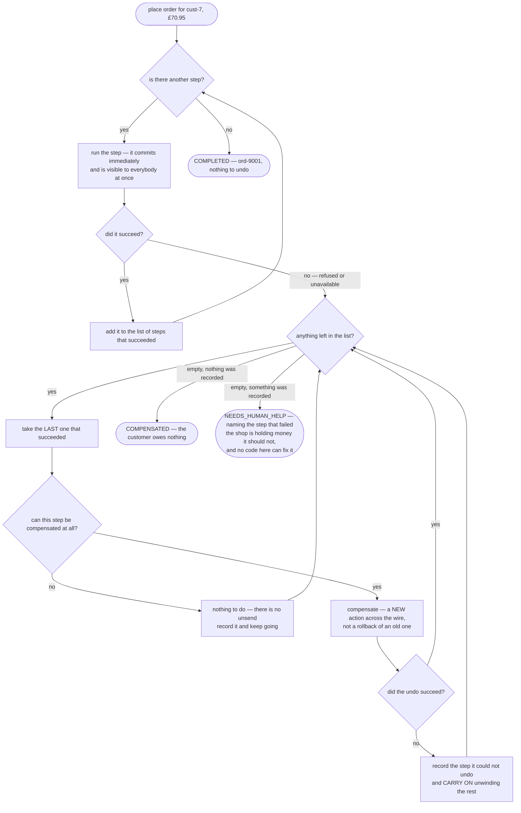

# Saga — Data Flow Diagram

One checkout, followed from the customer pressing the button to one of three endings. The
architecture diagram says what each step costs to undo; this one says **how the run decides
which way to go, and what is left behind in each case**.

The thing to follow is the list. `SagaOrchestrator.run` walks the steps forward and keeps a
list of the ones that succeeded. That list is the whole state of the pattern: if everything
succeeds the list is discarded, and if anything throws the list is walked backwards. There
is nothing else — no transaction manager, no coordinator, no two-phase commit.

Follow the failed-compensation branch especially. It does not stop. A failed undo is
recorded and the unwinding carries on, because the steps below it can still be undone and
leaving them done as well would make the mess strictly worse.

Mermaid source

## What the picture is telling you

**There is no arrow that unwinds a step which never ran.** The list only contains steps
that succeeded, which is why the forward path pushes and the backward path pops. This is
the single most common bug in hand-written compensation code: undoing something that never
happened, usually because the failure was a timeout and nobody knew which side of the wire
it landed on.

**The `can this be compensated` fork is a fact about the world, not a flag to flip.**
`SendConfirmationEmail.canBeCompensated()` returns false and its `compensate` is
deliberately empty. The only defence is position, and the demo has a version of the steps
with the email moved up one place purely so it can be shown failing: a later refusal leaves
the shop having promised in writing something it must then take back.

**The failed-undo branch loops back rather than exiting.** Look at the demo timeline for
act three: Payments does not answer at 300ms, and stock is still released at 330ms. Then
the run ends with an outcome naming `take payment` as the step it could not undo.

**Two of the three endings are successes.** `COMPLETED` and `COMPENSATED` are both correct
outcomes — one where the order exists, one where nothing does and the customer owes nothing.
Only the third needs a person. Designing for two endings is what produces the third by
accident.

**Every box on the forward path commits on its own.** Nothing is held open, nothing is
pending, and nothing can be rolled back later. That is what having five databases means,
and every other property in this diagram follows from it.

## The same checkout without any of this

`NaiveCheckoutService` makes the four calls in a row inside a `try`, and its flow chart is
a straight line with one arrow off the side into a log statement. **Every test in its class
passes**, and that is the lesson: nothing threw. The card was charged, the kettle is off
the shelf, the order says `CONFIRMED`, nothing will ever ship, and a line went into a log
that somebody reads three weeks later while investigating a complaint.

The difference between the two diagrams is not the forward path — they are identical. It is
that one of them has a second half.

## What the diagram does not model

The state of the run is in memory. Kill the process between "take payment" and "create
order" and the list of successful steps goes with it, leaving a charge nobody will ever
compensate. In a real shop the list is a row written after every step, so the run can be
resumed by whoever restarts. Compensations also need to be safe to attempt twice, which is
[Idempotent Consumer](../idempotent-consumer-pattern) at the end of this category, and the
step-plus-event needs to commit together, which is
[Transactional Outbox](../transactional-outbox-pattern).
